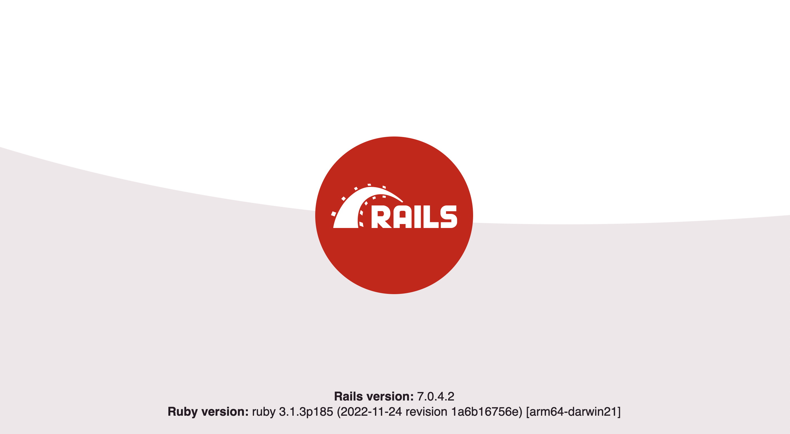

Ruby on Rails is a popular fullstack web framework used by companies like Shopify, GitHub, Twitch, and more.

In this tutorial, we build a basic [Ruby on Rails](https://rubyonrails.org/) app, add PostHog to it, and then set up some of the key features of PostHog, such as custom event capture, user identification, and feature flags.

> Already know how to build a Ruby on Rails app? Skip to the [PostHog integration step](#2-integrating-the-posthog-snippet-and-ruby-library).

## 1. Creating a basic Ruby on Rails app

First, install Ruby. I used `rbenv` and a `~/.bash_profile` to install version `3.1.3` but there are many ways you can do it. After installing the right version of Ruby, install Rails.

```bash
gem install rails
```

Once done, we can start our blog by running the `rails new` command. going into the blog folder, and starting the server.

```bash
rails new blog
cd blog
bin/rails server
```

Going to `localhost:3000` pulls up a site that looks like this:



> A more detailed version of this Ruby app building process is in the [Getting Started with Rails](https://guides.rubyonrails.org/getting_started.html) guide.

### Setting up the articles routes

Rails is nice because it has a bunch of commands you can use to generate parts of the app. Use `generate controller` to create the controller for our articles:

```bash
bin/rails generate controller Articles index --skip-routes
```

We skip the routes because we will set those up manually. In `config/routes.rb`, add details to the route. The `resources` method lets us define a bunch of routes we want all a once:

```bash
Rails.application.routes.draw do
	root "articles#index"
  resources :articles
end
```

### Creating the article model

Like the controller, the models have commands to generate them as well. We want our article to have a title, body, and author so run the command:

```bash
bin/rails generate model Article title:string body:text author:string
```

Then migrate these changes to our database by running:

```bash
bin/rails db:migrate
```

Once done, we can create an article in the console by running these three commands:

```bash
bin/rails console
article = Article.new(title: "Cool tutorial", body: "PostHog and Rails together!", author: "ian@posthog.com")
article.save
```

### Showing our articles

With the routes, controller, and model all set up, it is time to actually show the articles. In `app/controllers/articles_controller.rb`, set up a function to get all the articles and individual routes for each of them:

```ruby
class ArticlesController < ApplicationController
  def index
    @articles = Article.all
  end

	def show
    @article = Article.find(params[:id])
  end
end
```

Next, add the code to show them all, go to the details about them, and create a new one (which we’ll set up next) in a new file at `app/views/articles/index.html.erb`:

```html
<h1>Articles</h1>

<ul>
  <% @articles.each do |article| %>
    <li>
      <%= link_to article.title, article %>
    </li>
  <% end %>
</ul>

<%= link_to "New Article", new_article_path %>
```

Also, set up the details page in a new file at `app/views/articles/show.html.erb`:

```html
<h1><%= @article.title %></h1>

<p><%= @article.body %></p>
```

### Creating new articles

The last thing to do is add the ability to create a new article. First, in `app/controllers/articles_controller.rb`, add a `new` and `create` function. We want to define the article params in another function to ensure title, body, and author are all included in the request as well:

```ruby
# ...
def new
    @article = Article.new
  end

  def create
    @article = Article.new(article_params)

    if @article.save
      redirect_to @article
    else
      render :new, status: :unprocessable_entity
    end
  end
	
private
    def article_params
      params.require(:article).permit(:title, :body, :author)
    end
# ...
```

Next, create a form page for article creation in `app/views/articles/new.html.erb`:

```ruby
<h1>New Article</h1>

<%= form_with model: @article do |form| %>
  <div>
    <%= form.label :title %><br>
    <%= form.text_field :title %>
  </div>

  <div>
    <%= form.label :body %><br>
    <%= form.text_area :body %>
  </div>

  <div>
    <%= form.label :author %><br>
    <%= form.text_field :author %>
  </div>

  <div>
    <%= form.submit %>
  </div>
<% end %>
```

You should now have a nice Ruby on Rails app with a home page, article pages, and the ability to add new articles. Customize it further if you'd like, then when you're ready it's time to add PostHog.


## 2. Integrating the PostHog snippet and Ruby library

Now our Ruby on Rails app is ready to integrate with PostHog. There are two ways to do this; with the snippet, or the library. The first method enables you to quickly get started with most PostHog features, such as analytics and session recording. If also want to use advanced tools, such as feature flags and experiments, you need to use the library. 

### Adding the JavaScript snippet

The first way is to use the JavaScript snippet. This provides autocapture of events, pageviews, session recordings, and more.

To set it up, [copy the code snippet from the PostHog docs](/docs/integrate) and add it to `views/layouts/application.html.erb`. With no other changes, this file looks like this:

```html
<!DOCTYPE html>
<html>
  <head>
    <title>Blog</title>
    <meta name="viewport" content="width=device-width,initial-scale=1">
    <%= csrf_meta_tags %>
    <%= csp_meta_tag %>

    <%= stylesheet_link_tag "application", "data-turbo-track": "reload" %>
    <script>
        !function(t,e){var o,n,p,r;e.__SV||(window.posthog=e,e._i=[],e.init=function(i,s,a){function g(t,e){var o=e.split(".");2==o.length&&(t=t[o[0]],e=o[1]),t[e]=function(){t.push([e].concat(Array.prototype.slice.call(arguments,0)))}}(p=t.createElement("script")).type="text/javascript",p.async=!0,p.src=s.api_host+"/static/array.js",(r=t.getElementsByTagName("script")[0]).parentNode.insertBefore(p,r);var u=e;for(void 0!==a?u=e[a]=[]:a="posthog",u.people=u.people||[],u.toString=function(t){var e="posthog";return"posthog"!==a&&(e+="."+a),t||(e+=" (stub)"),e},u.people.toString=function(){return u.toString(1)+".people (stub)"},o="capture identify alias people.set people.set_once set_config register register_once unregister opt_out_capturing has_opted_out_capturing opt_in_capturing reset isFeatureEnabled onFeatureFlags getFeatureFlag getFeatureFlagPayload reloadFeatureFlags group updateEarlyAccessFeatureEnrollment getEarlyAccessFeatures getActiveMatchingSurveys getSurveys".split(" "),n=0;n<o.length;n++)g(u,o[n]);e._i.push([i,s,a])},e.__SV=1)}(document,window.posthog||[]);
        posthog.init('<ph_project_api_key>',{api_host:'ph_instance_address})
    </script>
    <%= javascript_importmap_tags %>
  </head>

  <body>
    <%= yield %>
  </body>
</html>
```

> Make sure to turn on session recordings in your PostHog project settings by scrolling down to "Recordings" and toggling on "Record user sessions"

Once you've set this up and clicked around on the server, you should see events in your PostHog instance from the source `web`.

### Adding the Ruby library

If you want access to all the features of PostHog, including custom event capture, user identification, and feature flags, you need the Ruby library. 

To set this up, first, add PostHog to the `Gemfile`:

```ruby
gem 'posthog-ruby'
```

Next, in `config/initializers`, create a `posthog.rb` file and initialize PostHog as a global variable there like this:

```ruby
$posthog = PostHog::Client.new(
    api_key: '<ph_project_api_key>',
    host: '<ph_instance_address>',
    on_error: Proc.new { |status, msg| print msg }
)
```

Now, you can call `$posthog` throughout your Ruby on Rails application to access all the features of PostHog.

## 3. Using PostHog in your Ruby on Rails app

With both the library and snippet set up, we can use both of them to capture events, identify users, and use feature flags.

### Capturing custom events

The snippet provides autocaptures of pageviews, clicks, inputs, and some other events. If you want to capture events which are more nuanced or unique to your product, you must set up custom event capture.

If we want to capture when someone submits a new article, we can call `$posthog.capture()` with the author string and an event name we choose. In `app/controllers/articles_controller.rb`, this looks like this:

```ruby
# ...
def create
    @article = Article.new(article_params)

    if @article.save
      $posthog.capture(
        distinct_id: @article.author,
        event: 'article_created',
        properties: {
          title: @article.title
        }
      )
      redirect_to @article
    else
      render :new, status: :unprocessable_entity
    end
  end
# ...
```

This creates an `Article created` event with a source from `posthog-ruby`.

### Aliasing identified users

In your PostHog instance, you see that events are coming from two different people, one with an anonymous ID and another with an email. Even though both these "people" are you, they are treated as two separate people in PostHog, but we can combine them with an `alias` call. 

To do this, you need both the anonymous ID and the new distinct ID (email). We can get the distinct ID when we save the article (like we did for custom event capture) and the anonymous ID via the cookies in the request. We also need our project API to get the right cookie.

Altogether, this looks like this:

```ruby
#...
def create
    @article = Article.new(article_params)

    if @article.save
      $posthog.capture(
        distinct_id: @article.author,
        event: 'article_created',
        properties: {
          title: @article.title
        }
      )

      @project_api_key = '<ph_project_api_key>'
      @ph_cookie = JSON.parse(cookies["ph_#{@project_api_key}_posthog"])

      $posthog.alias({
        distinct_id: @article.author,
        alias: @ph_cookie['distinct_id']
      })

      redirect_to @article
    else
      render :new, status: :unprocessable_entity
    end
  end
#...
```

You should see an `Alias` event in your PostHog instance, and when you check the person, you should see their distinct ID and anonymous IDs connected. This remains true for further events either send.

### Using feature flags

The last feature to set up is feature flags. We will set up a feature flag to redirect to the homepage instead of the article details.

First, create the flag in PostHog. You can do so in "Feature Flags." Click "New feature flag," add a key (I chose `home-redirect`), set the release condition to 100% of users, and click save.

Once done, we can check for this flag in our Ruby code and redirect to the home page if it is active. Again, we need the distinct ID to call `is_feature_enabled()`, so use the author string. 

```ruby
# ...
def create
  @article = Article.new(article_params)

  if @article.save
    if $posthog.is_feature_enabled(
      'home-redirect',
      @article.author
    )
      redirect_to root_path
    else
      redirect_to @article
    end
  else
    render :new, status: :unprocessable_entity
  end
end
# ...
```

You can then turn off the flag to check that it is redirecting back to the article and modify the conditions how you like. Just remember you must identify users with the properties before you can use them in your release conditions.

Once done, you have a basic Ruby on Rails app with many of the key features of PostHog setup. You can customize it to your liking. There are also more PostHog features to explore like group analytics, user and event properties, and experiments. Read more in [our Ruby documentation](/docs/integrate/server/ruby).

## Further reading

- [What to do after installing PostHog in 5 steps](/tutorials/next-steps-after-installing)
- [How to set up A/B tests in Ruby on Rails](/tutorials/ruby-ab-tests)
- [Complete guide to event tracking](/tutorials/event-tracking-guide)