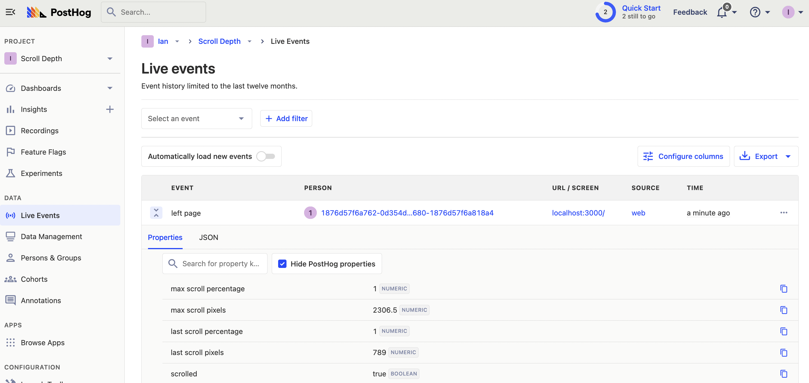
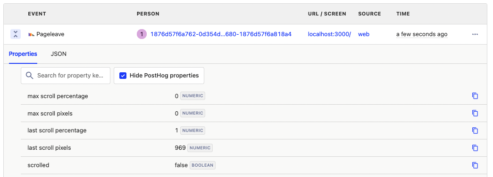
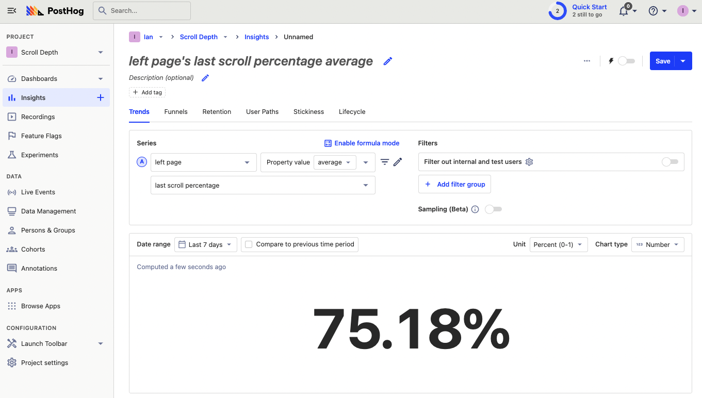
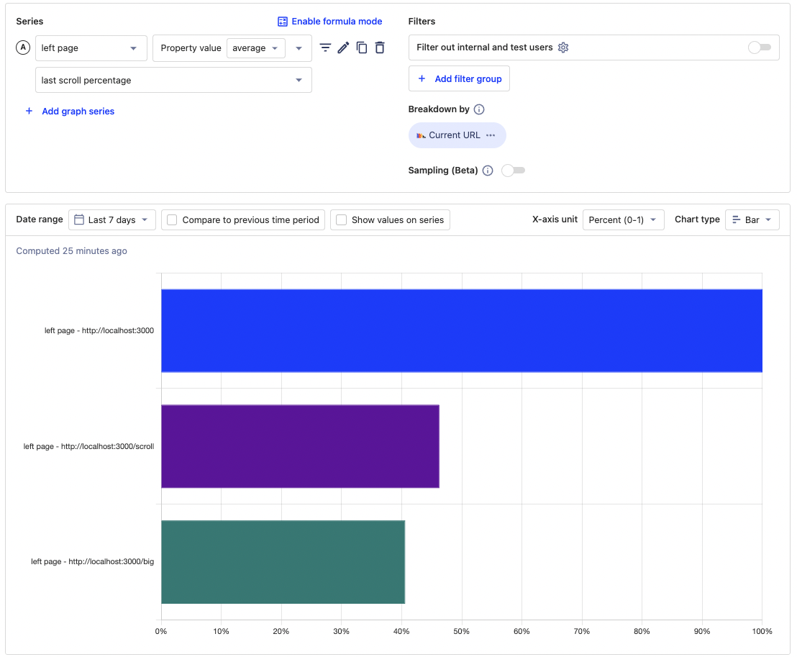
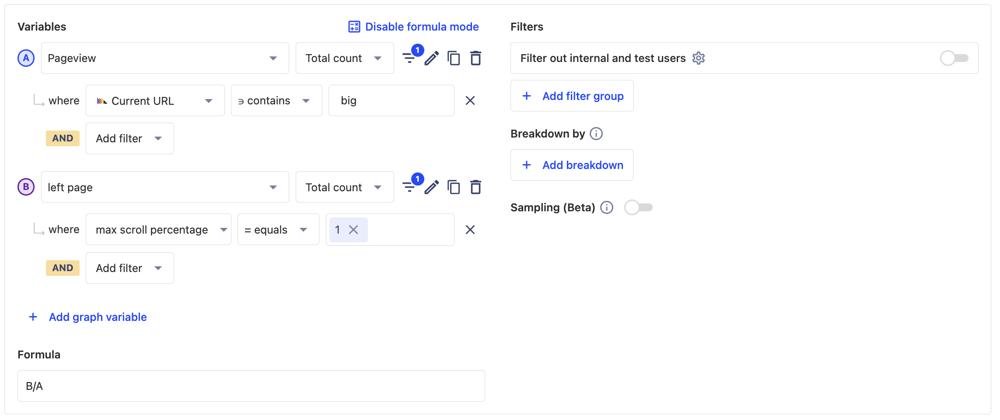

    
You can waste a lot of effort on parts of pages people never see. While [session replay](/tutorials/explore-insights-session-recordings) is great for understanding individual sessions, an aggregate understanding of how much of a page is viewed is valuable too. This is where tracking scroll depth can be helpful. 

In this tutorial, we go over the different ways of measuring scroll depth, calculating and tracking them with PostHog, then creating insights with the data captured.

## Setup

To showcase all this, first create a [Next.js app](/tutorials/nextjs-analytics). Run the script below, choose **not** to use TypeScript, **not** to use the app router, and the defaults for everything else.

```bash
npx create-next-app@latest scroll-depth
```

Once created, create another page in the `pages` folder named `big`. It contains a long page with can scroll through.

```js
// pages/big.js
import Link from "next/link";

export default function Big() {
  const divStyle = {
    height: "500px",
    backgroundColor: "blanchedalmond",
    marginBottom: "50px"
  }

  return (
    <>
      <h1>Big page</h1>
      <div style={divStyle}>First</div>
      <div style={divStyle}>Second</div>
      <div style={divStyle}>Third</div>
      <div style={divStyle}>Fourth</div>
      <Link href="/">Go Home</Link>
    </>
  )
}
```

This is all we need for scroll depth tracking.

## Measuring scroll depth

There are multiple ways to measure scroll depth:

1. **Depth in pixels.** To measure this, add the `window.innerHeight` and the `window.pageYOffset`. This isn’t always accurate because pages and viewports can vary in size. Two users might have different-sized viewports causing the same pixel scroll depth to be a different experience.
 
2. **Depth in percentage.** To measure this, take the pixel depth (`window.innerHeight + window.pageYOffset`) and divide it by the `document.body.offsetHeight`.  This is a better metric to use because it captures the relative depth of the scroll. Getting 50% down a page is roughly equal to getting through 50% of the page’s content.
 
3. **Scrolled at all** or **scrolled to the bottom of the page**. To calculate these, check if the depth percentage is either not 0 or equal to 1. For many sites, this might not be relevant, but it does provide an easy point to say someone started or completed a page. If a page "ends" earlier than the bottom, you can also set up a trigger at that point.

## Capturing scroll depth

We now calculate and capture these scroll depth measurements. Depending on how much information you want, you could capture scroll depth on every page change, or only when a user finally leaves your site. We’ll show you how to set up both.

### Capturing scroll depth on page change

Similar to how we [capture pageviews in Next.js](/tutorials/nextjs-analytics#capturing-pageviews-in-nextjs), use `next/router` to listen for route change events, then capture the scroll depth values when those happen. Use the `routeChangeStart` event as the `routeChangeComplete` event doesn’t give us access to the `window` data we want.

```js
// pages/_app.js
const router = useRouter()
  useEffect(() => {
    const handleRouteChange = () => {
			// Capture scroll depth here
    }
    router.events.on(
      'routeChangeStart', 
      handleRouteChange
    )
    return () => {
      router.events.off(
        'routeChangeStart',
        handleRouteChange
      )
    }
  }, [router.events])
```

When a `routeChangeStart` event happens, we want to capture an event that includes both pixel and percentage depth. Because what you want to analyze might vary, we will capture both the last and maximum values for these depths.

To get the maximum values, set up `refs` for both pixel and percentage. Add an event listener on the `scroll`  event to check if the current depth is larger than the maximum depth, and update the `ref` if so. We don’t use state because it triggers a re-render causing our state to be reset. 

```js
// pages/_app.js
const maxPercentage = useRef(0)
const maxPixels = useRef(0)

useEffect(() => {
  function handleScroll() {
    const lastPercentage = Math.min(1, (window.innerHeight + window.pageYOffset) / document.body.offsetHeight)
    const lastPixels = window.innerHeight + window.pageYOffset
    if (lastPercentage > maxPercentage.current) {
      maxPercentage.current = lastPercentage
    }

    if (lastPixels > maxPixels.current) {
      maxPixels.current = lastPixels
    }
  }

  window.addEventListener('scroll', handleScroll)

  return () => {
    window.removeEventListener('scroll', handleScroll)
  }
}, [])
```

With this set up., we can set up the capture calls. For this, we need an initialization of PostHog. Run `npm i posthog-js`, and then add a `posthog.init` call with your project API key and instance address. You can get both from your project settings. 

In the `handleRouteChange` function, call `posthog.capture()` with a `left page` event with all the properties we want. Altogether, this looks like this.

```js
// pages/_app.js
import posthog from 'posthog-js'
import { useEffect, useRef } from 'react'
import { useRouter } from 'next/router'

if (typeof window !== 'undefined') {
  posthog.init('<ph_project_api_key>',
    {
      api_host: '<ph_instance_address>'
    }
  )
}

export default function App({ Component, pageProps }) {

  const maxPercentage = useRef(0)
  const maxPixels = useRef(0)
  useEffect(() => {
    function handleScroll() {
      const lastPercentage = Math.min(1, (window.innerHeight + window.pageYOffset) / document.body.offsetHeight)
      const lastPixels = window.innerHeight + window.pageYOffset
      if (lastPercentage > maxPercentage.current) {
        maxPercentage.current = lastPercentage
      }
      if (lastPixels > maxPixels.current) {
        maxPixels.current = lastPixels
      }
    }

    window.addEventListener('scroll', handleScroll)

    return () => {
      window.removeEventListener('scroll', handleScroll)
    }
  }, [])

  const router = useRouter()
  useEffect(() => {
    const handleRouteChange = () => {
      posthog.capture('left_page', {
        'max scroll percentage': maxPercentage.current,
        'max scroll pixels': maxPixels.current,
        'last scroll percentage': Math.min(1, (window.innerHeight + window.pageYOffset) / document.body.offsetHeight),
        'last scroll pixels': window.innerHeight + window.pageYOffset,
        'scrolled': maxPixels.current > 0,
      })
    }

    router.events.on('routeChangeStart', handleRouteChange)
    return () => {
			router.events.off('routeChangeStart', handleRouteChange)
    }
  }, [router.events])

  return (
    <Component {...pageProps} />
  )
}
```

This captures details about scroll depth into PostHog.



### Capturing scroll depth on pageleave

The other time we can capture scroll depth is on page leave. Page change doesn’t capture when a user leaves the site completely, such as closing the page. It also doesn’t work for applications without a router of some type.

To capture page depth on page leave, we can set up an event listener for the `beforeunload` event, then capture the values when this happens. This is similar to what PostHog does for the `$pageleave` event, so we can create a custom version of it. To prevent duplicate events from being captured, make sure to set your PostHog config `capture_pageleave` to false.

The changed pieces of our code look like this.

```js
// pages/_app.js
if (typeof window !== 'undefined') {
  posthog.init('<ph_project_api_key>',
    {
      api_host: '<ph_instance_address>',
      capture_pageleave: false,
    }
  )
}

export default function App({ Component, pageProps }) {
	//...percentages, pixels, scroll, 

  useEffect(() => {
    const handlePageleave = () => {
      posthog.capture('$pageleave', {
        'max scroll percentage': maxPercentage.current,
        'max scroll pixels': maxPixels.current,
        'last scroll percentage': Math.min(1, (window.innerHeight + window.pageYOffset) / document.body.offsetHeight),
        'last scroll pixels': window.innerHeight + window.pageYOffset,
        'scrolled': maxPixels.current > 0,
      })
    }

    window.addEventListener('beforeunload', handlePageleave)
    
    return () => {
      window.removeEventListener('beforeunload', handlePageleave)
    }
  }, [])
// ...handleRouteChange, returning the component
```

With this, we’ll get a custom `$pageleave` event.



## Creating scroll depth insights

Now that we are capturing scroll depth, we can use PostHog to analyze each of these.

First, create an insight for the average max scroll depth. To do this, create a new insight, choose the `left page` (or `Pageleave`) event, change "Total count" to "Property value (average)," then select  "last scroll percentage" as your property.



Second, break this down by pages to see the average scroll depth on different pages. Alternatively, you could filter the `left page` event by the current URL to get the average last scroll percentage for a specific page.



Third, create an insight to figure out what percentage of pageviews for a specific page made it to the bottom. 

To do this, add a graph series for pageviews where the current URL contains the slug you want, in our case "big." Next, change the `left page` event back to "Total count" and add a filter where the max scroll percentage equals 1. You can also do this for scrolling at all (by using the `scrolled` property). Once done, use formula mode to divide the `left page` series by the `Pageview` series.



Once you’ve done this, you have scroll depth tracked and basic insights to analyze your pages. You can continue using the different properties we capture to figure out which pages are fully viewed, and which aren’t.

## Further reading

- [How to set up a React app heatmap with PostHog](/tutorials/react-heatmap)
- [How to use session recordings to improve your support experience](/tutorials/session-recordings-for-support)
- [How to use session recordings to get a deeper understanding of user behavior](/tutorials/explore-insights-session-recordings)
