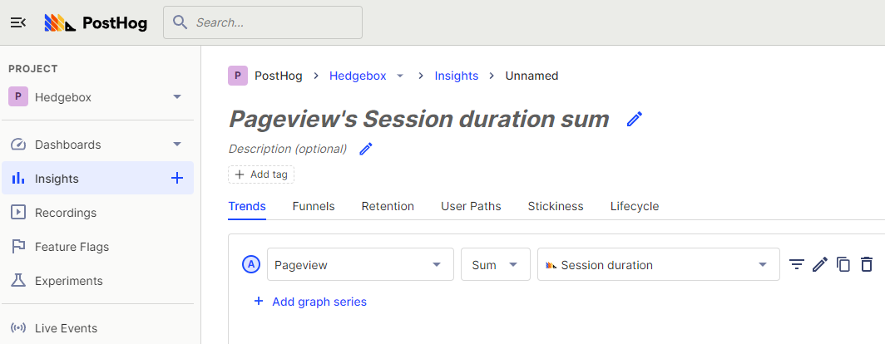
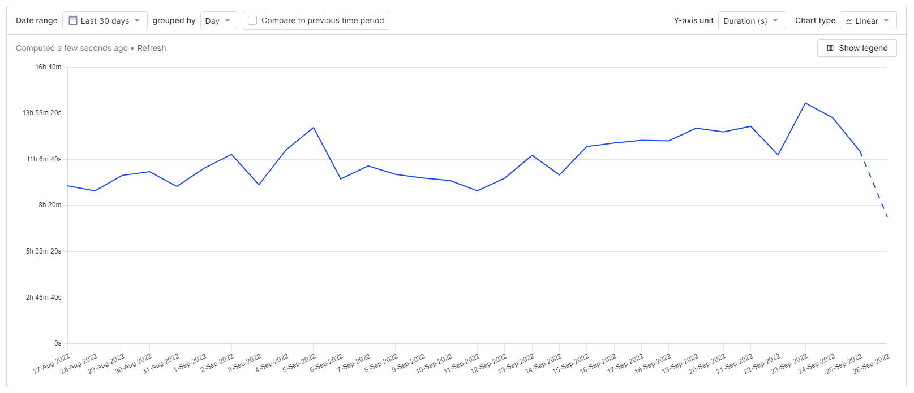
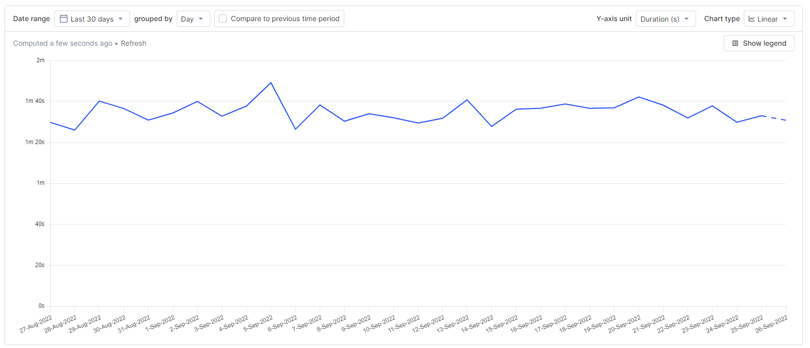
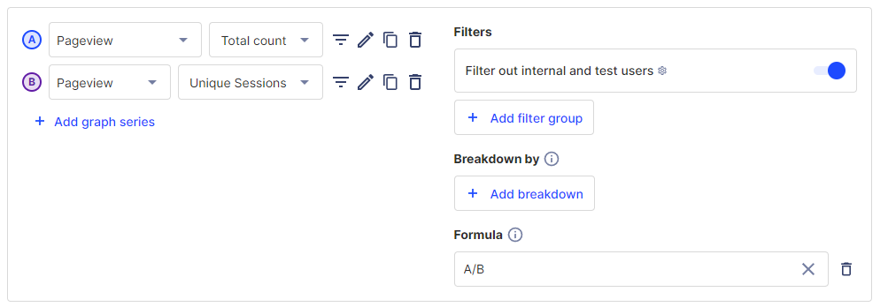

> 
Open this tutorial in PostHog and follow along step-by-step!
 <CallToAction href="https://app.posthog.com/#panel=docs:/tutorials/session-metrics" size="sm" className="mt-auto self-start sm:w-auto !w-full">Launch tutorial</CallToAction>

Analyzing where users spend their time in your product is vital for understanding which features they value most. There are numerous ways to do this, but one of the most common is tracking metrics like time on site, average session duration, and pages per session. 

PostHog defines a session as a set of events grouped to try to capture a single "use" of your product. Each session includes a duration between the first and last event. We get session data from our [snippet](/docs/getting-started/install?tab=snippet), [JavaScript library](/docs/libraries/js), or ][mobile SDKs](/docs/libraries/ios). For more information about sessions, see our [docs](/docs/data/sessions). 

In this tutorial, we will use sessions to calculate and visualize a variety of session and time-based metrics like time on site and average session duration.

## Prerequisites

To follow this tutorial along, you need to have:

1. **[Deployed PostHog](/docs/getting-started/cloud)**.
2. Installed **[posthog-js](/docs/integrate/client/js)** or added the **[PostHog snippet](/docs/integrate/client/js)** to your site.

## Time on site

To start calculating time-based insights you first must go to insights and create a new insight. Once in, choose pageview as your event, and aggregate the sum of session duration.

Once you modify the graph to your liking, by choosing a date range and setting the Y-axis unit to `Duration (s)`, you have a nice graph of the sum of time on site over time.

This might be useful for getting a rough idea of the usage of our whole product over time but becomes more useful as you break it down. You can do this by filtering the data. For example, you can filter for sessions by section of your product or site such as pricing or signup.

> **Calculating time on page**: PostHog doesn't keep track of how long users spend on individual pages, only entire sessions. To calculate time on page, you can either implement a custom pageleave event (like we do in [how to capture scroll depth](/tutorials/scroll-depth)) that contains the time a user spent on a page, or calculate the time between a pageview and a subsequent pageview or pageleave event (like we do in our [how to calculate time on page](/tutorials/time-on-page) tutorial).

## Average session duration

Now that you visualized time on site, we can visualize session-based metrics based on averages. Averages provide better insight into how individual users spend their time, compared to the sum of time spent metrics shown in the previous section.

We’ll start with the average session duration. It can be calculated by again choosing pageview, but now aggregating by average session duration. Ensuring Y-axis is set to `Duration (s)` creates a graph of average session duration. 

In many ways, average session duration is more useful than the sum or total time spent on site. A large number of sessions can increase total time on site, which is driven by brand, marketing, and distribution. Average session duration is more driven by the quality and content of the pages and application, which engineers and product managers have more control over. 

Once you calculate average session duration, you can filter the series to get information based on source or referring domain, device type, active feature flags, cohorts, and more. All of these filters help you get closer to the actual user behavior you are trying to understand.

## Pages per session

Another useful average to visualize is the average number of pages per session. To do this set up two graph series, one for total pageview count and a second for pageview unique sessions. You can then use the `A/B` formula to calculate the number of pages per session. 

> **Tip:** Be sure to set the Y-axis unit in your chart back to `None`.

Again, you can filter these series to better identify the types of users you want, or to provide details on sections and funnels on our site. Clicking on the charts will provide a list of the users included in that data. If there is a [session recording](/manual/recordings) available for that user session, there will be a link for you to go directly watch it.

### Understanding how users spend their time

These metrics should give you a better understanding of how users are spending their time in your product and site. Time on site, average session time, and pages per session all provide insight into the experience of your product or the quality of your content. Making improvements to product or content quality helps improves these metrics.

To dive deeper into these insights, you can use [session recordings](/product/session-recording) to watch exactly how users are interacting with your product or the toolbar to use [heatmaps](/product/heatmaps) to understand popular areas on pages.
