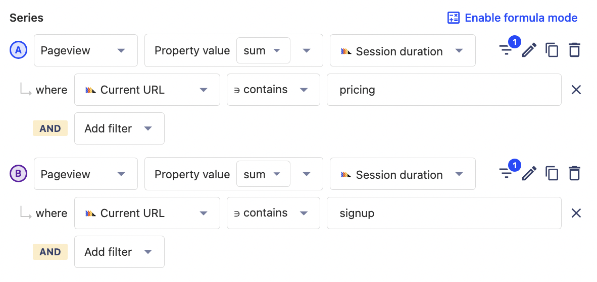
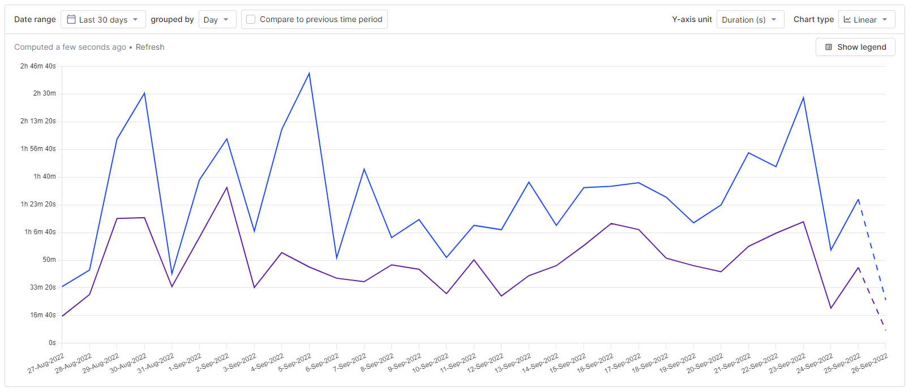
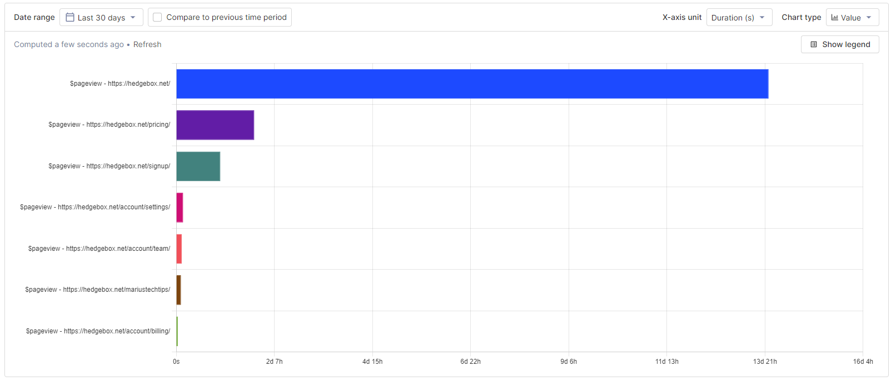

- **Level:** Easy 🦔
- **Estimated reading time:** 5 minutes ☕️

Understanding how users spend their time in your product is a key part of understanding their behavior. Where users spend their time informs where your product development focus should be. Common metrics that reflect how users spend their time in your product include time on site, time on page, average session duration, and pages per session. 

These metrics can be calculated and visualized in PostHog by making use of sessions and their durations. We define a session as a set of events grouped to try to capture a single "use" of your product. Each session includes a duration between the first and last event, which we’ll heavily rely on. For more basic information about session data, see our [product manual](https://posthog.com/manual/sessions). 

In this tutorial, we will use sessions to calculate and visualize a variety of session and time-based metrics like time on site and average session duration.

### Prerequisites

To follow this tutorial along, you need to have:

1. **[Deployed PostHog](https://posthog.com/docs/deployment)**.
2. Installed **[posthog-js](https://posthog.com/docs/integrate/client/js)** or added the **[PostHog snippet](https://posthog.com/docs/integrate/client/js)** to your site.

### Time on site

To start calculating time-based insights you first must go to insights and create a new insight. Once in, choose pageview as your event, and aggregate the sum of session duration.

Once you modify the graph to your liking, by choosing a date range and setting the Y-axis unit to `Duration (s)`, you have a nice graph of the sum of time on site over time.

This might be useful for getting a rough idea of the usage of our whole product over time but becomes more useful as you break it down. You can do this by filtering the data. For example, you can filter for sessions by section of your product or site such as pricing or signup.

### Time in sections

To visualize time in sections, add a filter where the `Current URL` contains the section URL you want. In this case, it will be pricing and signup. Once one is set up, use the copy button and then change the `Current URL` value. This makes it quick to add multiple sections to the graph.

> **Tip:** Filter out pages you don’t want to be included, such as your main application on queries related to you marketing site.

Once done, you’ll have a graph of session duration for the signup and pricing sections. Looks like people are spending a lot more time on pricing pages than signup, but remember that this is the *sum of session duration*, averages will be different.

### Time on pages

If you want to know exactly what pages people are spending the most time in, you can *breakdown by* `Current URL` . Resetting the filters and switching the chart type to `Value` gives you a visual that looks like this:

These insights and visualization might help you reprioritize pages and sections people are spending more time on. Depending on the context, high time on a page could mean the page is important, confusing, or not optimized. [Session recordings](https://posthog.com/product/session-recording) can help you find out if you don’t know.

### Average session duration and pages per session

Now that you visualized time on site, time in sections, and time on page, we can visualize some session-based metrics based on averages. Averages provide better insight into how individual users spend their time compared to the sum of time spent metrics calculated and visualized in the last section.

We’ll start with the average session duration. It can be calculated by again choosing pageview, but now aggregating by average session duration. Ensuring Y-axis is set to `Duration (s)` creates a graph of average session duration. 

In many ways, average session duration is more useful than the sum or total time spent on site. A large number of sessions can increase total time on site, which is driven by brand, marketing, and distribution. Average session duration is more driven by the quality and content of the pages and application, which engineers and product managers have more control over. 

Once you calculate average session duration, you can filter the series to get information based on source or referring domain, device type, active feature flags, cohorts, and more. All of these filters help you get closer to the actual user behavior you are trying to understand.

### Pages per session

Another useful average to visualize is the average number of pages per session. To do this set up two graph series, one for total pageview count and a second for pageview unique sessions. You can then use the `A/B` formula to calculate the number of pages per session. 

> **Tip:** Be sure to set the Y-axis unit in your chart back to `None`.

Again, you can filter these series to better identify the types of users you want, or to provide details on sections and funnels on our site. Clicking on the charts will provide a list of the users included in that data. If there is a [session recording](https://posthog.com/manual/recordings) available for that user session, there will be a link for you to go directly watch it.

### Understanding how users spend their time

These metrics should give you a better understanding of how users are spending their time in your product and site. Time on site, time in sections, average session time, and pages per session all provide insight into the experience of your product or the quality of your content. Making improvements to product or content quality helps improves these metrics.

To dive deeper into these insights, you can use [session recordings](https://posthog.com/product/session-recording) to watch exactly how users are interacting with your product or the toolbar to use [heatmaps](https://posthog.com/product/heatmaps) to understand popular areas on popular pages.

<NewsletterTutorial compact/>
