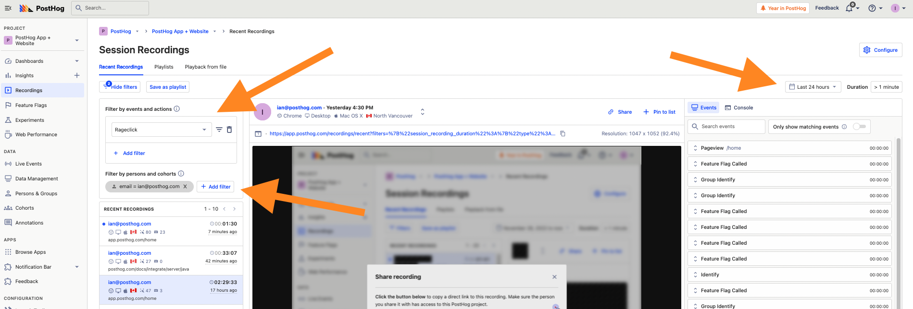
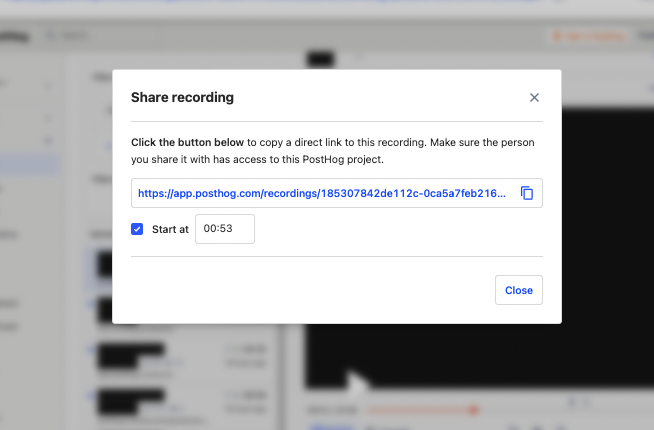
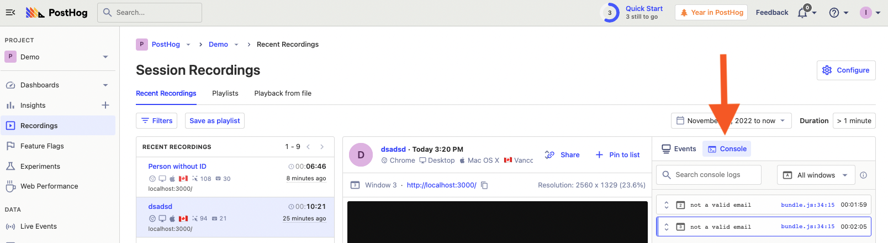
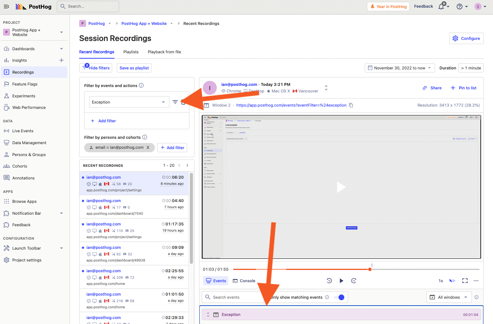

On top of being useful for understanding user behavior, session replays help solve problems with your product. You can use them to discover issues, understand why they are happening, and work to fix them. In this way, session replays help you provide a better support experience to users.

## Finding relevant sessions for users needing support

When a user reports an issue, a session replay turns a long conversation into a short recording viewing. This is because you can see what actions they took, rather than them explaining their situation. It also provides easy access to relevant data and properties (like OS, browser, and custom properties). This helps your team diagnose issues faster.

To find recordings from a specific user that needs support, you can filter for a person or event on the Sessions Recording page. For example, to find a recent session replay where my account had a problem, I could filter for sessions:
- in the last 24 hours 
- which has the `Rageclick` event
- from a person with my email address.



Once you’ve found a relevant recording, click the toggle above the events to show the ones matching your filters (in this case, `Rageclick`) to go straight to the issue. You can also search for other events within the session (such as [errors](/tutorials/sentry-plugin-tutorial)). This shows you those events in the recording, the behavior before or after, and the related person and event data.

Finding a session replay connected to the issue saves you time in multiple ways:
- You don’t have to go back and forth with the user for details.
- You get the session and data context which enables you to respond better.
- If it is a bug, you have the steps to debug and recreate to easily share with your team.

### Sharing recordings as a support team

Once you’ve found a session replay related to an issue, you can share a link with your teammates (including a timestamp). This helps them access the recording and details (like the person and their properties) quickly. Just click the share button at the top of the recording viewer to open this modal.



You can share these links on platforms you use to coordinate user support, such as Zendesk, Slack, GitHub, HubSpot, and Salesforce. This is valuable context for other people supporting that user. It is also useful for development teams who require data on the user and “steps to recreate the issue” so they can solve the issue. It is a simple, useful connection between your support tools and PostHog.

## Combining error monitoring and session replay

You can combine PostHog’s suite of product tools for a better support experience through [real user monitoring](/blog/real-user-monitoring). Because errors hurt user experience, capturing and monitoring them is vital to triaging and resolving them. Using custom event capture and integrations enables PostHog to capture errors. You can then use that error data to analyze session replays and provide better support.

The most basic way to do this is to send custom error events in problem areas using a capture call. In an extremely basic form, it looks like this:

```js
function get_pizza() {
  return 'pineapple'
}

try {
  let pizza = get_pizza()
  if (pizza === 'pineapple') throw "no pineapple on pizza"
}

catch(err) {
  posthog.capture('error', { details: err });
}
```

You could then use the `error` event to understand their frequency, details, and context in session replays. Every language, library, framework, and project has a different way of handling errors, and the customizability of PostHog can fit all of them.

### Console logs in recordings

PostHog also includes the option to record console logs in session replays. This is useful for getting errors that log to the console. To turn this on, go to Project Settings and under recordings toggle “Capture console logs.” This adds console logs (as well as errors and warnings) to a separate tab on the recordings page.



Within a recording, you can search for the specific console logs you’re looking for, and see the details about them (such as strings or objects they include).

### Setting up and using Sentry to get error monitoring data

A more automated way of getting error data into PostHog is using our Sentry integration. Sentry is an application performance and error monitoring product that integrates with your code to capture errors and provide details about them (like the stack trace).

Our two-way integration sends person data related to an error to Sentry and an `$exception` event to PostHog with a link to Sentry. This enables you to combine Sentry’s error monitoring tools with PostHog’s product tools for a better support experience.

To set up Sentry, initialize it along with PostHog and call the PostHog Sentry integrations.

<MultiLanguage>

```js
import posthog from 'posthog-js'
import * as Sentry from '@sentry/browser'

posthog.init('<ph_project_api_key>')

Sentry.init({
    dsn: '<your Sentry DSN>',
    integrations: [new posthog.SentryIntegration(posthog, 'your organization', project-id)],
})
```

```python
import sentry_sdk
from posthog.sentry.posthog_integration import PostHogIntegration

PostHogIntegration.organization = "orgname"

sentry_sdk.init(
    dsn="https://examplePublicKey@o0.ingest.sentry.io/0",
    integrations=[PostHogIntegration()],
)

# Also set `posthog_distinct_id` tag
from sentry_sdk import configure_scope

with configure_scope() as scope:
    scope.set_tag('posthog_distinct_id', 'some distinct id')
```

</MultiLanguage>

Once set up, this creates exception events with the properties `Sentry URL` (with a link to the details in Sentry) and `Sentry tags` (with a link to the person and recording in PostHog). You can use these events to filter session replays further, combining them with the error data Sentry captures to get the full details about your issues.



Doing this enables you to further improve the support experience for users, especially technical ones. It speeds up the debugging and triaging process for your team, giving you data and details on what is going wrong. Ultimately, it enables the product to be continually improved and fixed faster, which leads to a higher quality overall product.

## Further reading

- [How to use filters + session replays to understand user friction](/tutorials/filter-session-recordings)
- [How to correlate errors with product performance using Sentry](/tutorials/sentry-plugin-tutorial)
- [How to add session replays to Zendesk](/tutorials/zendesk-session-replays)
