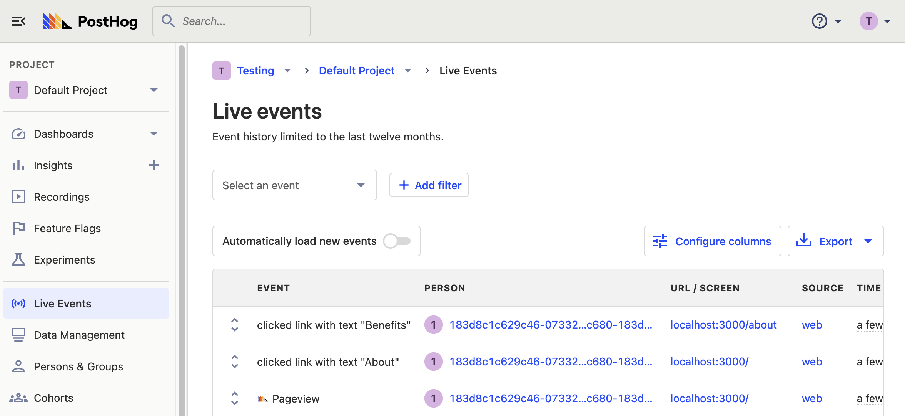
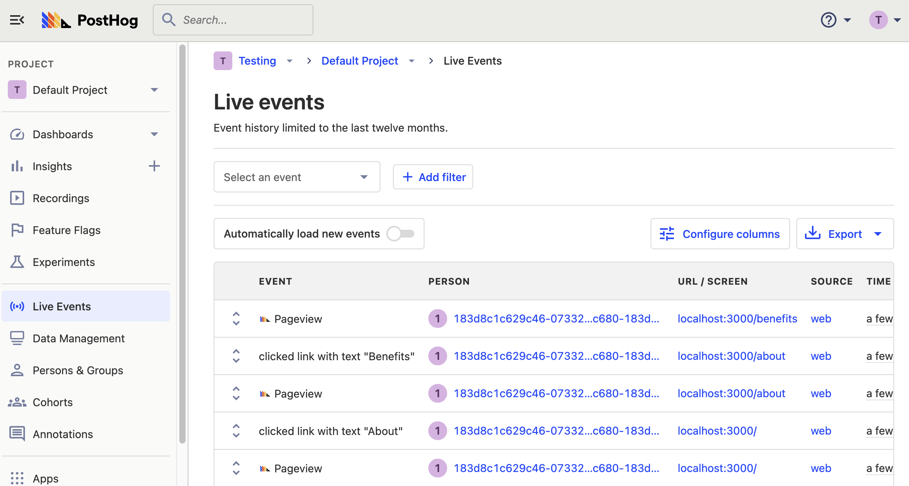

_Estimated reading time: 12 minutes_ ☕☕

A single page application (or SPA) is an app that lives on a single page. Users can navigate around the app and change the content without having to load new pages. Single page apps rely heavily on caching and components like loading screens compared to other types of apps like progressive web apps.

Single page apps come with some unique challenges. A big one is that since pages don’t need to be reloaded to change, pageviews are often not captured properly. Developers of single page apps need to set up custom events to trigger pageviews at the right time.

In this tutorial, we’ll be creating a single page app, setting up PostHog, then providing multiple ways to capture pageviews. This includes triggering events on page renders, using the router, and watching for component visibility on scroll.

> **Note:** although we’ll be using React for this tutorial, it is relevant to other web SPA frameworks (like Vue, Svelte, or Meteor), mobile apps (Android, iOS), and apps with non-standard navigation. You can find our full list of [client libraries here](/docs/integrate#client-libraries).
> 

## Setting up a single page app in React

We’ll start by setting up a basic React app with a router and a couple of pages. To start, go to the command line (or terminal), create a folder for our project, then create the react app (named `spa_client`), and start the app. 

```bash
mkdir spa_pageview_app
cd spa_pageview_app
npx create-react-app spa_client
cd spa_client
npm start
```

If successful, going to `localhost:3000` should show you the React logo.

Next, we’ll install the packages we need for the router and PostHog. Back in your terminal install `posthog-js` and `react-router-dom`

```bash
npm install --save posthog-js
npm install --save react-router-dom
```

Once we’ve done this, we can start to work on the content of the application, and routing between each of the pages.

### Setting up the router and pages

First, in `src/index.js` we’ll import `BrowerRouter` and then wrap our app in it. The `BrowserRouter` will turn our component into a single page app so we can add multiple pages. Your `index.js` file should look like this (we’ve removed some unnecessary code like `css` and `webVitals` for now):

```js
// src/index.js
import React from 'react';
import ReactDOM from 'react-dom/client';
import App from './App';
import { BrowserRouter } from 'react-router-dom'; // new

const root = ReactDOM.createRoot(document.getElementById('root'));
root.render(
  <React.StrictMode>
    <BrowserRouter> {/* new */}
      <App />
    </BrowserRouter>
  </React.StrictMode>
);
```

Next, we’ll create a couple of basic pages as functions. Create `Home.js`, `About.js`, and `Benefits.js` all with a basic format like this (replace Home with the other names):

```js
// src/Home.js
export function Home() {
  return (
    <>
      <h1>Home</h1>
      <p>Welcome to the Home page</p>
    </>
  );
}
```

Once you’ve done this, go to `App.js` and get rid of the boilerplate. We are going to add our routes and navigation to each of the routes here. You’ll need to import each of the pages we’ve created as well as `Routes`, `Route`, and `Link` from `react-router-dom`. We’ll add each of the pages as a route and a link in our nav. Once you’ve done all of this, your `App.js` file should look like this:

```js
// src/App.js
import { Route, Routes, Link } from 'react-router-dom';
import { Home } from './Home';
import { About } from './About';
import { Benefits } from './Benefits'

function App() {
  return (
    <>
      <nav>
        <ul>
          <li><Link to="/">Home</Link></li>
          <li><Link to="/about">About</Link></li>
          <li><Link to="/benefits">Benefits</Link></li>
        </ul>
      </nav>
      <Routes>
        <Route path="/" element={<Home />} />
        <Route path="/about" element={<About />} />
        <Route path="/benefits" element={<Benefits />} />
      </Routes>
    </>
  );
}

export default App;
```

Once done, checking our local site again should give us a single page app with a few pages. Although basic, it’ll help us illustrate what you need to do to set up tracking and pageview events correctly.

### Setting up PostHog

Our last step before setting up correct pageview tracking in this SPA is setting up PostHog. To do this, go back to `index.js`, import PostHog (we installed it earlier), and initialize it using your project key and host.

```js
// index.js
import React from 'react';
import ReactDOM from 'react-dom/client';
import App from './App';
import { BrowserRouter } from 'react-router-dom';
import posthog from 'posthog-js'; // new

posthog.init( // new
	'<ph_project_api_key>', { api_host: '<ph_instance_address>' }
)

const root = ReactDOM.createRoot(document.getElementById('root'));
root.render(
  <React.StrictMode>
    <BrowserRouter>
      <App />
    </BrowserRouter>
  </React.StrictMode>
);
```

Once we’ve initialized PostHog, autocaptured events should start flowing into our instance. We’ll also see that we have some `pageview` events, but clicking our nav links doesn’t trigger `pageview` events.



Because this is a single page app, navigation does not trigger new `pageview` events. You see we clicked the button to go to the Benefits and About pages, but didn’t get `pageview` events for either of them. We will have to set up custom events to trigger them. In the next step, we’ll go over some ways to do this. 

## Capturing pageviews

Although autocapture does a lot we’ll have to write more code to capture pageviews in our single page app. We’ll go over a few ways of triggering the pageview events: the router, page render, and on visibility change. 

### Method 1: router

The first method is using the router. The router allows us to add functions that run every time the page changes. With `react-router-dom`, we can use `useLocation` for this. We’ll add a location variable we get from the router, and run a `useEffect` to trigger a pageview every time it changes.

This is what it looks like in `App.js`

```js
// src/App.js
import { Route, Routes, Link, useLocation } from 'react-router-dom'; // new
import { Home } from './Home';
import { About } from './About';
import { Benefits } from './Benefits'
import * as React from 'react'; // new
import posthog from 'posthog-js'; // new

function App() {
  let location = useLocation(); // new

  React.useEffect(() => { // new
    posthog.capture('$pageview')
  }, [location]);

  return (
    <>
      <nav>
        <ul>
          <li><Link to="/">Home</Link></li>
          <li><Link to="/about">About</Link></li>
          <li><Link to="/benefits">Benefits</Link></li>
        </ul>
      </nav>
      <Routes>
        <Route path="/" element={<Home />} />
        <Route path="/about" element={<About />} />
        <Route path="/benefits" element={<Benefits />} />
      </Routes>
    </>
  );
}

export default App;
```

Now when we move between pages, we’ll trigger pageviews on each.



> **Note:** other frameworks or languages have ways to “listen” for the changes in the router that we use to trigger a pageview event. For example, in Vue, you can set up a `watcher` and in Svelte, you can use the `navigating` store.
> 

### Method 2: page render

A more manual way to trigger pageview events is by setting them up to trigger every time a page is rendered. You may want to do this if you have a smaller number of pages and only want some of them to trigger pageview events. 

To set this up, add a `useEffect` hook to the page we want to capture. It should look like this:

```js
// src/Benefits.js
import posthog from 'posthog-js'; // new
import React from "react"; // new

export function Benefits() {
  React.useEffect(() => { 
    posthog.capture('$pageview') // new
  }, [])
  return (
    <>
      <h1>Benefits</h1>
      <p>Welcome to the Benefits page</p>
    </>
  );
}
```

Once this is done on each of the pages you want to trigger events, rendering that page will create a `pageview` event.

### Method 3: visibility

Many single page apps navigate through scrolling. As users scroll through the app new content, sections, and components are shown to them. This isn’t automatically captured with PostHog, but we can set up a way to capture it. We’ll do this by checking if the component is visible and triggering a pageview event if so.

There are a few ways to trigger pageview events based on visibility, but we are just going to pick a simple one for this tutorial. We could use  [IntersectionObserver](https://developer.mozilla.org/en-US/docs/Web/API/Intersection_Observer_API) or set up [JQuery](https://stackoverflow.com/questions/123999/how-can-i-tell-if-a-dom-element-is-visible-in-the-current-viewport) to track when elements are in the viewport, but we will just install a [react-visibility-sensor](https://github.com/joshwnj/react-visibility-sensor) component. To start, we’ll install the module.

```bash
npm install react-visibility-sensor
```

Next, we’ll modify our `App.js` page a bit, so it is one long, scrollable page. We’ll add some tall `divs` to split up the page.

```js
// src/App.js
import { Home } from './Home';
import { About } from './About';
import { Benefits } from './Benefits'

function App() {
  return (
    <>
      <Home />
      <div style={{height: '50rem'}} />
      <About />
      <div style={{height: '50rem'}} />
      <Benefits />
    </>
  );
}

export default App;
```

Finally, we’ll wrap each of the components in a `VisibilitySensor` and have the change trigger a pageview event.

> **Note:** you can trigger whatever event you want, such as `screenview`, if you didn’t want to combine it with the autocaptured pageview events.
> 

```js
// src/App.js
import { Home } from './Home';
import { About } from './About';
import { Benefits } from './Benefits'
import VisibilitySensor from 'react-visibility-sensor'; // new
import posthog from 'posthog-js';

function App() {
	function onChange (isVisible) { // new
    if (isVisible) posthog.capture('$pageview');
  }
  return (
    <>
      <VisibilitySensor onChange={onChange}>
        <Home />
      </VisibilitySensor>
      <div style={{height: '50rem'}} />
      <VisibilitySensor onChange={onChange}>
        <About />
      </VisibilitySensor>
      <div style={{height: '50rem'}} />
      <VisibilitySensor onChange={onChange}>
        <Benefits />
      </VisibilitySensor>
    </>
  );
}

export default App;
```

Scrolling the app will now trigger a pageview every time one of the components is visible. 

## Next steps

Now that we are capturing pageviews, we can figure out how users move around our app. For example, we could analyze and optimize our conversion funnel. [See a tutorial on how here](https://posthog.com/tutorials/funnels).

We can also track more events than just pageviews. The [event tracking guide](https://posthog.com/tutorials/event-tracking-guide) will provide you with all the details on how.

For more advanced PostHog users, you can use all of your new pageview data to help you build [an AARRR dashboard](https://posthog.com/blog/aarrr-pirate-funnel).
