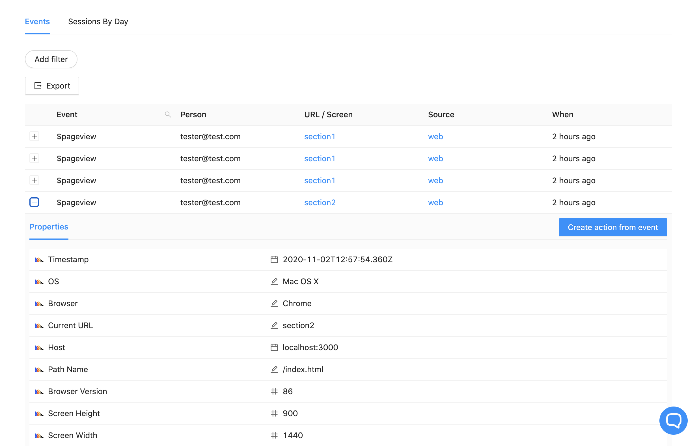

_Estimated reading time: 8 minutes_ ☕☕

If you have a Single Page Application (SPA), and have been thinking about how to track it using PostHog - look no further. 

This tutorial will guide you through multiple methods you can use to ensure you capture navigation in your SPA website. 

### Is this tutorial for me?

This tutorial is aimed at SPAs, which are websites that only load one time, with all content either being loaded at once or dynamically as the user browses (without a page refresh). However, it may also provide relevant insights for:

- Tracking mobile apps
- Tracking apps/Websites with non-standard navigation
- Those looking to capture additional `$pageview` events

### Prerequisites

To follow this tutorial along, you need to:

1. Have [deployed PostHog](/docs/deployment).
1. Be using our [JavaScript Library](/docs/integrate/client/js) to track your SPA

### Tracking navigation changes in SPAs

If you use PostHog to track a traditional website, our [autocapture](/docs/integrate/client/js#autocapture) feature is great at providing insight into how users navigate your page, since `$pageview` events are captured automatically on page loads. However, if you have an SPA, PostHog will only capture a `$pageview` once, since the page only loads one time. 

As such, in order to accurately capture navigation in SPAs, we need to manually send events, since autocapture is not enough. 

This tutorial will now take you through various methods that use events to track navigation, which can be used by themselves or in combination with the others.

### Navigation via clicks

The most straightforward way to track navigation in SPAs is to set triggers for clicks that coordinate the navigation and use them to determine what "page" the user is now on.

Consider a webpage where clicking on the navigation takes the user to another location on the same page, for example. This can easily be done by adding element IDs as values for the `href` property on links, like so:

```html
<a id='nav-about-us' href='#about-us'>About Us</a>
```

Clicking the link above will take the user to the element with ID `about-us`, working as navigation. 

Thus, we can track that by listening for the click event on that element, and subsequently capturing a PostHog `$pageview` when the event is triggered. In Vanilla JS, this would look something like this:

```js
document.getElementById('nav-about-us').addEventListener('click', () => {
    posthog.capture('$pageview')
})
```

Since PostHog captures the 'Current URL' property from `window.location.href` and `a` tags pointing to the same page update that value, the event `$pageview` will be automatically populated with the correct URL, such as `mywebsite.com/#about-us`.

As such, to track navigation via clicks, one simply needs to set event listeners for the all the relevant clicks and capture a `$pageview` on those events. Provided that the clicks change the URL (`window.location.href`), this method will work with no additional tweaks needed. However, we will still go through how you can update the URL yourself.

### Tracking visible elements on the page

While tracking pageviews from clicks is a good first step, the approach is not ideal for a lot of SPAs. 

Tracking navigation via clicks only works perfectly if the _only way_ users can navigate through your application is via clicking. However, for many SPAs, scrolling is another way to navigate via sections, so that the user can either click on the navbar items or scroll through the page in order to access other sections.

In this case, clicks are not enough: we need to track what elements are visible on the page every time the viewport changes, and capture page views when new sections become visible (i.e. were navigated to). 

To do so, we need a few things.

#### Checking if an element is visible to the user

To check if an element is visible to the user, we can use the following helper function:

```js
const isElementInViewport = (el) => {
    const rect = el.getBoundingClientRect()
    
    return (
        rect.top >= 0 &&
        rect.left >= 0 &&
        (   
            window.innerHeight || 
            document.documentElement.clientHeight
        ) >= rect.bottom &&
        (
            window.innerWidth || 
            document.documentElement.clientWidth
        ) >= rect.right
    )
}
```

The function above takes a reference to a DOM element as a parameter and returns `true` if the element is visible (and `false` otherwise). It does so by checking the coordinates of the rectangle that bounds the element against the user viewport to determine if the element is visible in the user's screen ([more info](https://stackoverflow.com/questions/123999/how-can-i-tell-if-a-dom-element-is-visible-in-the-current-viewport)).

We will be using this function to periodically check if certain elements are visible as the user goes through the page.

#### Determining elements that represent new sections

The next step is to decide what elements in our SPA constitute a new section/screen. We will use these to trigger pageviews when they are visible for the user.

For example, these could be section heders, as well as wrapping `div` tags. This will vary from website to website, and you need to decide for yourself when _exactly_ the page view should be triggered. For example, do you want to trigger a `$pageview` when the section is partly visible or entirely covering the screen? 

Once you have determined the elements to use, you can specify them in a structure like this:

```js
let elementsToTrack = [
    {
        name: "section1",
        ref: document.getElementById('section1'),
        visible: true
    },
    {
        name: "section2",
        ref: document.getElementById('section2'),
        visible: false
    },
]
```

This structure will be useful for the next step, but you can of course customize this entire solution as you wish.

#### Listening for changes to the window to trigger page views

With the structure in place, let's now actually listen for changes and capture events.

First, let's write up a handler that checks if our elements are visible and captures a pageview if they are:

```js
const visibilityChangeHandler = () => {
    
    // Loop through the relevant elements
    for (let el of elementsToTrack) {

        // Check if the element is visible
        let visible = isElementInViewport(el.ref)

        // Check diff to prevent useless triggers
        if (visible !== el.visible) {

            // Update the element visibility state
            el.visible = visible

            // Capture a pageview with PostHog
            if (visible) {
                posthog.capture(
                    '$pageview', 
                    { section: el.name, $current_url: el.name }
                )
            }
        }
    }
}
```

The comments in the code provide context as to what each line is doing, but, essentially, when the handler is triggered, we check the elements we care about for _changes_ in visibility, update the state, and capture a `$pageview` if the change was from `false -> true` only. 

You could also add some more complex logic here, such as capturing a pageview when one element stops being visible and another one becomes visible. 

Additionally, you also have choices when calling `posthog.capture`. You can either set your custom property to track the current screen (`section` in the example), or override PostHog's default `$current_url` prop (or both). 

If you override the default property, your events table will look like this:



Instead of a the automatically captured URL, your events table will show your custom value under 'URL / Screen'.

Additionally, you will also be able to use our [paths](/docs/user-guides/paths) feature with your custom URLs.

> **Note:** If your page does not refresh but the URL changes with navigation, PostHog's default 'Current URL' may still be useful. Otherwise, if your URL _never_ changes, you should definitely override the prop with your own values - just make sure to follow a good naming system!

#### Setting the relevant listeners

Finally, we need to listen for the relevant changes to window that might lead to a new page view:

```js
if (window.addEventListener) {
    addEventListener('scroll', visibilityChangeHandler, false)
    addEventListener('resize', visibilityChangeHandler, false)

    // Uncomment next lines to capture pageviews on page load
    // addEventListener('DOMContentLoaded', handler, false);
    // addEventListener('load', visibilityChangeHandler, false);
}
```

Here, we are listening for window events that may cause a new section to come into view, which are scrolling and resizing. Since PostHog autocapture already captures a `$pageview` when the page loads, you don't need to capture another one immeediately. 

However, if you have reason to do so, you can listen for window `load` events and/or `DOMContentLoaded` events. The latter triggers when the DOM structure is ready (i.e. HTML and CSS loaded), whereas the former triggers when images and frames finish loading.

#### Full snippet

Putting everything together, here's what the final snippet looks like (without comments):

```js
let elementsToTrack = [
    {
        name: "section1",
        ref: document.getElementById('section1'),
        visible: true
    },
    {
        name: "section2",
        ref: document.getElementById('section2'),
        visible: false
    },
]

const isElementInViewport = (el) => {
    const rect = el.getBoundingClientRect()
    
    return (
        rect.top >= 0 &&
        rect.left >= 0 &&
        (   
            window.innerHeight || 
            document.documentElement.clientHeight
        ) >= rect.bottom &&
        (
            window.innerWidth || 
            document.documentElement.clientWidth
        ) >= rect.right
    )
}

const visibilityChangeHandler = () => {
    for (let el of elementsToTrack) {
        let visible = isElementInViewport(el.ref)
        if (visible !== el.visible) {
            el.visible = visible
            if (visible) {
                posthog.capture(
                    '$pageview', 
                    { section: el.name, $current_url: el.name }
                )
            }
        }
    }
}

if (window.addEventListener) {
    addEventListener('scroll', visibilityChangeHandler, false)
    addEventListener('resize', visibilityChangeHandler, false)
}
```

This snippet is written in Vanilla JS and can be included at the bottom of your page's `body` to track navigation.

Additionally, if you are using a web framework like React, you can either set this logic on a `useEffect` hook or `componentDidMount` call on a wrapper/layout component, as well as you can also track navigation based on when certain components render. 


#### Additional methods

The methods presented here are examples of options to track SPAs with PostHog. However, with an understanding of how to go about setting up tracking, you can also explore other methods.

Given the wide variety of available JavaScript events, you can also set up your navigation tracking in other ways, such as through `mouseover` events, for example. 

In addition, you can also send your own [custom events](/docs/integrate/client/js/#capture) to track navigation if you prefer to keep PostHog's default `$pageview` untouched. You could, for example, create a `screenview` event, passing any other properties you wish to include with it, like so:

```js
posthog.capture(
    'screenview', 
    { 
        screenName: 'About Us', 
        route: '#about-us', 
        navigationMethod: 'scroll' 
    }
)

```

Essentially, the key steps to keep in mind for tracking navigation in SPAs are:

1. Identify what counts as a new screen and how to account for it (e.g. relevant elements and triggers)
1. Capture a pageview or custom event to track navigation
1. Set your own properties and/or override `$current_url` to track pages as you like

Following these steps, you can track navigation on your app just like any other website, ensuring you capture exactly how users are using your product. 
