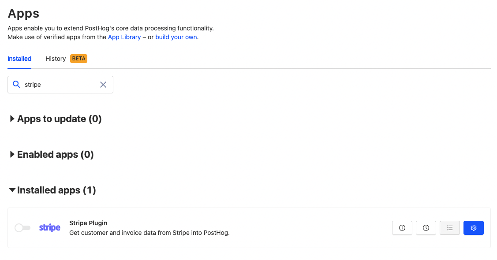

Stripe is one of the most popular payment platforms online. Connecting data from there with product data is critical for many businesses. It allows them to connect product usage with what’s keeping the product alive (revenue).

In this tutorial, we’ll show you how to get payment and revenue data from Stripe in PostHog. After that, we’ll show you some basic insights you can set up to use this data.

All you’ll need for this tutorial are [PostHog](/signup) and [Stripe](https://stripe.com/) accounts.

## Setting up the Stripe app

For this tutorial, we’ll be using the [Stripe app](https://github.com/PostHog/stripe-plugin). To find it, in your project, go to Apps and search for the “Stripe Plugin.”

Configure it by clicking the blue gear, but first, we’ll need a Stripe restricted key.

> **Note:** you can also use your Stripe secret key

To create a restricted key, you’ll need to go into the [API keys section](https://dashboard.stripe.com/apikeys) of your Stripe developer dashboard. In “[Create restricted API key](https://dashboard.stripe.com/apikeys/create),” give it a name (like “PostHog app”) and add **read** access permissions for Customers, Products, Invoices, Subscriptions, and Usage Records. Once selected, scroll to the bottom and click “Create key.” Back on your dashboard, copy the key, and head to PostHog.

In the Stripe Plugin configuration screen, paste the key into the “Your Stripe API key” field. Optionally, you can set the group type to whatever you currently use, organization is a good default if you don’t have one. Set the group type index to match the group type you choose. This is found in the API at `/api/groups_types/` or if `organization` is your first group, the group type will be `0`. Finally, choose if you want to send events even if a user isn’t found in PostHog. For maximum payment data, select `Yes`.

Once done, click Save and enable the app (click the toggle). Once you see “No results” or “Trying to save `number` new invoices…” in logs you’re ready to go.

## Testing

If you have regular transactions, you can test to ensure the flow works with those. If you don’t, you can use data from test transactions. Just make sure your restricted key is for the right mode (test vs live).

If you don’t have regular transactions, you can either run a test transaction in your development environment or [create an invoice](https://dashboard.stripe.com/invoices). Every minute, PostHog will check Stripe for new invoices (transactions) and process them.

The events from Stripe will include details like the customer’s email (as a distinct ID), the amount paid, time, and product name. We’ll be able to use these details to gain details on our business.

## Using payment data

Now that we have some payment data, we can start to develop some insights and trends from it. Some ideas:

- Total count of `Stripe Customer Subscribed`, `Stripe Invoice Paid`
- Sum of `stripe_amount_paid` for `Stripe Invoice Paid` (weekly, monthly)
- Funnel of `pageview` or `signup` to `Stripe Invoice Paid`
    - Use `utm_source` to judge sources on conversion; for example, if Google Ads vs Facebook Ads
    - Key feature events to `Stripe Invoice Paid`
- Retention of users (or organizations) who paid Stripe Invoice and continued to…
    - use the product or key features
    - pay another Stripe invoice next month (revenue retention)
- Create a cohort of churned users
    - Match persons who completed `Stripe Invoice Paid` in the last 60 days and did not complete `Stripe Invoice Paid` in the last 30 days

With some of those set up, you’ve setup Stripe and PostHog to combine product analytics with payment data. PostHog’s full suite of product tools offers you many more options for what to do with this data.

## Further reading

If you’re interested in learning more about churn rate, check out our tutorial on [how to calculate and lower churn rate](/tutorials/churn-rate).

If you need more help building our funnels for conversion, see our tutorial on [analyzing your conversion with funnels](/tutorials/funnels).

Finally, if you’re looking for more inspiration for metrics you can track in your business see our tutorial on [B2B metrics](/tutorials/metrics-tutorial) or [how our marketing team uses PostHog](/blog/posthog-marketing).
