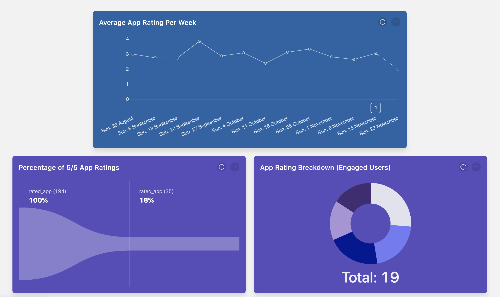

## Objective

Running a user feedback survey without any backend

## Why is this useful?

Getting user feedback is very important for improving your product. With PostHog, you run a survey without a backend, and can easily pair the survey data with all other metrics about your product.

This is especially helpful for static websites, or those using static site generators like Gatsby or Node.js.

## Prerequisites

To follow this tutorial along, you should:

1. Have [deployed PostHog](/docs/deployment) or be using PostHog Cloud.

> **Note:** PostHog surveys are best for binary or categorical data. If you want to collect arbitrary responses, PostHog might not be the most suitable tool.

## Step-by-step instructions

**1. Determine what you want to ask in your survey.**
   
PostHog is best suited for visualizing data that is categorical, binary, interval-based, or on a scale. In other words, there should be a limited set of possibilities from which an answer is chosen, rather than accepting arbitrary data.

PostHog also allows users to visualize arbitrary data from surveys, but we believe other services may be better suited for this.
    
> **Fun Fact:** At PostHog we use PostHog to run our _"Was this page helpful?"_ survey.

**2. Implement your survey frontend e.g. by using HTML forms.**

Example:

```html
<p>How would you rate your experience with this feature?</p>
<form>
	<div>
  		<select id="survey-select">
          <option value="3">Great</option>
          <option value="2">Good</option>
          <option value="1">Ok</option>
          <option value="0">Poor</option>
        </select>
  </div>
  <button onclick="submitDataToPostHog()">Submit</button>
</form> 
```

**3. Send the data as a PostHog event**

Determine an event name for the specific survey you are running and capture a PostHog event with that name when the usersubmits the survey (e.g. via a button click).

Following the example from above, we could do:

```js
const submitDataToPostHog = () => {
    // Get survey response and convert to number for better analytics
    const surveyRating = Number(
        document.getElementById('survey-select').value
    )
    // Capture an event with the rating
    posthog.capture('my_feature_reviewed', {
        rating: surveyRating
    })
    // Set a property on the respondent based on the rating
    posthog.people.set({
        survey_rating: surveyRating
    })
}
```

**4. Analyze the data in PostHog**

There's a lot you can do with survey data in PostHog, such as:

- Plotting aggregate survey data to distill feedback into insights
- Creating cohorts based on survey responses 
- Rolling out feature flags based on user preferences
- Tracking retention and conversion by user preferences 
- Getting the average, sum, maximum, and minimum values of numerical data

For example, here's a dashboard based on app ratings:



And that's it! 

You've created a mechanism for getting user feedback with just a few lines of code, no backend, and that integrates seamlessly with the rest of your product data. 
