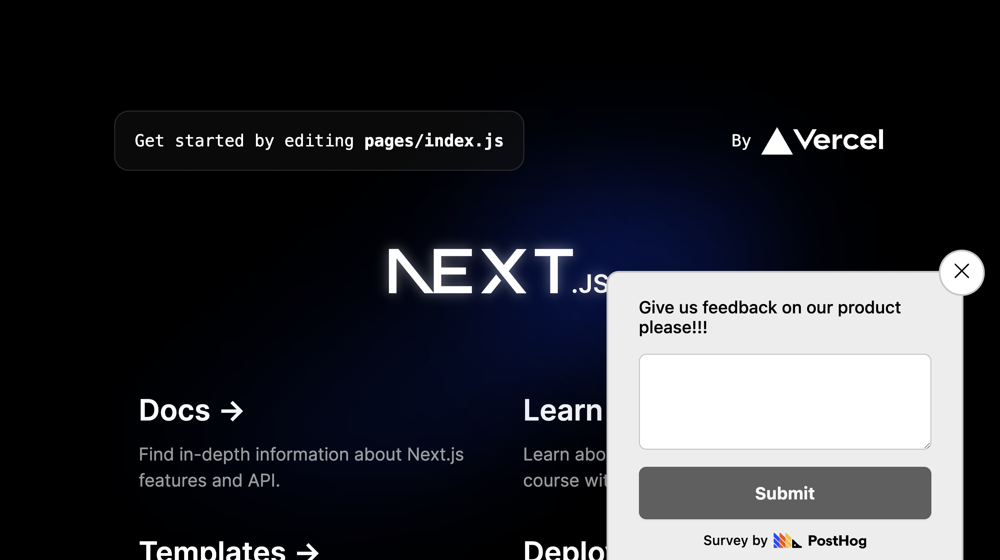
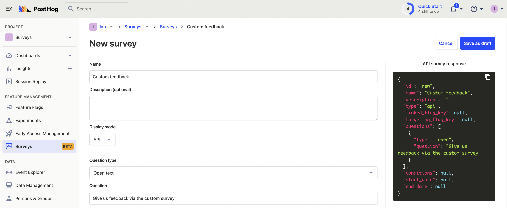
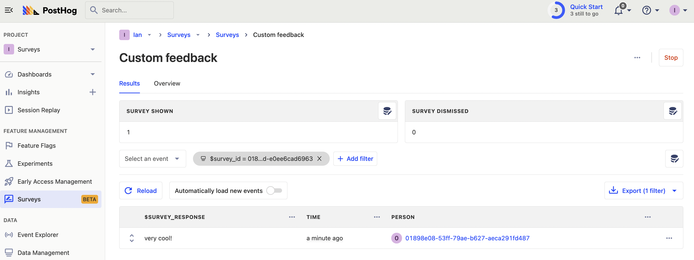

[Surveys](/docs/surveys/manual) make it easy to collect qualitative feedback fast. PostHog provides everything you need to do this, but you can also customize the implementation of the survey in your app. In this tutorial, we show you how to do this by creating a Next.js app, adding PostHog, setting up a basic survey, and then creating a completely custom survey.

> Already have an app and PostHog set up? [Skip to survey creation](#creating-a-basic-survey).

## Creating a Next.js app and installing PostHog

First, once [Node is installed](https://nodejs.dev/en/learn/how-to-install-nodejs/), create a Next.js app. Run the command below, select **No** for TypeScript, **Yes** for `use app router`, and the defaults for every other option.

```bash
npx create-next-app@latest surveys
```

Once created, go into the folder and install `posthog-js`.

```bash
cd surveys
npm i posthog-js
```

Next, go into your `app` folder and create a `providers.js` file. Create a client-side PostHog initialization using the project API key and instance address (from your [project settings](https://app.posthog.com/project/settings)). Make sure to add the `use client` directive and a check for the window. Altogether, this looks like this:

```js-web
// app/providers.js
'use client'
import posthog from 'posthog-js'
import { PostHogProvider } from 'posthog-js/react'

if (typeof window !== 'undefined') {
  posthog.init('<ph_project_api_key>', {
    api_host: '<ph_instance_address>'
  })
}

export function PHProvider({ children }) {
  return <PostHogProvider client={posthog}>{children}</PostHogProvider>
}
```

We can then import the `PHProvider` component from the `provider.js` file in our `app/layout.js` file, and wrap our app in it.

```js-web
// app/layout.js
import { PHProvider } from './providers'

export default function RootLayout({ children }) {
  return (
    <html lang="en">
      <PHProvider>
        <body>{children}</body>
      </PHProvider>
    </html>
  )
}
```

After setting this up and running `npm run dev`, your app is ready for surveys.

## Creating a basic survey

With our app and PostHog set up, we can go to the [surveys tab](https://app.posthog.com/surveys) in PostHog and enable the surveys popup if it isn’t already.


Aftwards click "Create survey." Enter a name, question, and any of the other details you want (like targeting). Once done, click "Save as draft," make sure everything looks good, then click "Launch."


In your app, you will now see your survey in the bottom right of the page. PostHog automatically tracks surveys shown, dismissed, and submitted along with the responses and user details for each.



## Creating a custom survey

You can customize how and when you show your survey. To start, create another survey, but this time set the "Display mode" as `API` instead of `popover`. Customize the details as much as you want, save it as a draft, then launch. It won’t show in your app until we write some code to implement it.



Once done, head back to the app and remove the boilerplate from `page.js` . We’ll make this the page with our survey. To start, this requires the `use client` directive, `usePostHog` context, and a `useState` hook for the survey data.

```js-web
// app/page.js
'use client'
import { usePostHog } from 'posthog-js/react'
import { useState } from 'react'

export default function Home() {
  
  const posthog = usePostHog()
  const [survey, setSurvey] = useState(null)

  return (
    <div>
      <h1>Take our survey!</h1>
    </div>
  )
}
```

We can then get the surveys for a user with PostHog’s `getActiveMatchingSurveys` method in a `useEffect`. In the callback, filter for API type surveys, set the first one in our state, and capture a `survey shown` event:

```js-web
//app/page.js
'use client'
import { usePostHog } from 'posthog-js/react'
import { useState, useEffect } from 'react'

export default function Home() {
  
  const posthog = usePostHog()
  const [survey, setSurvey] = useState(null)

	useEffect(() => {
    posthog.getActiveMatchingSurveys((surveys) => {
      const firstSurvey = surveys.filter(survey => survey.type === 'api')[0]
      if (firstSurvey) {
        setSurvey(firstSurvey)
        posthog.capture("survey shown", {
          $survey_id: firstSurvey.id,
          $survey_name: firstSurvey.name
        })
      }
    })
  }, [])
//...
```

Next, add our survey data to our page with a `<textarea>` and submit button.

```js-web
// app/page.js
//...

return (
    <div>
      <h1>Take our survey!</h1>
      {survey && (
        <div>
          <h2>{survey.name}</h2>
          <h4>{survey.questions[0].question}</h4>
          <textarea></textarea>
          <br/>
          <button>Submit</button>
        </div>
      )}
    </div>
  )
}
```

To capture responses, we need another state for value of our `<textarea>` and a function to set the state when it changes.

```js-web
// app/page.js
//...

const [textAreaValue, setTextAreaValue] = useState('')

//...

const handleTextAreaChange = (event) => {
  setTextAreaValue(event.target.value);
};

return (
  <div>
    <h1>Take our survey!</h1>
    {survey && (
      <div>
        <h2>{survey.name}</h2>
        <h4>{survey.questions[0].question}</h4>
        <textarea
          value={textAreaValue}
          onChange={handleTextAreaChange}
        ></textarea>
//...
```

Finally, set up a `survey sent` event capture when the user clicks the submit button. This needs to include the survey ID, name, and response, and should also reset the `textarea`.

```js-web
// app/page.js
//...
	const submit = () => {
    posthog.capture("survey sent", {
      $survey_id: survey.id,
      $survey_name: survey.name,
      $survey_response: textAreaValue
    })
    setTextAreaValue('')
  }

  return (
    <div>
      <h1>Take our survey!</h1>
      {survey && (
        <div>
          <h2>{survey.name}</h2>
          <h4>{survey.questions[0].question}</h4>
          <textarea
            value={textAreaValue}
            onChange={handleTextAreaChange}
          ></textarea>
          <br/>
          <button onClick={submit}>Submit</button>
        </div>
      )}
    </div>
  )
}
```

When you submit the survey with a response, it shows up in your results in PostHog.



### Dismiss and hide survey

The last thing you might want to do is enable users to dismiss the survey and prevent it from being shown repeatedly. The PostHog survey app handles this with `localStorage` storing a value that is `'seenSurvey_' + survey.id`, so we will use that as well.

First, create a function to close the survey which sets the value in `localStorage` and the state of the survey to `null`.

```js-web
// app/page.js
//...
const closeSurvey = () => {
  localStorage.setItem('seenSurvey_' + survey.id, true)
  setSurvey(null)
}
//...
```

Next, add the `closeSurvey` function to the `submit` function and a new `dismiss` function that captures a `survey dismissed` event. We also need a dismiss button on our page under our submit button.

```js-web
// app/page.js
//...

const submit = () => {
  posthog.capture("survey sent", {
    $survey_id: survey.id,
    $survey_name: survey.name,
    $survey_response: textAreaValue
  })
  setTextAreaValue('')
  closeSurvey()
}

const dismiss = () => {
  posthog.capture("survey dismissed", {
    $survey_id: survey.id,
    $survey_name: survey.name,
  })
  closeSurvey()
}

//...
<button onClick={submit}>Submit</button>
<br/>
<button onClick={dismiss}>Dismiss</button>
//...
```

This hides the survey when either are clicked, but it shows again when the page is refreshed. To fix this, we check for the `seenSurvey_` value in local storage and don’t show the survey if it’s `true`. We can do this in the `useEffect` like this:

```js-web
// app/page.js
//...

useEffect(() => {
  posthog.getActiveMatchingSurveys((surveys) => {
    const firstSurvey = surveys.filter(survey => survey.type === 'api')[0]
    const seenSurvey = localStorage.getItem('seenSurvey_' + firstSurvey.id)

    if (firstSurvey && !seenSurvey) {
      setSurvey(firstSurvey)
      posthog.capture("survey shown", {
        $survey_id: firstSurvey.id,
        $survey_name: firstSurvey.name
      })
    }
  })
}, [])
//...
```

This completes an introduction to our custom survey functionality, which you can customize further to your needs.


## Further reading

- [Get feedback and book user interviews with surveys](/tutorials/feedback-interviews-site-apps)
- [The Product-Market Fit Game](/blog/product-market-fit-game)
- [How we made something people want](/blog/making-something-people-want)