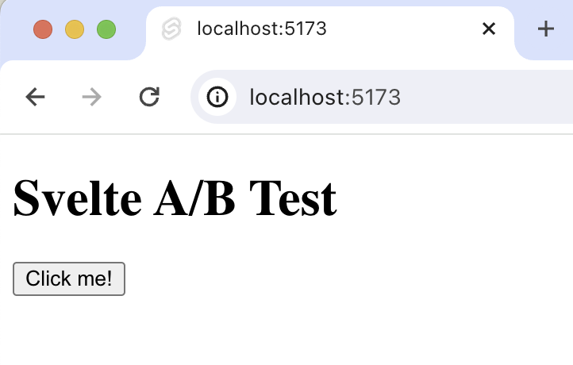

import { ProductScreenshot } from 'components/ProductScreenshot'
export const EventsInPostHogLight = "https://res.cloudinary.com/dmukukwp6/image/upload/posthog.com/contents/images/tutorials/svelte-ab-tests/events-light.png"
export const EventsInPostHogDark = "https://res.cloudinary.com/dmukukwp6/image/upload/posthog.com/contents/images/tutorials/svelte-ab-tests/events-dark.png"
export const TestSetupLight = "https://res.cloudinary.com/dmukukwp6/image/upload/posthog.com/contents/images/tutorials/svelte-ab-tests/experiment-setup-light.png"
export const TestSetupDark = "https://res.cloudinary.com/dmukukwp6/image/upload/posthog.com/contents/images/tutorials/svelte-ab-tests/experiment-setup-dark.png"

A/B tests help you make your Svelte app better by enabling you to compare the impact of changes on key metrics. To show you how to set one up, we create a basic SvelteKit app, add PostHog, create an A/B test, and implement the code for it.

## 1. Create a Svelte app

First, ensure [Node.js is installed](https://nodejs.dev/en/learn/how-to-install-nodejs/) (version 16.0 or newer). Then, create a new Svelte app:

```bash
npm create svelte@latest my-svelte-ab-testing-app
```

When prompted in the command line, choose `Skeleton project`, `No` to TypeScript, and none of the additional options. 

Once created, go into your newly created `my-svelte-ab-testing-app` folder and install the packages:

```bash
cd my-svelte-ab-testing-app
npm install
```

Next, replace the code in `src/routes/+page.svelte` with a simple heading and button:

```svelte file=+page.svelte
<script>
  function handleClick() {
    // Event handling logic will go here
  }
</script>

<div id="app">
  <h1>Svelte A/B Test</h1>
  <button on:click={handleClick}>Click me!</button>
</div>
```

Run `npm run dev` and navigate to http://localhost:5173 to see your app in action.



## 2. Add PostHog to your app

With our app set up, it’s time to install and set up PostHog. If you don't have a PostHog instance, you can [sign up for free](https://us.posthog.com/signup).

To start, install the [JavaScript web SDK](/docs/libraries/js):

```bash
npm i posthog-js
```

In the `src/routes` folder, create a `+layout.js`. In this file, check the environment is the browser, and initialize PostHog if so. You can get both your API key and instance address in your [project settings](https://us.posthog.com/project/settings).  


```js file=routes/+layout.js
import posthog from 'posthog-js'
import { browser } from '$app/environment';

export const load = async () => {

  if (browser) {
    posthog.init(
      '<ph_project_api_key>',
      { api_host: '<ph_instance_address>' }
    )
  }
  return
};
```

Once you’ve done this, reload your app and click the button a few times. You should see events appearing in the [PostHog events explorer](https://us.posthog.com/events).

## 3. Capture a custom event

The first part of setting up our A/B test in PostHog is setting up the goal metric. We'll use the number of clicks on the button as our goal.

To measure this, we [capture a custom event](/docs/product-analytics/capture-events) called `home_button_clicked` when the button is clicked. To do this, update the script in your `+page.svelte` file:

```svelte file=+page.svelte
<script>
  import posthog from 'posthog-js';

  function handleClick() {
    posthog.capture('home_button_clicked');
  }
</script>

<div id="app">
  <h1>Svelte A/B Test</h1>
  <button on:click={handleClick}>Click me!</button>
</div>
```

With this set up, refresh your app and click the button a few times to see the event captured in PostHog.

<ProductScreenshot
  imageLight={EventsInPostHogLight} 
  imageDark={EventsInPostHogDark} 
  alt="Events captured in PostHog" 
  classes="rounded"
/>

## 4. Create an A/B test in PostHog

If you haven't done so already, you'll need to [upgrade](https://us.posthog.com/organization/billing) your PostHog account to include A/B testing. This requires entering your credit card, but don't worry, we have a [generous free tier](/pricing) of 1 million requests per month – so you won't be charged anything yet.

Next, go to the [A/B testing tab](https://us.posthog.com/experiments) and create an A/B test by clicking the **New experiment** button. Add the following details to your experiment:

1. Name it "My cool experiment".
2. Set "Feature flag key" to `my-cool-experiment`.
3. Under the experiment goal, select the `home_button_clicked` event we created in the previous step.
4. Use the default values for all other fields.

Click "Save as draft" and then click "Launch".

<ProductScreenshot
  imageLight={TestSetupLight} 
  imageDark={TestSetupDark} 
  alt="Experiment setup in PostHog" 
  classes="rounded"
/>

## 5. Implement the A/B test code

When it comes to implementing our experiment code, there are two options:

1. Client-side rendering
2. Server-side rendering

We'll show you how to implement both options.

### Client-side rendering

To implement the A/B test, we fetch the `my-cool-experiment` flag when the page component is mounted using [`posthog.onFeatureFlags`](/docs/libraries/js#ensuring-flags-are-loaded-before-usage). Then, we update the button text based on whether the user is in the `control` or `test` variant of the experiment:

```svelte file=+page.svelte
<script>
  import { onMount } from 'svelte';
  import posthog from 'posthog-js';
  let ctaText = 'No variant';

  onMount(async () => {
    if (posthog) {
      if (posthog.getFeatureFlag('my-cool-experiment') === 'control') {
        ctaText = 'Control variant';
      } else if (posthog.getFeatureFlag('my-cool-experiment') === 'test') {
        ctaText = 'Test variant';
      }
    }
  });

  function handleClick() {
    posthog.capture('home_button_clicked');
  }
</script>

<div id="app">
  <h1>Svelte A/B Test</h1>
  <button id="main-cta" on:click={handleClick}>{ctaText}</button>
</div>
```

Now if you refresh your app, you should see the button text updated to either `Control variant` or `Test variant`. 

### Server-side rendering

Notice that when you refresh the page, the button text flickers between `No variant` and `Control/Test variant`. This is because it takes time for PostHog to load and make the feature flag request.

Server-side rendering is a way to avoid this. This fetches the feature flag before the page loads on the client.

To set this up, we must install and use [PostHog’s Node library](/libraries/node) (because we are making server-side requests).

```bash
npm install posthog-node
```

In SvelteKit, server-side logic can be implemented using the [load](https://kit.svelte.dev/docs/load#page-data) function. To do this, create a new file `+page.server.js` in the same directory as `+page.svelte` and add the following code:

```js file=src/routes/+page.server.js
import { PostHog } from 'posthog-node';

export async function load() {
  const posthog = new PostHog('<ph_project_api_key>', 
  { host: '<ph_instance_address>' });
  
  let ctaText = 'No variant'
  try {
    const distinctId = 'placeholder-user-id'
    const enabledVariant = await posthog.getFeatureFlag('my-cool-experiment', distinctId);
    if (enabledVariant === 'control') {
      ctaText = 'Control Variant';
    } else if (enabledVariant === 'test') {
      ctaText = 'Test Variant';
    }
  } catch (error) {
    ctaText = 'Error';
  }
  return { ctaText };
}
```

Then, update your code in `+page.svelte` to the following:

```svelte file=+page.svelte
<script>
  export let data;

  function handleClick() {
    posthog.capture('home_button_clicked');
  }
</script>

<div id="app">
  <h1>Svelte A/B Test</h1>
  <button id="main-cta" on:click={handleClick}>{data.ctaText}</button>
</div>
```

Now, when you refresh the page, the button text is already set when the page loads. 

#### Setting the correct `distinctId`

You may notice that we set `distinctId = 'placeholder-user-id'` in our flag call above. In production apps, to ensure you fetch the correct flag value for your user, `distinctId` should be set to their unique ID. 

For logged-in users, you typically use their email as their `distinctId`. However, for logged-out users, you can use the `distinct_id` property from their PostHog cookie:

```js file=src/routes/+page.server.js
import { PostHog } from 'posthog-node';
import { parse } from 'cookie';

export async function load({ request }) {
  const projectAPIKey = '<ph_project_api_key>'
  const posthog = new PostHog(projectAPIKey, 
  { host: '<ph_instance_address>' });
  
  let ctaText = 'No variant'
  
  const cookies = parse(request.headers.get('cookie') || '');
  const cookieKey = `ph_${projectAPIKey}_posthog`;
  if (cookies[cookieKey]) {
    try {
      const distinctId = JSON.parse(cookies[cookieKey]).distinct_id;
      const enabledVariant = await posthog.getFeatureFlag('my-cool-experiment', distinctId);
      if (enabledVariant === 'control') {
        ctaText = 'Control Variant';
      } else if (enabledVariant === 'test') {
        ctaText = 'Test Variant';
      }
    } catch (error) {
      ctaText = 'Error';
    }
    return { ctaText };
  }
}
```

## Further reading

- [How to set up Svelte analytics, feature flags, and more](/tutorials/svelte-analytics)
- [How to set up surveys in Svelte](/tutorials/svelte-surveys)
- [A software engineer's guide to A/B testing](/product-engineers/ab-testing-guide-for-engineers)
