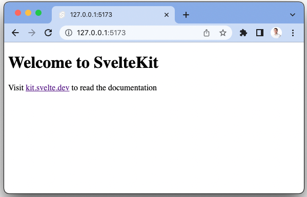
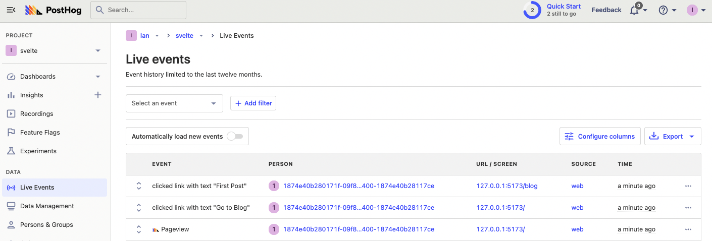
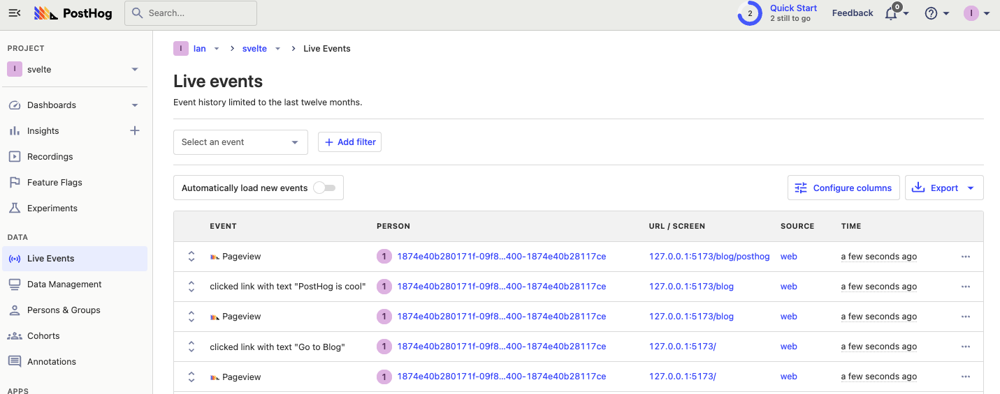
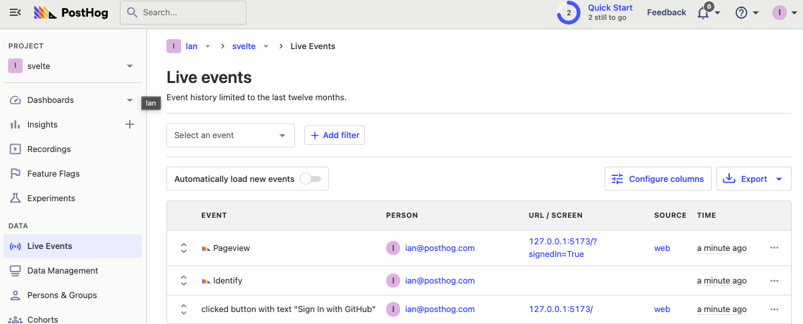
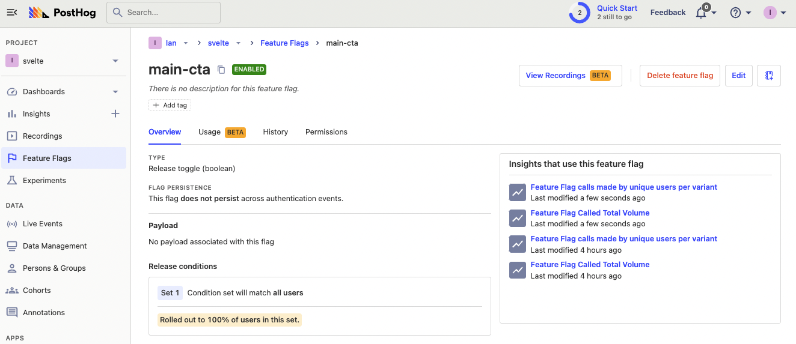
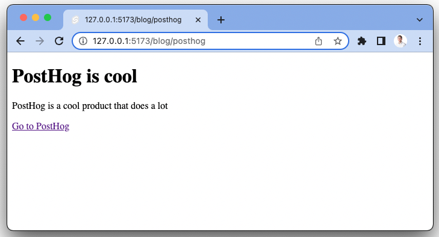

Svelte is a popular frontend JavaScript framework, similar to [Next.js](/tutorials/nextjs-analytics) and [Vue](/tutorials/posthog-for-vuejs). Svelte shifts much of the work for processing the app from the browser, to a compile step when you build your app.

In this tutorial, we'll build a basic Svelte blog app with user authentication, add PostHog, and set up the features of PostHog including custom event capture, session recordings, user identification, feature flags, and more.

> Already built a Svelte app you want to add PostHog to? [Skip the app creation and go straight to the PostHog setup.](#adding-posthog)

## Creating our Svelte app

First, we need to create a Svelte app using the `npm create` command. When prompted in the command line, choose `Skeleton project`, no type checking, and none of the additional options.

```bash
npm create svelte@latest my-app
```

Once created, go into your newly created `my-app` folder, install the packages, and run the server.

```bash
cd my-app
npm install
npm run dev
```

This runs a basic Svelte app that we can start to turn into our blog. 



## Adding the blog functionality

To start creating our blog, create a `blog` folder in the `src/routes` folder. In this folder, we add a `blog.js` file that is a list of blog objects with a slug, title, and content. This acts as the source of our content for the entire blog.

```js
// src/routes/blog/blog.js
export const posts = [
  {
    slug: 'first',
    title: 'First Post',
    content: 'This is the first post'
  },
  {
    slug: 'posthog',
    title: 'PostHog is cool',
    content: 'PostHog is a cool product that does a lot'
  }
]
```

Next, create another file in the `blog` folder named `+page.server.js`. We use this file to load the blog posts listing page. This file returns a map of the posts.

```js
// src/routes/blog/+page.server.js
import { posts } from './blog.js';

export function load() {
  return {
    posts: posts.map(post => ({
      slug: post.slug,
      title: post.title
    }))
  }
}
```

Finally, create the actual page by creating a `+page.svelte` file. This file loads the posts and loops through them to display their title and link.

```svelte file=+page.svelte
<script>
  export let data;
</script>

<h1>Posts</h1>
{#each data.posts as post}
  <h2><a href="/blog/{post.slug}">{post.title}</a></h2>
{/each}
```

### Creating the individual post pages

Next, we create the pages for those posts. To do this, we create a `[slug]` folder in the `blog` folder. In this folder, create another `+page.server.js` file that finds the individual page matching the URL params, and passes it to the page. If the slug doesn’t exist, we throw a 404 error.

```js
// src/routes/blog/[slug]/+page.server.js
import { posts } from '../blog.js';
import { error } from '@sveltejs/kit';

export function load({ params }) {
	const post = posts.find((post) => post.slug === params.slug);

	if (!post) throw error(404);

	return {
		post
	};
}
```

Again, we create a `+page.svelte` file in the `[slug]` folder to display the individual posts.

```svelte file=+page.svelte
<script>
	export let data;
</script>

<h1>{data.post.title}</h1>
<p>{data.post.content}</p>
```

Finally, back in the `+page.svelte` in our base `routes` folder, we add a link to the blog index page.

```svelte file=+page.svelte
<h1>Welcome to my cool site</h1>
<a href="/blog">Go to Blog</a>
```

Our blog now has everything it needs.


## Setting up user authentication

Next, we want to set up user authentication in our app so we can showcase user identification and feature flags later. This is relatively easy to set up thanks to [SvelteKit Auth](https://authjs.dev/reference/sveltekit). To get started, install the required `@auth/sveltekit` and `@auth/core` packages.

```bash
npm i @auth/sveltekit @auth/core
```

Next, in the `src` folder, create a `hooks.server.js` file to set up `SvelteKitAuth`. We'll use the GitHub authentication provider, but Auth.js comes with [many options](https://next-auth.js.org/configuration/providers/oauth).

```js
// src/hooks.server.js
import { SvelteKitAuth } from "@auth/sveltekit"
import GitHub from "@auth/core/providers/github"
import { GITHUB_ID, GITHUB_SECRET, AUTH_SECRET } from "$env/static/private"

export const handle = SvelteKitAuth({
  providers: [GitHub({ clientId: GITHUB_ID, clientSecret: GITHUB_SECRET })],
  secret: AUTH_SECRET
})
```

To fill out all the secrets we use in this file, we need a GitHub OAuth app. To do this, go to your [developer settings in GitHub](https://github.com/settings/developers) and create a "New OAuth app." Choose a name, set your homepage URL to `http://127.0.0.1:5173/`, set your callback URL to `http://127.0.0.1:5173/auth/callback/github`, and click register application. 

Keep the application creation page open and head back to your app. In the base `my-app` folder, create a `.env` file. In this file, add the Client ID and Client secret you generated from GitHub as well as an Auth secret (a 32-character string, [you can generate one here](https://generate-secret.vercel.app/32)). Once done, your .`env` file should look like this:

```
GITHUB_ID=c6c022a494ecf3fef0d (from GitHub Client ID)
GITHUB_SECRET=ez5fa33a2252d26d4236ee024330d450cc3a910 (from GitHub client secret)
AUTH_SECRET=d3fe411d34da313244393a4b0245a5a (32-character string)
```

### Setting up sign in and out

Now, we can implement the user session and sign in and out. We need a store for our user session, and can create one by creating a `+layout.server.js` file in `src/routes`. 

```js
//  src/routes/+layout.server.js
export const load = async (event) => {
  return {
    session: await event.locals.getSession()
  };
};
```

Next, we set up signing in and out. To do this, go back to our home page at `src/routes/+page.svelte`. Here we import the `signIn` and `signOut` functions from `@auth/sveltekit/client` as well as use the `page` store from `$apps/stores` to get data on the session.

```svelte file=+page.svelte
<script>
  import { signIn, signOut } from "@auth/sveltekit/client"
  import { page } from "$app/stores"
</script>

<h1>Welcome to my cool site</h1>
<a href="/blog">Go to Blog</a>

<div>
  {#if $page.data.session}
    <p>Signed in as: {$page.data.session.user?.email ?? "User"}</p>
    <button on:click={() => signOut()} class="button">Sign out</button>
  {:else}
    <p>You are not signed in</p>
    <button on:click={() => signIn("github")}>
      Sign In with GitHub
    </button>
  {/if}
  </div>
```

Now, you can click sign in, authorized with GitHub, and your basic details show in our app. With this, we are ready to add PostHog.

## Adding PostHog

To add PostHog to our Svelte app, we need a PostHog instance ([sign up for free](https://app.posthog.com/signup)). Get your project API key from either the getting started flow or your project settings, along with your instance address from the URL.

Next, install `posthog-js`.

```bash
npm i posthog-js
```

In the `src/routes` folder, create a `+layout.js` (different from the `+layout.server.js` file you created earlier). In this file, check the environment is the browser, and initialize PostHog if so. 

```js
// src/routes/+layout.js
import posthog from 'posthog-js'
import { browser } from '$app/environment';

export const load = async () => {

  if (browser) {
    posthog.init(
      '<ph_project_api_key>',
      { api_host: '<ph_instance_address>' }
    )
  }
  return
};
```

After restarting your app and going back to your site, you should start to see events autocaptured into your PostHog instance as well as sessions recorded if you turned them on.



## Capturing pageviews and pageleaves

For your app, PostHog only captures the initial page load as a pageview and the final pageleave. This is because Svelte acts as a [single page app](/tutorials/single-page-app-pageviews). To capture every pageviews and pageleaves, we check for navigation and then capture custom events.

We can set this up by creating one more file, a `+layout.svelte` file in `src/routes`. In this file, we set up a browser check then use the `beforeNavigate` and `afterNavigate` interceptors to capture a `$pageleave` or `$pageview` event.

```svelte file=+layout.svelte
<script>
  import posthog from 'posthog-js'
  import { browser } from '$app/environment';
  import { beforeNavigate, afterNavigate } from '$app/navigation';

  if (browser) {
		beforeNavigate(() => posthog.capture('$pageleave'));
		afterNavigate(() => posthog.capture('$pageview'));
	}
</script>

<slot></slot>
```

To make sure we don't double count pageviews and pageleaves, we also need to adjust our PostHog initialization in `routes/+layout.svelte` to set `capture_pageview` and `capture_pageleave` to false.

```js
// src/routes/+layout.js
import posthog from 'posthog-js'
import { browser } from '$app/environment';

export const load = async () => {

  if (browser) {
    posthog.init(
      '<ph_project_api_key>',
      {
        api_host:'<ph_instance_address>',
        capture_pageview: false,
        capture_pageleave: false
      }
    )
  }
  return
};
```

Once you save and relaunch, you get pageviews and pageleaves for all the navigation between pages in your app.



## Identifying users

You might notice even though you are logged in, your events are still captured from an anonymous person in PostHog. This is because users aren’t identified by PostHog. We can fix this by using `posthog.identify()` when users redirect back to our app from GitHub. We set a param in the call back URL, then check for that param, and use the email from GitHub to identify the user. We can add this to our home `src/routes/+page.svelte` file.

```svelte file=+page.svelte
<script>
  import { signIn, signOut } from "@auth/sveltekit/client"
  import { page } from "$app/stores"
  import posthog from 'posthog-js'

  if ($page.url.searchParams.get("signedIn") === "True" && $page.data.session) {
    posthog.identify($page.data.session.user.email, {
      email: $page.data.session.user.email,
    })
  }
</script>

<h1>Welcome to my cool site</h1>
<a href="/blog">Go to Blog</a>

<div>
  {#if $page.data.session}
    <p>Signed in as: {$page.data.session.user?.email ?? "User"}</p>
    <button on:click={() => signOut()} class="button">Sign out</button>
  {:else}
    <p>You are not signed in</p>
    <button on:click={() => signIn("github", {callbackUrl: "/?signedIn=True"})}>
      Sign In with GitHub
    </button>
  {/if}
</div>
```

Now, when we sign in again, we are identified with the email we use with GitHub. 



> **Note:** You can also call `posthog.identify()` in `+layout.svelte`, but not `+layout.js`. This is because `+layout.js` is run on the server, and `posthog.identify()` needs access to information from the client.

### Resetting identification

To avoid having multiple users identified as one, make sure to call `posthog.reset()` when a user signs out. We can use the same callback URL check as signing in, but for signing out.

```svelte file=+page.svelte
//...
  if ($page.url.searchParams.get("signedOut") === "True") {
    posthog.reset()
  }

</script>

<h1>Welcome to my cool site</h1>
<a href="/blog">Go to Blog</a>

<div>
  {#if $page.data.session}
    <p>Signed in as: {$page.data.session.user?.email ?? "User"}</p>
    <button on:click={() => signOut({callbackUrl: "/?signedOut=True"})} class="button">
      Sign out
    </button>
//...
```

This ensures when a user logs out, the events after they do aren’t connected to them, and future users who log in aren’t also connected.

> **Note:** Be careful to only reset when a user logs out, **not** on every request. If you reset on every request, you create an excess of new anonymous users and new session recordings.

## Using feature flags

The last feature of PostHog to set up is feature flags. Feature flags enable you to conditionally run code based on users, properties, and more. To showcase them, we are going to set up a flag that conditionally shows a call-to-action in our blog posts.

To set this up, create the feature flag. In PostHog, go to the feature flags tab, click "New feature flag," add a key (like `main-cta`), roll out to 100% of users, and click save. 



Next, in the `src/routes/blog/[slug]` folder, go to the `+page.svelte` file. Add the `posthog.onFeatureFlags()` function to check the `main-cta` flag once they load. The `posthog.isFeatureEnabled()` controls a variable to display a call-to-action link below our post.

```svelte file=+page.svelte
<script>
	export let data;
  import posthog from 'posthog-js'

  let showCta = false

  posthog.onFeatureFlags(() => {
    posthog.isFeatureEnabled('main-cta') ? showCta = true : null
  })
</script>

<h1>{data.post.title}</h1>
<p>{data.post.content}</p>
{#if showCta}
  <p><a href="http://posthog.com/">Go to PostHog</a></p>
{/if}
```

Once saved, back on your site, the CTA added to your blog post. 



You can test it works by going back to PostHog, disabling your flag, and seeing the call to action disappear.

With this done, you built a Svelte app with all the basics of PostHog set up. To go further, check out [group analytics](/docs/getting-started/group-analytics), [experimentation](/docs/experiments), and [our configuration options](/docs/libraries/js#config).

## Further reading

- [How to set up A/B tests in Svelte](/tutorials/svelte-ab-tests)
- [How to set up surveys in Svelte](/tutorials/svelte-surveys)
- [An introductory guide to identifying users in PostHog](/tutorials/identifying-users-guide)
