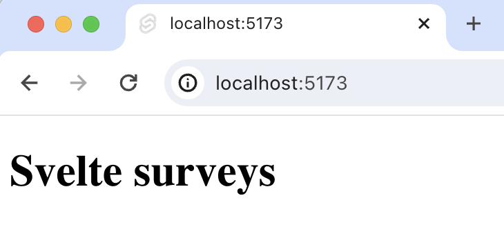
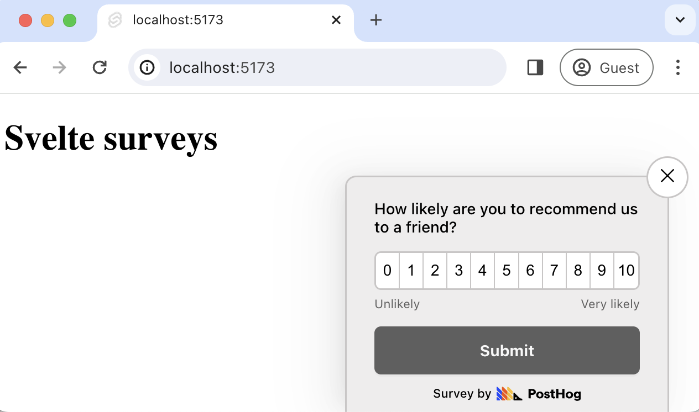
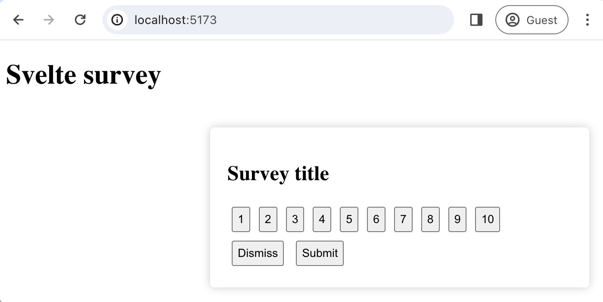

import { ProductScreenshot } from 'components/ProductScreenshot'
import EventsLight from '../images/tutorials/svelte-surveys/events-light.png'
import EventsDark from '../images/tutorials/svelte-surveys/events-dark.png'
import ImgSurveyResultsLight from '../images/tutorials/svelte-surveys/survey-results-light.png'
import ImgSurveyResultsDark from '../images/tutorials/svelte-surveys/survey-results-dark.png'
import ImgSurveyTemplatesLight from '../images/tutorials/svelte-surveys/survey-templates-light.png'
import ImgSurveyTemplatesDark from '../images/tutorials/svelte-surveys/survey-templates-dark.png'

[Surveys](/docs/surveys) are a great way to get feedback from your users. In this guide, we show you how to add a survey to your Svelte app.

We'll create a basic SvelteKit app, add PostHog, create a survey, and then show you how to display the survey in the app and get responses.

## 1. Create a Svelte app

First, ensure [Node.js is installed](https://nodejs.dev/en/learn/how-to-install-nodejs/) (version 16.0 or newer). Then, create a new Svelte app:

```bash
npm create svelte@latest my-svelte-survey
```

When prompted in the command line, choose `Skeleton project`, `No` to TypeScript, and none of the additional options. 

Once created, go into your newly created `my-svelte-survey` folder and install the packages:

```bash
cd my-svelte-survey
npm install
```

Next, replace the code in `src/routes/+page.svelte` with a simple heading:

```svelte file=+page.svelte
<div id="app">
  <h1>Svelte surveys</h1>
</div>
```

Run `npm run dev` and navigate to http://localhost:5173 to see your app in action.



## 2. Add PostHog

We use PostHog to create and control our survey as well as monitor results. If you don't have a PostHog instance, you can [sign up for free here](https://us.posthog.com/signup). 

To start, install the [JavaScript web SDK](/docs/libraries/js):

```bash
npm i posthog-js
```

In the `src/routes` folder, create a `+layout.js`. In this file, we check if the environment is the browser, and initialize PostHog if so. You can get both your API key and instance address in your [project settings](https://us.posthog.com/project/settings).  

```js file=routes/+layout.js
import posthog from 'posthog-js'
import { browser } from '$app/environment';

export const load = async () => {

  if (browser) {
    posthog.init(
      '<ph_project_api_key>',
      { api_host: '<ph_instance_address>' }
    )
  }
  return
};
```

Once you’ve done this, reload your app and click the button a few times. You should see events appearing in the [PostHog events explorer](https://us.posthog.com/events).

<ProductScreenshot
  imageLight={EventsLight} 
  imageDark={EventsDark} 
  alt="Events in PostHog" 
  classes="rounded"
/>

## 3. Create a survey

There are two options for displaying a survey using PostHog:

1. Use PostHog's prebuilt survey UI.
2. Implement your own survey UI.

This tutorial will cover how to implement both options:

### Option 1: Use PostHog's prebuilt survey UI

This is the simplest option. PostHog has a variety of [survey templates](/templates?filter=type&value=survey) to choose from, and handles all the display logic and response capture for you. You can also customize the questions, branding, and targeting as needed – see our [survey docs](/docs/surveys/creating-surveys) for more details on how to do so.
 
To create a survey with a prebuilt UI, go to the [surveys tab](https://us.posthog.com/surveys) in PostHog and click "New survey". 

<ProductScreenshot
  imageLight={ImgSurveyTemplatesLight} 
  imageDark={ImgSurveyTemplatesDark} 
  alt="PostHog survey templates" 
  classes="rounded"
/>

Select any template, or you can create your own by clicking "Create blank survey". Then, configure your survey with the following details:

1. Ensure `Presentation` is set to **Popover**.
2. Set the targeting to `All users`.
3. Use the default values for everything else.

Then, click "Save as draft" and then "Launch". Your survey is now live and you should see it in your app. After submitting responses, you can [view results in PostHog](#4-view-results).



### Option 2: Implement your own survey UI

If you prefer to have complete control of your survey UI and logic, you can still use PostHog to keep track of and analyze your results.

First, create a survey in PostHog like in option 1 above (for this tutorial, we use a Net Promoter Score survey template). The only difference is you must set `Presentation` to **API**.

Then, there are four parts to adding code for our custom survey:

1. Create the survey UI.
2. Fetch the survey from PostHog.
3. Add the logic for displaying and hiding it.
4. Capture interactions from it.

#### 1. Create the survey UI

We've created a sample survey UI for this tutorial. To use it, create a new `components` folder in your `src` directory and then a new file `CustomSurvey.svelte`:

```bash
cd ./src
mkdir components
cd ./components
touch CustomSurvey.svelte
```

Add the following code to `CustomSurvey.svelte`:

```svelte file=CustomSurvey.svelte
<script>
  import { createEventDispatcher } from 'svelte';
  export let title;
  let selectedValue = null;

  const dispatch = createEventDispatcher();

  const handleSelect = (value) => {
    selectedValue = value;
  };

  const emitDismiss = () => {
    dispatch('dismiss'); // Dispatching 'dismiss' event
  };

  const emitSubmit = () => {
    dispatch('submit', { selectedValue }); // Dispatching 'submit' event with data
  };
</script>

<div class="survey">
  <h2>{title}</h2>
  <div>
    {#each Array(10) as _, i}
      <button class="button" on:click={() => handleSelect(i + 1)}>
        {i + 1}
      </button>
    {/each}
  </div>
  <div>
    <button class="button" on:click={emitDismiss}>Dismiss</button>
    <button class="button" on:click={emitSubmit}>Submit</button>
  </div>
</div>

<style>
  .survey {
    position: fixed;
    bottom: 20px;
    right: 20px;
    width: 400px;
    padding: 20px;
    background-color: #ffffff;
    box-shadow: 0px 0px 10px rgba(0, 0, 0, 0.2);
    border-radius: 5px;
    z-index: 1000;
  }

  .button {
    margin: 5px;
    padding: 5px;
  }
</style>
```

Then, integrate the component into `src/routes/+page.svelte`:

```svelte file=+page.svelte
<script>
  import CustomSurvey from '../components/CustomSurvey.svelte';
  let showSurvey = true;
  let surveyTitle = 'Survey title';

  const handleDismiss = () => {
    showSurvey = false;
  };

  const handleSubmit = (event) => {
    console.log("Submitted value:", event.detail.selectedValue);
    showSurvey = false;
  };
</script>

<div>
  <h1>Svelte survey</h1>
  {#if showSurvey}
    <CustomSurvey
      title={surveyTitle}
      on:dismiss={handleDismiss}
      on:submit={handleSubmit}
    />
  {/if}
</div>
</script>
```

This shows a survey popup every time you visit your app's homepage.



#### 2. Fetch the survey from PostHog

To fetch the active surveys, we use [`posthog.getActiveMatchingSurveys()`](/docs/libraries/js#surveys). This returns an array of survey objects that looks like this:

```JSON
[
   {
     "id": "018cfcd5-107e-0000-49a1-8e7c6b825947",
     "name": "Net promoter score (NPS) API Survey",
     "description": "",
     "type": "api",
     "linked_flag_key": null,
     "targeting_flag_key": null,
     "questions": [
       {
         "type": "rating",
         "scale": 10,
         "display": "number",
         "question": "How likely are you to recommend us to a friend?",
         "description": "",
         "lowerBoundLabel": "Unlikely",
         "upperBoundLabel": "Very likely"
       }
     ],
     "conditions": null,
     "start_date": "2024-01-12T08:41:20.614000Z",
     "end_date": null
   }
]
```

To fetch this array and integrate it with your survey UI, we call `posthog.getActiveMatchingSurveys()` when our page is mounted:

`posthog.getActiveMatchingSurveys()` returns a surveys object that looks like this:

```svelte file=+page.svelte
<script>
  import CustomSurvey from '../components/CustomSurvey.svelte';
  import { onMount } from 'svelte';
  import posthog from 'posthog-js';

  let showSurvey = true;
  let surveyTitle = 'Survey title';
  let surveyID = '';

  onMount(() => {
    fetchActiveSurveys();
  });

  const fetchActiveSurveys = async () => {
    posthog.getActiveMatchingSurveys((surveys) => {
      if (surveys.length > 0) {
        const survey = surveys[0];
        surveyID = survey.id;
        surveyTitle = survey.questions[0].question;
        showSurvey = true;
      }
    });
  };

  // rest of your code
```

#### 3. Add the logic for displaying and hiding it.

We want to make sure we don't show the survey again to users who have either submitted or dismissed it. We use [`localStorage`](https://developer.mozilla.org/en-US/docs/Web/API/Window/localStorage) to store this data and use it to check whether to show the survey or not.

```svelte file=+page.svelte
<script>
  // your imports

  let showSurvey = false; // updated to false

  // rest of your code

    const fetchActiveSurveys = async () => {
    posthog.getActiveMatchingSurveys((surveys) => {
      if (surveys.length > 0) {
        const survey = surveys[0];
        surveyID = survey.id;
        surveyTitle = survey.questions[0].question;
        showSurvey = true;
        checkSurveyInteraction(); // added this line
      }
    });
  };

  const checkSurveyInteraction = () => {
    const hasInteractedWithSurvey = localStorage.getItem(`hasInteractedWithSurvey_${surveyID}`);
    showSurvey = !hasInteractedWithSurvey;
  };

  const handleDismiss = () => {
    showSurvey = false;
    localStorage.setItem(`hasInteractedWithSurvey_${surveyID}`, 'true');
  };

  const handleSubmit = (event) => {
    console.log("Submitted value:", event.detail.selectedValue);
    showSurvey = false;
    localStorage.setItem(`hasInteractedWithSurvey_${surveyID}`, 'true');
  };
</script>

<!-- rest of your code -->
```

#### 4. Capture interactions from it.

The final step in setting up our survey is capturing interactions. This enables us to analyze the results in PostHog. 

There are 3 events to capture:

1. `"survey shown"`
2. `"survey dismissed"`
3. `"survey sent"` (for responses)

You can capture these events using `this.$posthog.capture()`:

```svelte file=+page.svelte
<script>
// your existing code

  const checkSurveyInteraction = () => {
    const hasInteractedWithSurvey = localStorage.getItem(`hasInteractedWithSurvey_${surveyID}`);
    showSurvey = !hasInteractedWithSurvey;
    if (showSurvey) {
      posthog.capture("survey seen", {
        $survey_id: surveyID // required
      })
    }
  };

  const handleDismiss = () => {
    showSurvey = false;
    localStorage.setItem(`hasInteractedWithSurvey_${surveyID}`, 'true');
    posthog.capture("survey dismissed", {
      $survey_id: surveyID // required
    })
  };

  const handleSubmit = (event) => {
    console.log("Submitted value:", event.detail.selectedValue);
    showSurvey = false;
    localStorage.setItem(`hasInteractedWithSurvey_${surveyID}`, 'true');
    posthog.capture("survey sent", {
      $survey_id: surveyID, // required
      $survey_response: `${event.detail.selectedValue}` // required. Convert numbers to string
    })
  };

</script>

<!-- rest of your code -->
```

Altogether, your code should look like this:

```svelte file=+page.svelte
<script>
  import CustomSurvey from '../components/CustomSurvey.svelte';
  import { onMount } from 'svelte';
  import posthog from 'posthog-js';

  let showSurvey = false;
  let surveyTitle = 'Survey title';
  let surveyID = '';

  onMount(() => {
    fetchActiveSurveys();
  });

  const fetchActiveSurveys = async () => {
    posthog.getActiveMatchingSurveys((surveys) => {
      if (surveys.length > 0) {
        const survey = surveys[0];
        surveyID = survey.id;
        surveyTitle = survey.questions[0].question;
        showSurvey = true;
        checkSurveyInteraction();
      }
    });
  };

  const checkSurveyInteraction = () => {
    const hasInteractedWithSurvey = localStorage.getItem(`hasInteractedWithSurvey_${surveyID}`);
    showSurvey = !hasInteractedWithSurvey;
    if (showSurvey) {
      posthog.capture("survey seen", {
        $survey_id: surveyID // required
      })
    }
  };

  const handleDismiss = () => {
    showSurvey = false;
    localStorage.setItem(`hasInteractedWithSurvey_${surveyID}`, 'true');
    posthog.capture("survey dismissed", {
      $survey_id: surveyID // required
    })
  };

  const handleSubmit = (event) => {
    console.log("Submitted value:", event.detail.selectedValue);
    showSurvey = false;
    localStorage.setItem(`hasInteractedWithSurvey_${surveyID}`, 'true');
    posthog.capture("survey sent", {
      $survey_id: surveyID, // required
      $survey_response: `${event.detail.selectedValue}` // required. Convert numbers to string
    })
  };
</script>

<div>
  <h1>Svelte survey</h1>
  {#if showSurvey}
    <CustomSurvey
      title={surveyTitle}
      on:dismiss={handleDismiss}
      on:submit={handleSubmit}
    />
  {/if}
</div>
```

Our survey is now ready to go! The next step is ship the changes, get responses, and view your results.

## 4. View results

After interacting with your survey, you can view results by selecting the survey from the [surveys tab](https://us.posthog.com/surveys). You'll see data on:

- How many users have seen the survey.
- How many users have dismissed the survey.
- Responses.

You can also filter these results based on [user properties](/docs/product-analytics/user-properties), [cohorts](/docs/data/cohorts), [feature flags](/docs/feature-flags/creating-feature-flags) and more.

<ProductScreenshot
  imageLight={ImgSurveyResultsLight} 
  imageDark={ImgSurveyResultsDark} 
  alt="Survey results" 
  classes="rounded"
/>

## Further reading

- [How to set up A/B tests in Svelte](/tutorials/svelte-ab-tests)
- [How to set up Svelte analytics, feature flags, and more](/tutorials/svelte-analytics)
- [How to analyze surveys with ChatGPT](/tutorials/analyze-surveys-with-chatgpt)