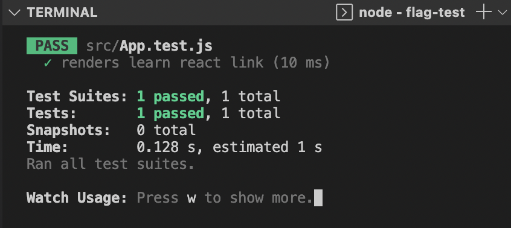
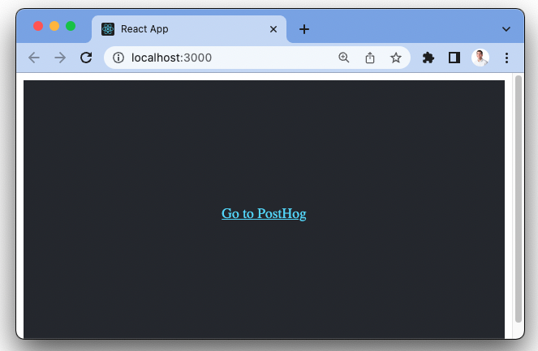

---
title: Testing frontend feature flags with React, Jest, and PostHog
date: 2023-03-16
author: ["ian-vanagas"]
showTitle: true
sidebar: Docs
featuredVideo: https://www.youtube-nocookie.com/embed/cKaQ2mR4sSc
tags: ["feature flags"]
--- 

> <p align="center">Open this tutorial in PostHog and follow along step-by-step!</p> <CallToAction href="https://app.posthog.com/#panel=docs:/tutorials/test-frontend-feature-flags" size="sm" className="mt-auto self-start sm:w-auto !w-full">Launch tutorial</CallToAction>

Combining both testing and feature flags can be a bit tricky. Tests generally check only one variant of the feature flag and leave other code untested. If you want to test the code behind feature flags, you must set up your tests to do so.

To do this, you need to mock the flags to access the other variations. This tutorial shows you how to do that by creating a React app with Jest tests, adding PostHog, then setting up tests that work with feature flags by mocking PostHog.

## Creating a React app

First, create a basic React app. Make sure [Node is installed](https://nodejs.dev/en/learn/how-to-install-nodejs/) then run `npx create-react-app` with the name of your app. We named ours `flag-test`.

```bash
npx create-react-app flag-test
```

After creating the app, in the newly created `flag-test` folder, a test is automatically created in `src/App.test.js` that looks like this:

```js
// src/App.test.js
import { render, screen } from '@testing-library/react';
import App from './App';

test('renders learn react link', () => {
  render(<App />);
  const linkElement = screen.getByText(/learn react/i);
  expect(linkElement).toBeInTheDocument();
});
```

This test uses Jest, a popular JavaScript testing library. It passes when all the default code is in place and is a test to build on as we build out our app.

```bash
cd flag-test
npm test
```



## Adding PostHog

If we’ve created our React app and run our first test, we want to add PostHog. First, we need a PostHog instance ([sign up for free](https://app.posthog.com/signup)). We then need our project API key and instance address from it. Once we have them, in our React app, install `posthog-js`:

```bash
npm i posthog-js
```

Next, add the `PostHogProvider` to `index.js`. This enables access to PostHog throughout your React app.

```js
// src/index.js
import React from 'react';
import ReactDOM from 'react-dom/client';
import App from './App';
import posthog from 'posthog-js';
import { PostHogProvider} from 'posthog-js/react'

posthog.init(
  "<ph_project_api_key>",
  {
    api_host: "<ph_instance_address>",
  }
);

const root = ReactDOM.createRoot(document.getElementById('root'));
root.render(
  <React.StrictMode>
    <PostHogProvider client={posthog}>
      <App />
    </PostHogProvider>
  </React.StrictMode>
);
```

With this setup, events are automatically captured, and we can set up our [React feature flag](/tutorials/react-feature-flags).

## Setting up our feature flag

In PostHog, go to the "Feature Flags" tab and click the "New feature flag" button. Set the key to `test-flag` and the release condition to 100% of users then click "Save."

With the flag created, go to  `src/App.js` in our React app, import `useFeatureFlagEnabled` from `posthog-js/react`, and use it to check the `test-flag`. We have access to this because we set up the `PostHogProvider` earlier. We then conditionally render either a link to PostHog if the flag is enabled or the default "Learn React" link if not. This looks like this:

```js
// src/App.js
import './App.css';
import { useFeatureFlagEnabled } from 'posthog-js/react'

function App() {
  const flagEnabled = useFeatureFlagEnabled('test-flag')

  return (
    <div className="App">
      <header className="App-header">
        { flagEnabled ?
          <a
            className="App-link"
            href="/"
            target="_blank"
            rel="noopener noreferrer"
          >
            Go to PostHog
          </a> : 
          <a
            className="App-link"
            href="https://reactjs.org"
            target="_blank"
            rel="noopener noreferrer"
          >
            Learn React
          </a>
        }
      </header>
    </div>
  );
}

export default App;
```

When we run the app again, the main link on the page changed to "Go to PostHog."



## Making our tests and feature flags work together

When we run tests now, it still passes, but only tests part of the code. To test all of it, we must handle feature flags by mocking PostHog. To do this, first, install `jest-mock`

```bash
npm i jest-mock
```

In `src/App.test.js`, mock `useFeatureFlagEnabled`. Create a new test where the mocked `useFeatureFlagEnabled` function return `true`, then checks the "Go to PostHog" version of the flag.

```js
// src/App.test.js
import { render, screen } from '@testing-library/react';
import App from './App';
import { useFeatureFlagEnabled } from 'posthog-js/react';

jest.mock('posthog-js/react', () => ({
  useFeatureFlagEnabled: jest.fn(),
}));

test('renders learn react link', () => {
  render(<App />);
  const linkElement = screen.getByText(/learn react/i);
  expect(linkElement).toBeInTheDocument();
});

test('renders go to posthog link', () => {
  useFeatureFlagEnabled.mockReturnValueOnce(true);
  render(<App />);
  const linkElement = screen.getByText(/go to posthog/i);
  expect(linkElement).toBeInTheDocument();
});
```

This tests both variants of the flag. You can use this mocking strategy to test other PostHog methods, components, and code throughout your app.

## Further reading

- [Master Feature Flags: Best practice, tips and examples](/blog/feature-flag-best-practices)
- [How to run Experiments without feature flags](/docs/experiments/running-experiments-without-feature-flags)
- [How to do a canary release with feature flags in PostHog](/tutorials/canary-release)