- **Level:** Easy
- **Estimated reading time:** 6 minutes_ ☕☕

An underlying purpose of analytics is to answer questions by utilizing data:

- _"Who's using my website?"_ 
- _"What type of people pay for my product?"_
- _"Why am I not retaining users?"_

Oftentimes, these questions don't have a straight-forward answer, and, more often than not, getting _any_ answer to your questions requires a good amount of effort. 

However, there are some questions that have straightforward answers - the difficulty comes in getting that answer across. 

Enter the [PostHog Toolbar](/docs/toolbar). 

Consider the question: _"Where are my users clicking?"_

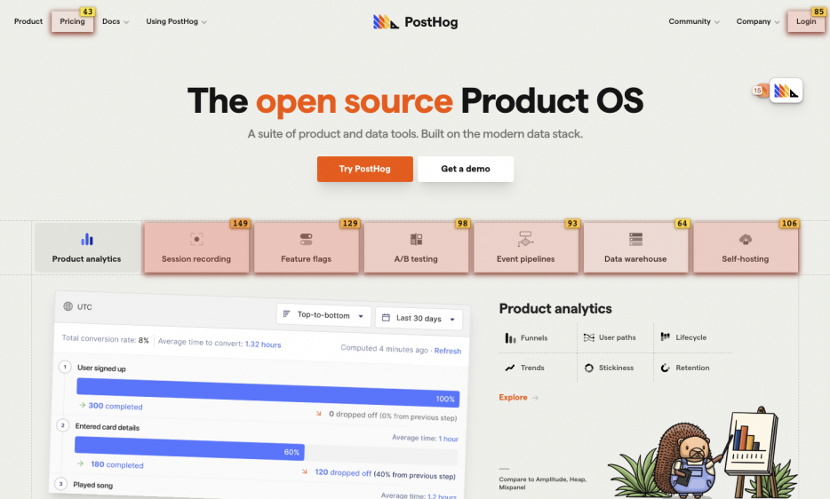

How's that for an answer?

This tutorial will walk you through using the PostHog Toolbar to answer some of your analytics questions, and give you step-by-step instructions for creating actions with it, so that you can sort through your events and level up your PostHog game. 

## Prerequisites

To follow this tutorial along, you need to:

1. Have [deployed PostHog](/docs/deployment).
1. Have added the [PostHog snippet](/docs/integrate/client/js) to your website. 

> **Note:** The toolbar only works with our [JavaScript library](/docs/integrate/client/js), so you will not have access to it without the PostHog snippet. Additionally, a Segment snippet is unable to load the toolbar.

## Why use the toolbar?

Before we go right into how to use the PostHog Toolbar, it's useful to understand why you'd want to do so.

Currently, the toolbar lets you: 

1. Inspect any clickable element on a webpage
1. Create custom Actions based on page elements
1. Discover the most clicked on elements of a webpage
1. Highlight elements associated to a custom event / action
1. View and control active feature flags

Our team uses the toolbar daily, mostly to get a quick overview of clicks (and therefore decide which pages need attention) and to create actions. This helps us to do things such as prioritize which parts of our website or product to redesign, as any PostHog user can see the potential impact of their work. 

Overall, the toolbar offers valuable context on how users are navigating your website or application, helping you design the menus, determine how to display information, and structure your product in a way that steers users towards the actions you would like them to perform.

## Launching the Toolbar

The PostHog Toolbar will only be enabled for you – not your users. The little floating hedgehog will only appear if the current visitor is authenticated into your PostHog instance.

To launch the toolbar, access your website and it should appear for you. If that does not work, you can go over to PostHog, click the dropdown arrow on 'Toolbar' in the sidebar menu, and click the URL you want to launch the toolbar on.

## Using the heatmap

### Enabling the heatmap

The heatmap is the most exciting feature of our toolbar. To use it, hover over the hedgehog, and click on the red fire (🔥) icon. 

The process is the same for toggling any functionality on or off.

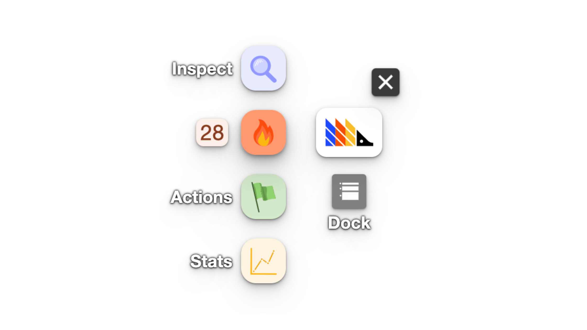

### Understanding the heatmap

With the heatmap on, you should now see that clickable elements on your website have a red overlay on them, with numbers on small yellow/orange boxes on the top right of each element. The bottom and/or top of your screen might also have these boxes.

Here's another example from our website with the heatmap enabled:

What the toolbar is doing here is displaying the number of clicks on each of those elements over the last day. The count at the top right of the box shows the number of clicks on that element, and the count at the top left shows the number of rage-clicks on that element.

You can change the date range of the heatmap by clicking on the number next to the (🔥) icon on the toolbar. 

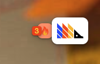

This displays a new menu where you can select the date range to query over, load more data, change how links are matched, and view a list of the most clicked on elements in descending order.

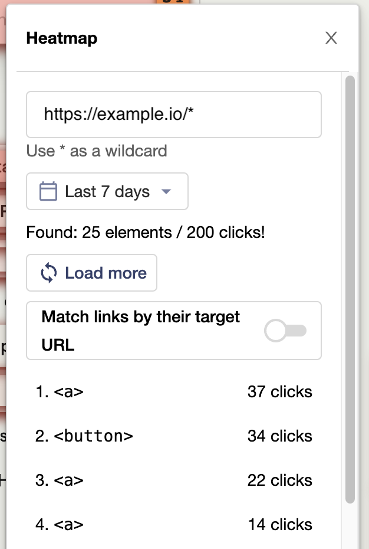

### Loading more data

If you have a lot of events, you may need to load more data to see everything you're interested in on the heatmap. To do this, click on the number next to the (🔥) icon on the toolbar, and then click on the "Load more data" button. 

### Matching links within the page

By default, the toolbar does not match links in the page by their `href` attribute. This means if you have a button on your page with a unique link in it, the toolbar will count every click on that button as a click on the same element. This is useful for links that include IDs or other unique values, but can be confusing if you want to distinguish between links that vary for different users. 

For example, if you have a list of links that changes based on the logged in user. The toolbar shows all the clicks on the element's by position in the list, rather than by the link they point to.

You can switch this behavior by clicking on the number next to the (🔥) icon on the toolbar, and then clicking on the "Match links by their target URL" button. Then the toolbar will match links by their `href` attribute. So we'll only show clicks for the links currently in the list.

As an example, on the PostHog app homepage there is a list of recently viewed insights. The items in the list change based on the user and that user's interactions on the app.

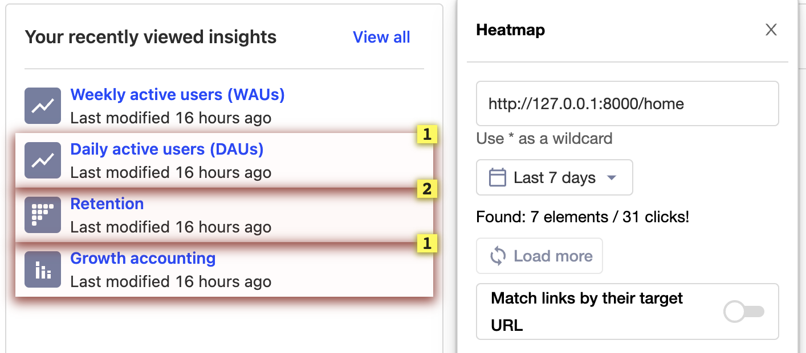

When we disable the "Match links by their target URL" option, we can see that the toolbar is matching the links by their position in the list, and so see multiple clicks on the links in the list. Links in these positions have been interacted with by multiple users.

So, you can answer questions like "Do people click on the first item in the list more than other items?"

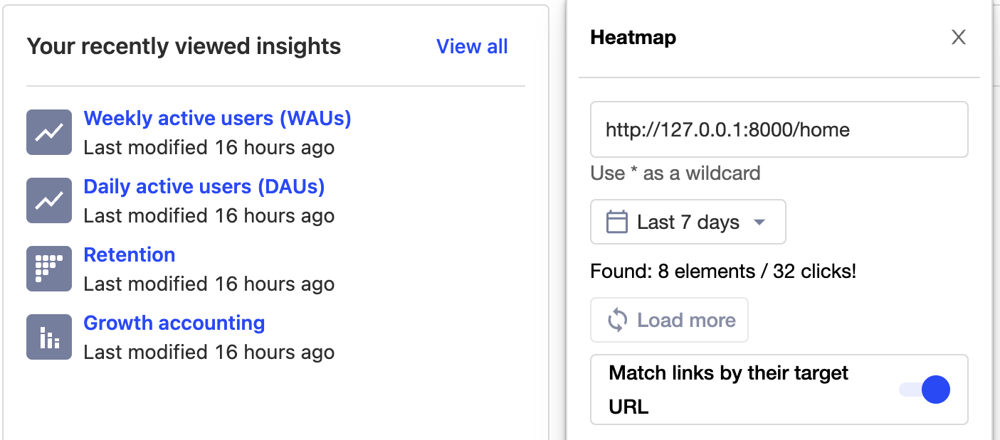

When we enable the "Match links by their target URL" option, we can see that the toolbar is now matching the links by their `href` attribute, and so see no clicks on the links in the list. These exact links have not been interacted with by any user.

So, you can answer questions like "Do people click on this link more when it is in the list?"

### Using wildcards to search "slug" URLs

If you have a page where the URL has an ID or repeating part (e.g. `/my-shop/product/a-product-id`), you can use this menu to add wildcards into the URL that the toolbar searches. Wildcards will match any value in that part of the URL.

For example, to show clicks across all product pages, replace `a-product-id` with `*` so the URL looks like `/my-shop/product/*`

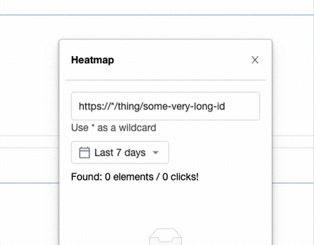

Numbers at the bottom or top of the screen indicate that there are more elements that are not currently being displayed on the page. 

With the heatmap enabled, if you then click on an element, you will also be able to see its ranking on the page and create an action from it.

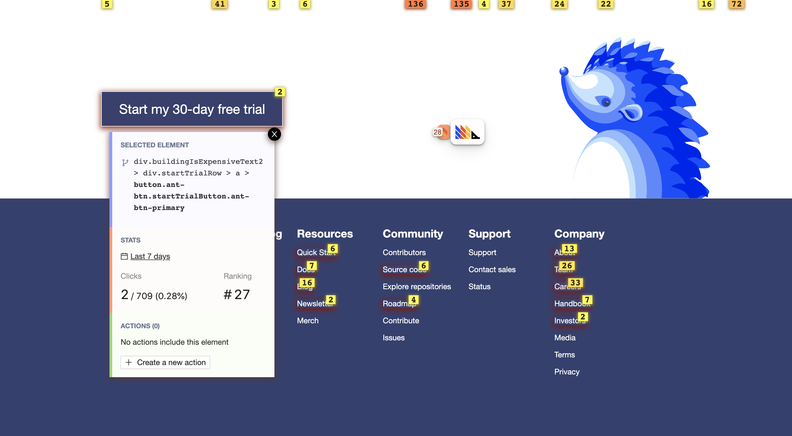

## Using Inspect and creating actions

When you're on your website with the toolbar enabled, you're able to create actions with only a few clicks.

Actions are PostHog's way of allowing you to sort through your events. If you have not used them, you can find more information in the [dedicated Actions page](/docs/user-guides/actions).

### How to create and action

To create an action from an element, toggle on 'Inspect' after hovering over the hedgehog. This is the blue button with the magnifying glass (🔍).

Example from our website:

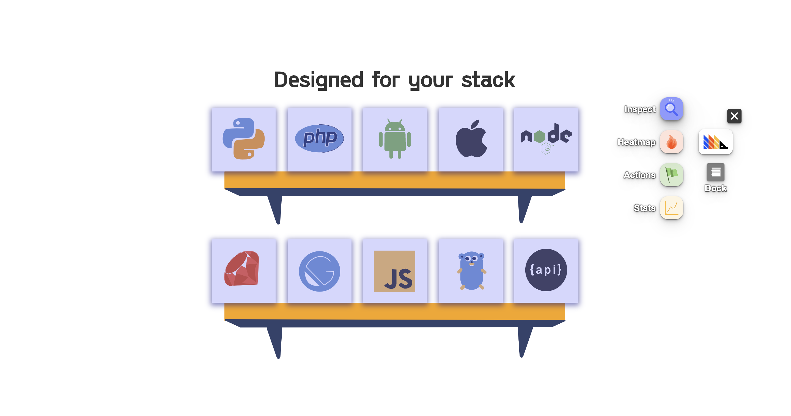

Like the heatmap, this will also add an overlay to the elements, albeit a blue one.

Then, if you click on an element, you will be given the option to create an action from it, on the bottom of the modal. 

This will open up an action creation modal, like this:

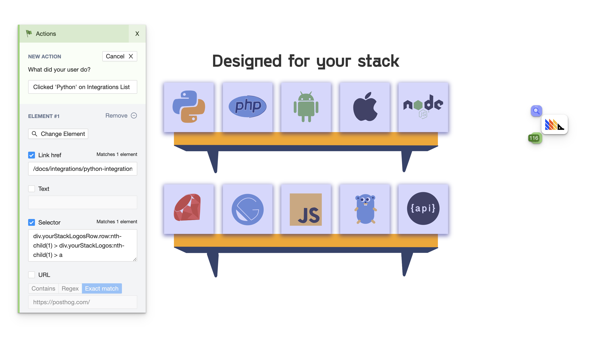

You should then fill in the name of the action under 'What did your user do?', scroll down, and click 'Create Action'.

If you want to create a more advanced action, you can also create it here. 

Here are the options you have for creating an action:

#### Element filters

These are used by PostHog to find the specific element you're creating the action for. 

- **Link target:** Where a click on the element leads to (if available).

- **Text:** Inner text of the element (if available).

- **Selector:** Path to the element on the page. If you're not happy with the selector PostHog is using automatically, you could, for example, select elements based on their `id` or `data-attr`. This is useful if the path to the element is too complicated and not sufficiently robust to withstand website changes. 

- **Page URL:** If you have the same element at the same position in various pages (e.g. navbar elements), the default action will capture them all. To prevent this, you can set an exact URL or specify a pattern for pages where this exact action should be recorded.

#### Add another element

If you want your action to cover more than one element, you can click 'Add another element' right above 'Create Action'. 

This is an `OR` operation, meaning that the action will be recorded if Element A _or_ Element B is clicked. 

This is useful if you have various buttons that take you to the same page, for instance, and only care that the user clicks one of them.

A good use case for this is leveraging the action as a [funnel step](/docs/user-guides/funnels). 

### Seeing your existing actions

Once you have created an action, it will be available for you in PostHog.

However, you can also visualize your actions with the toolbar.

By toggling on 'Actions' (yellow target icon), you'll see a view of all actions on the page. 

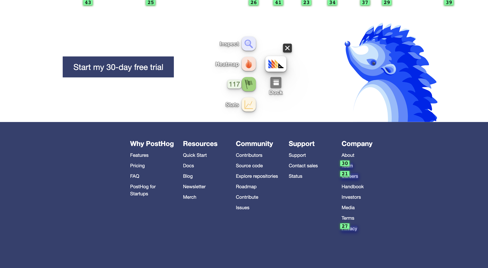

Here, you can click an element and see all actions that use it. This is a great way of making sure the relevant elements to you have an action associated with them. 

Additionally, by clicking a specific action on an element, you can update or delete it.

## Editing the selector for an action

When you select an element to create an action, PostHog automatically generates a selector for that element. Computers are good at choosing unique selectors, but sometimes you might want to change it to something more meaningful. 

You can type a selector into the "Selector" field in the action creation modal to do this.

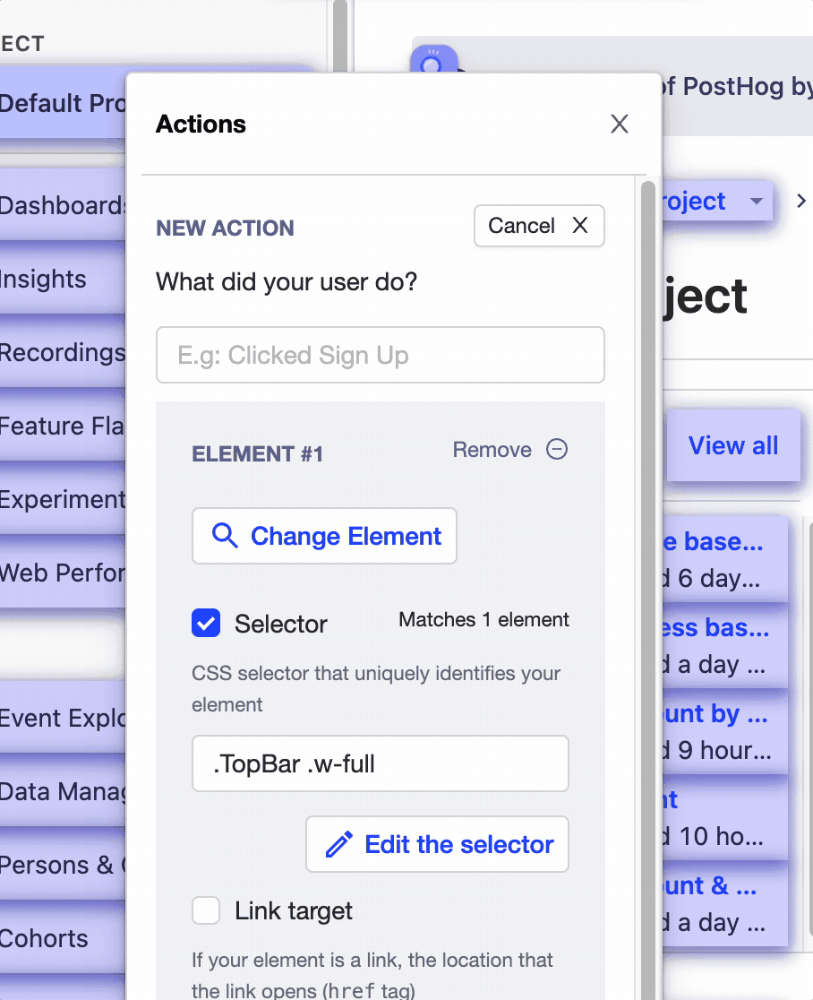

Or in the same modal, click "Edit the selector" to use our element picker to build the selector you want.

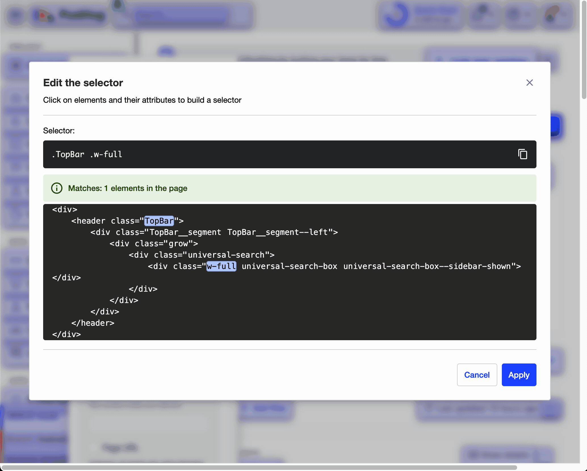

## Further reading

- [How to run Experiments without feature flags](/docs/experiments/running-experiments-without-feature-flags)
- [How to build, analyze and optimize conversion funnels](/tutorials/funnels)
- [B2B product metrics 101](/blog/b2b-saas-product-metrics)
