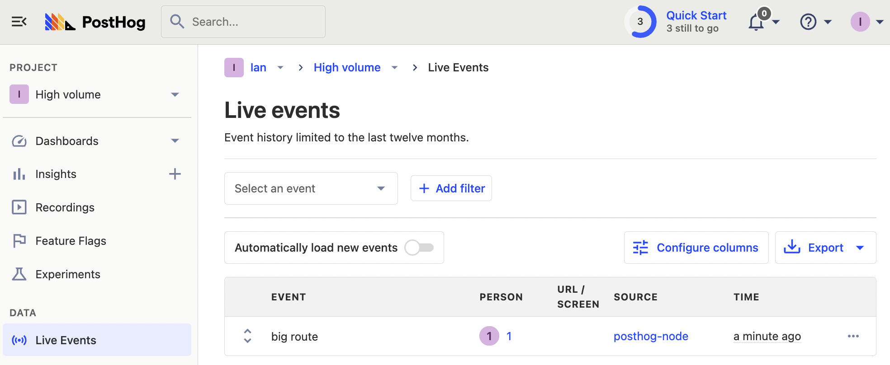
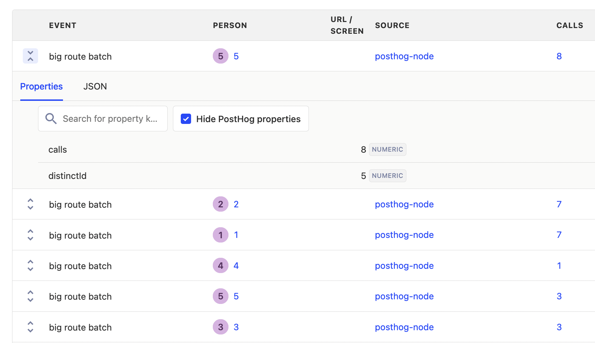
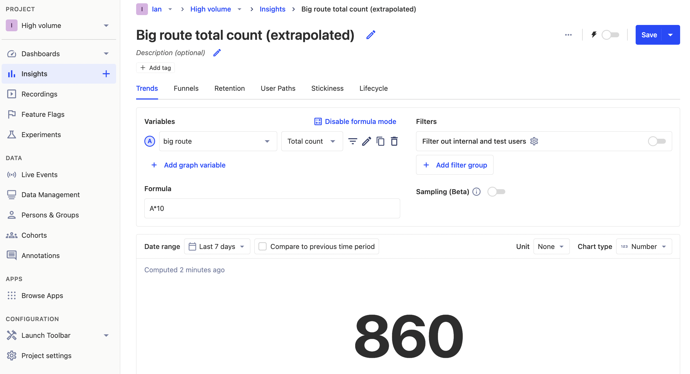
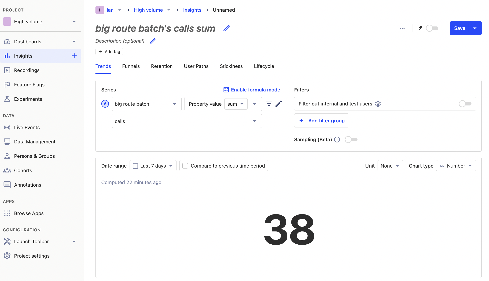
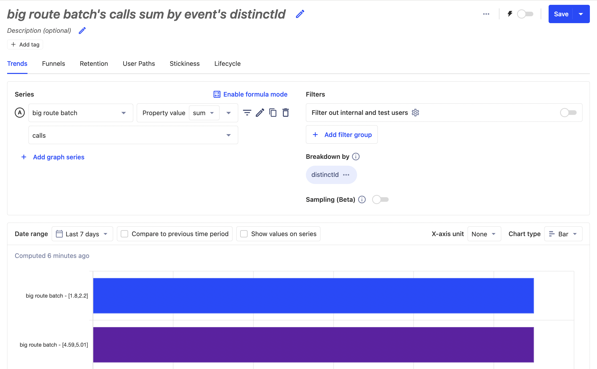

Tracking high-volume APIs is a balancing act. You want to keep them as efficient as possible, while still capturing data to improve them. This tutorial aims to help you find this balance. 

We'll build an API in Express, add PostHog, and then implement two solutions for tracking:

1. Sampling using feature flags
2. Caching usage and batching event capture

After doing this, we also show the different ways you can calculate insights.

## Building our API

To start, we will build a basic API that captures and returns the ID that is passed to it. We'll use [Express, the Node server framework,](/tutorials/node-express-analytics) to do this.

Create a folder for our project, go into the folder, and initialize npm. When prompted, select all the default options.

```bash
mkdir high-volume
cd high-volume
npm init
```

Once done, install Express.

```bash
npm i express
```

In your `high-volume` folder, create a file named `index.js`, and set up a basic Express app.

```node
// index.js
const express = require('express');
const app = express();
const port = 3000

app.get('/', (req, res) => {
  res.send('Hello World!');
})

app.listen(port, () => {
  console.log(`App listening on http://localhost:${port}`)
})
```

Lastly, add a new route that will handle high volume requests and set its path to `/big/:id`. For now, return a string in the response using the request ID.

```node
//...
app.get('/big/:id', (req, res) => {
  res.send(`Welcome to the big route, ${req.params.id}`);
})
//...
```

### Adding PostHog

Next, we install and set up PostHog. 

```bash
npm i posthog-node
```

We set up the PostHog client with our project API key, instance address, and personal API key. The first two you can get from your [project settings](https://app.posthog.com/project/settings). The personal API key can be created in your [account settings](https://app.posthog.com/me/settings).

 We add a `client.capture()` call to our `/big` route. The capture call includes the route distinct ID and an event name. We also include a `firstRouteCalled` user property to use for a filter later. 

```node
const express = require('express');
const { PostHog } = require('posthog-node');
const app = express();
const port = 3000

const client = new PostHog(
  '<ph_project_api_key>',
  { 
    host: '<ph_instance_address>',
    personalApiKey: '<ph_personal_api_key>'
  }
)

//...

app.get('/big/:id', (req, res) => {
  client.capture(
    { 
      event: 'big_route',
      distinctId: req.params.id,
			properties: {
        $set_once: { firstRouteCalled: req.url },   
      },
    },
  );
  res.send(`Welcome to the big route, ${req.params.id}`);
})
//...
```

When we go to our route again, we capture an event that we can see in our PostHog instance.



In this scenario, capturing every single request to this route creates many capture requests. It hurts the performance of our API to make a request every time. Instead, we can use two different strategies for capturing them: sampling and batching.

## Option 1. Sampling with feature flags and local evaluation

We can use feature flags to sample users. This way, we can easily control how many events we capture without needing to redeploy. For example, we can set up a flag to only capture specific or a percentage of:

- Users
- Cohorts
- Groups

To set this up, we must create a new feature flag:

1. In PostHog, go to the feature flags tab, click new feature flag.
2. Set your key name, such as `sample-flag`.
3. Select your rollout conditions, such as 100% of users in a specific cohort. I chose "100% of users where the `firstRouteCalled` person property (we set earlier) equals `/big/1`".
4. Click save. 

This setup enables us to edit this flag at any time to change the number of events we capture. 

### Adding our flag to our code

We can now wrap our existing `client.capture()`call with our feature flag code. To do this, we need to make our route async, and then call `client.isFeaturedEnabled()` with our flag key and distinct ID.

```node
// index.js
//...
app.get('/big/:id', async (req, res) => {
  const eventSampling = await client.isFeatureEnabled('sample-flag', req.params.id);
  if (eventSampling) {
    client.capture(
      { 
        event: 'big_route',
        distinctId: req.params.id,
        properties: {
          $set_once: { firstRouteCalled: req.url },   
        },
      },
    );
  }
  res.send(`Welcome to the big route, ${req.params.id}`);
})
//...
```

You might notice that this sends a "Feature Flag Called" event to PostHog on every call. We can turn this off by adding `{ sendFeatureFlagEvents: false }` to our `client.isFeatureEnabled()` call.

```node
//...
const eventSampling = await client.isFeatureEnabled(
	'sample-flag',
	req.params.id,
	{ sendFeatureFlagEvents: false }
);
//...
```

### Locally evaluating our flag

Another problem is that every feature flag call on the server side sends a request to PostHog to evaluate the flag. In a high volume API endpoint, the time it takes to make this request can add up. We can limit this by evaluating the flag locally using the person properties the flag relies on.

Because we initialize the `posthog-node` SDK with our personal API key, setting this up is simple. Just add `firstRouteCalled` in `personProperties` to the options in our `client.isFeatureEnabled()` call.

```node
//...
const eventSampling = await client.isFeatureEnabled(
    'sample-flag',
    req.params.id,
    { 
      sendFeatureFlagEvents: false,
      personProperties: {
        'firstRouteCalled': req.url,
      },
    }
  );
//...
```

In our small example, this reduced response time by about 100ms. A massive amount for high-volume APIs where every millisecond counts.

## Option 2. Cache usage and batch events

Another way to capture events for high-volume APIs is to cache usage of the API and then capture a batch of events at regular intervals. 

To do this, we use [node-cache](https://www.npmjs.com/package/node-cache) to create a basic cache to store the number of requests, then use [node-cron](https://www.npmjs.com/package/node-cron) to set up a cron job to read the cache, capture values for each of the IDs, and clear the cache. 

First, install them both.

```bash
npm i node-cache node-cron
```

Next, set up our cache. It simply gets the amount of API calls for a param ID and then increments it.

```node
// index.js
//...
const NodeCache = require('node-cache');
const cache = new NodeCache()

//...

app.get('/big/:id', async (req, res) => {
  let apiCalls = cache.get(req.params.id) || 0;
  apiCalls++;
  cache.set(req.params.id, apiCalls);

  res.send(`Welcome to the big route, ${req.params.id}`);
})
//...
```

We can now set up our cron job to loop through the keys in the cache, get the number of events for that key, capture a batch event with a distinct ID (which we'll use later), and then clear the cache once completed.

```node
// index.js
//...
const cron = require('node-cron');

//...

cron.schedule('*/10 * * * * *', () => {
  cache.keys().forEach((key) => {
    let apiCalls = cache.get(key);
    client.capture(
      { 
        event: 'big_route_batch',
        distinctId: key,
        properties: { 
          calls: apiCalls,
	  distinctId: key
        },
      },
    );
  });
  cache.flushAll();
});
```

Once you restart the server to implement the changes and send multiple events to an ID, you will see the event batches in your PostHog instance. Each batch event has the amount of API calls as a property which we can use for our analysis. Try sending groups of events to multiple different IDs for comparison later.



## Insights with batched events

Creating insights for batched or sampled events requires a little more planning than standard insights. This is because the actual values require one more step of setup. We rely on both formula mode and property aggregations to get the actual values we want for analysis.

### Extrapolating sampled events with formula mode

If we want sampled events to represent actual usage, we can multiply the rollout percentage to extrapolate a total count. For example, if we rolled out a flag to capture 10% of events, we can create an insight that takes the total count of events and multiplies it by 10.



If you are doing this, it is important to make sure your rollout percentage matches your formula multiple to avoid large inaccuracies.

### Aggregating event properties

For our batched events, we can create an insight that uses the big route batch event, and then sums the property value of calls to give us our total number of calls.



Since we included an ID in the event property, we can use it to break down the sum for each of those IDs and use the total value bar chart type. This gives us a better understanding of individual ID usage of the API.



## Further reading

- [Using the PostHog API to capture events](/tutorials/api-capture-events)
- [How to evaluate and update feature flags with the PostHog API](/tutorials/api-feature-flags)
- [How to set up Node.js (Express) analytics, feature flags, and more](/tutorials/node-express-analytics)