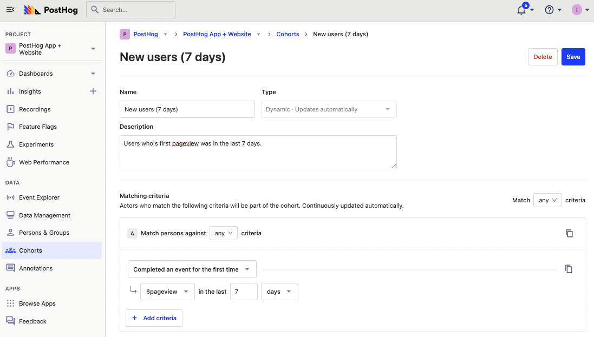
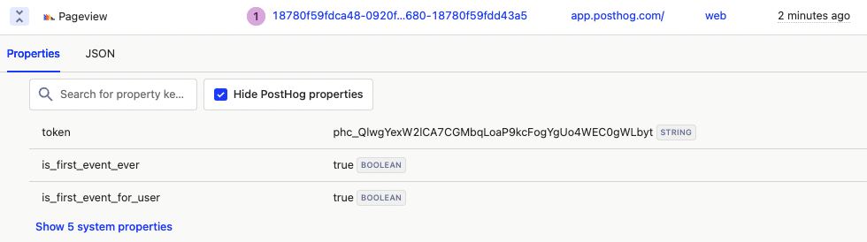
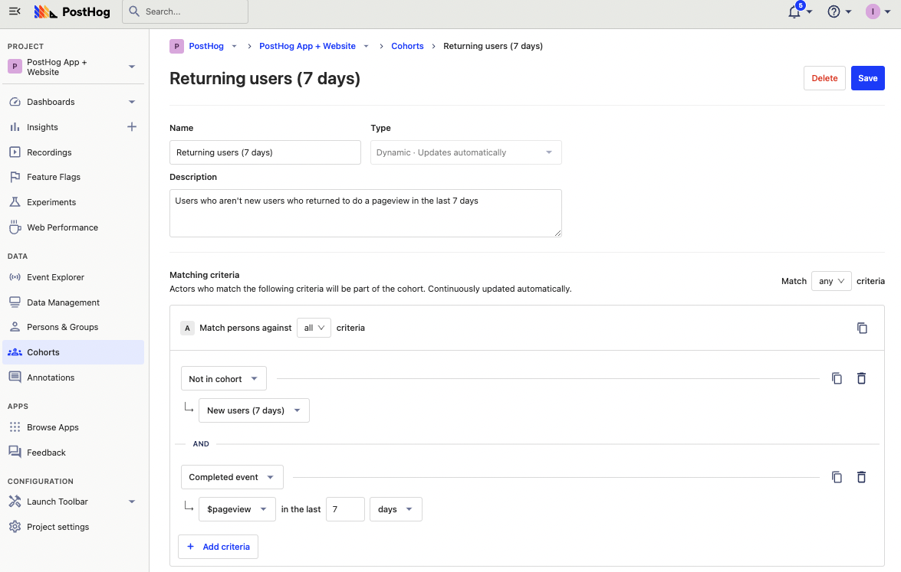
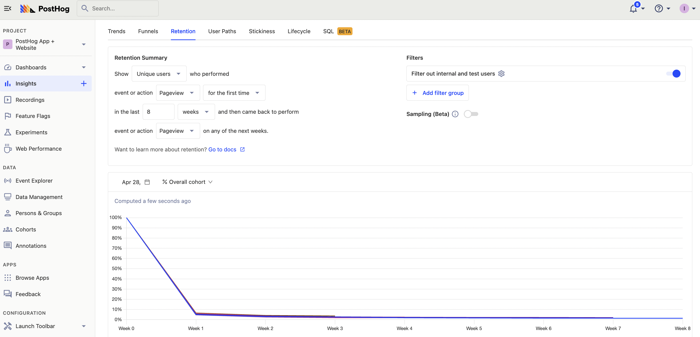
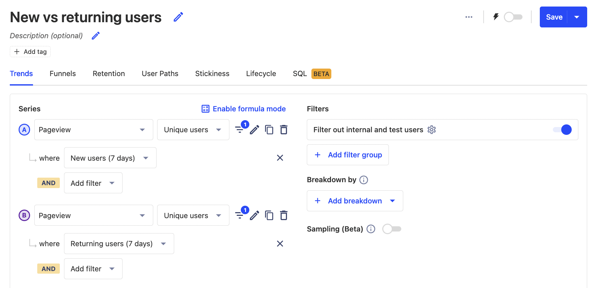
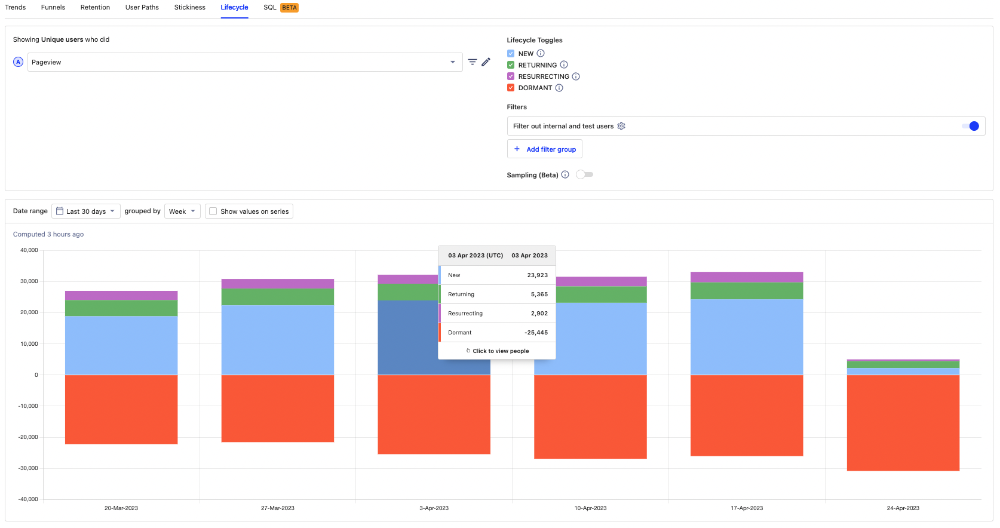

Understanding user growth is critical to building a successful product. A lack of new users or existing users churning is a bad sign. This tutorial goes over the different ways to calculate new and returning users in PostHog, as well as insights you can create using these calculations.

> **How does Google Analytics calculate new vs returning users?** When you first visit a site, Google Analytics generates a client ID for your device and sets it in your cookies. GA uses this client ID cookie to calculate if a user is new (didn’t have cookie set) or returning (had cookie set). This, like any tracking, isn’t 100% accurate.

## Calculating new users

There are multiple ways to calculate new users in PostHog depending on your situation and need.

### Completed event for the first time cohort

The first and easiest is creating a cohort where the users completed an event (such as pageviews, [identify](/docs/data/identify), or a custom event) for the first time. To set this up, go to the cohort tab, click new cohort, enter a title and description, then choose "completed an event for the first time" with your event and recency. 



You can then use this cohort of new users for further analysis.

> **Note:** since this is a behavioral cohort (based on events), this cohort won’t work with feature flags.

### First time event tracker

You can set up and use the [first time event tracker app](/docs/apps/first-time-event-tracker) to add a property to events that indicates if it was the first time it happened.

To set it up, search for "First Time Event Tracker" in your PostHog instance, set the event you want to track in the configuration (like `$pageview`) and enable the app. 



You can then filter for events where `is_first_event_user` is `true` recently to get new users for analysis. This method is useful if you don't want to set up or use cohorts in your analysis. 

### Manually set user property

If neither of these works for you, you can set up a user property manually in a custom event. 

For example, when a user first uses your API, set their creation date in their user properties. To do this, you can capture an event at the same time, and use the `$set_once` property like this:

```python
posthog.capture(
    '<ph_project_api_key>',
    event='new_user_created',
    properties={ '$set_once': { 'created_at': '2023-04-24T22:02:02' } }
)
```

This is especially useful for projects that are on the backend, not using autocapture, or not using `posthog-js`, or have many custom events. 

## Calculating returning users

Calculating returning users is done by identifying users who aren’t new and have completed an event recently. To create a cohort for this, you can use the new user cohort as an anti-cohort (choose "Not in cohort"), and include another criteria for completing an event recently.



Alternatively, if you created a `created_at` user property, you can also filter for users who weren’t created recently but completed the event. 

### Using a retention insight

If you care specifically about returning users, you can set up a retention insight. This shows the number of users who completed an event and then return to complete another event at a later date. You can customize the event and timeframe depending on what you care about.

For example, an 8 week pageview retention graph looks like this:



You can learn more about retention in our [guide to churn analysis](/blog/customer-churn-analysis-guide).

## Comparing new vs returning users

With both new and returning users calculated, you can compare them for analysis. To do this, create an insight with two unique user trends: one filtered by the new user cohort, the other filtered by the returning user cohort. 



This gives you a trend similar to Google Analytics’ new vs returning visitors graph. You can also use these cohort filters for further analysis like comparing [session duration](/tutorials/session-metrics), feature usage, or even funnel conversion.

### Using the lifecycle chart

The lifecycle chart doesn’t use either of the new or returning cohorts we set up, but it does give us the data we want for comparing those users. 

Create a new insight, select the lifecycle tab, then  choose the event you want. This gives you a visualization with new, returning, resurrecting, and dormant users for that time and event which enables you to compare new vs returning users for that event easily.



## Further reading

- [Calculating average session duration, time on site, and other session-based metrics](/tutorials/session-metrics)
- [How to identify and analyze power users](/tutorials/power-users)
- [How to use session recordings to get a deeper understanding of user behavior](/tutorials/explore-insights-session-recordings)