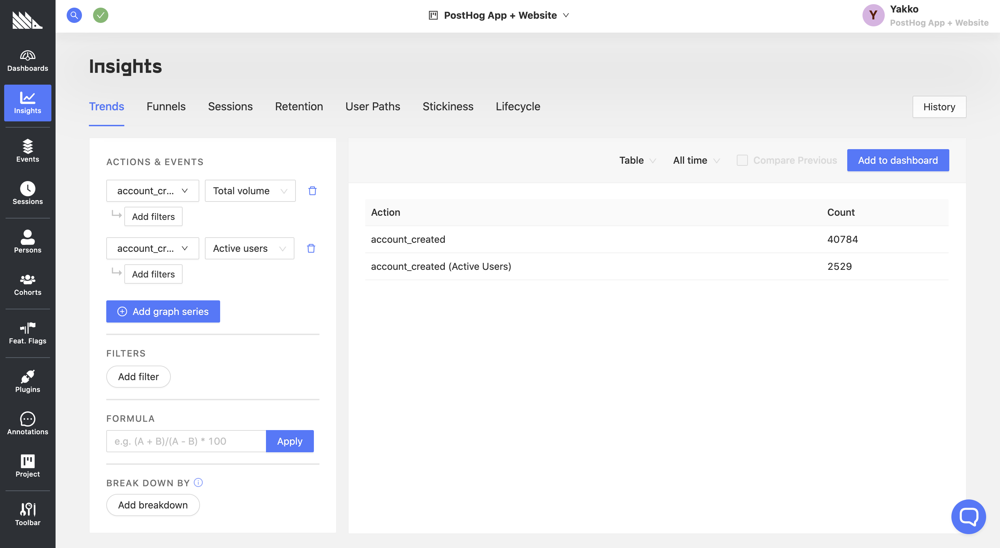
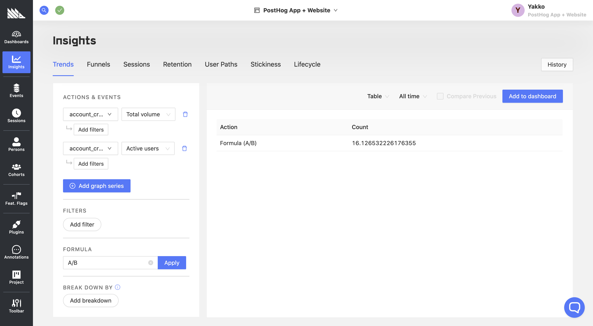
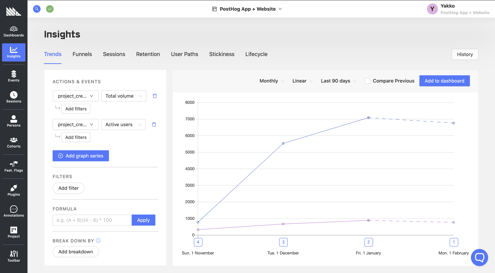
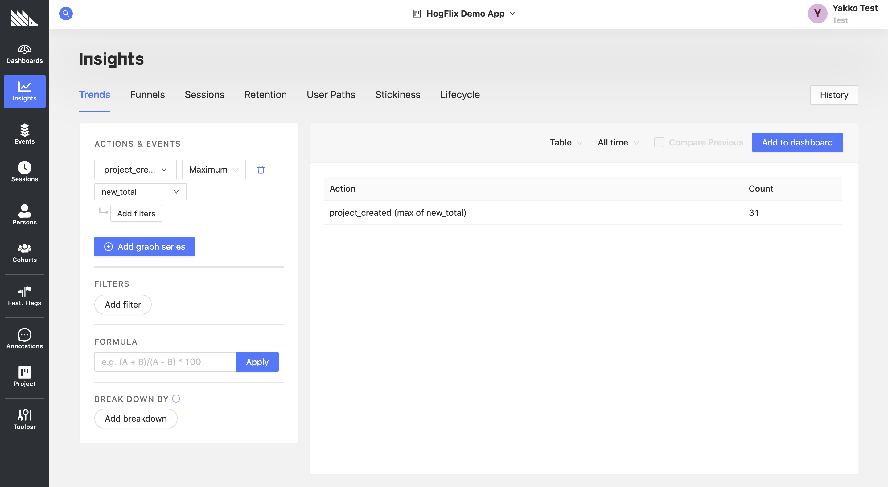
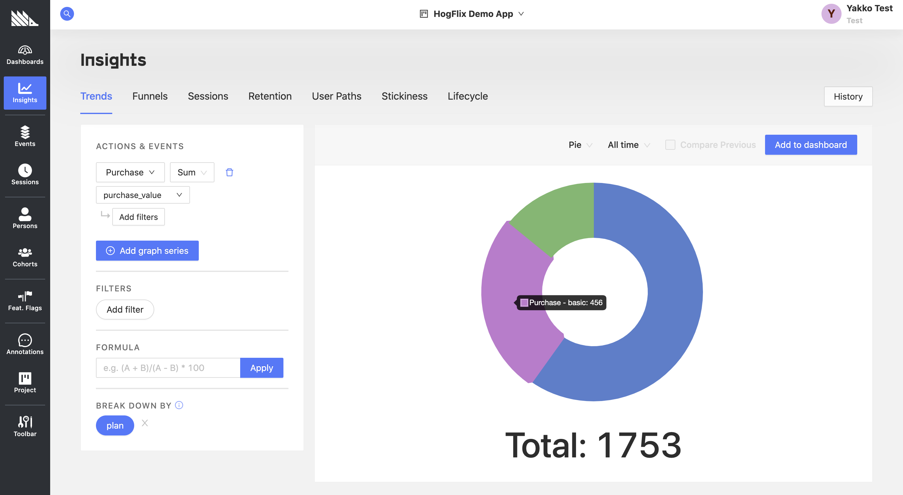
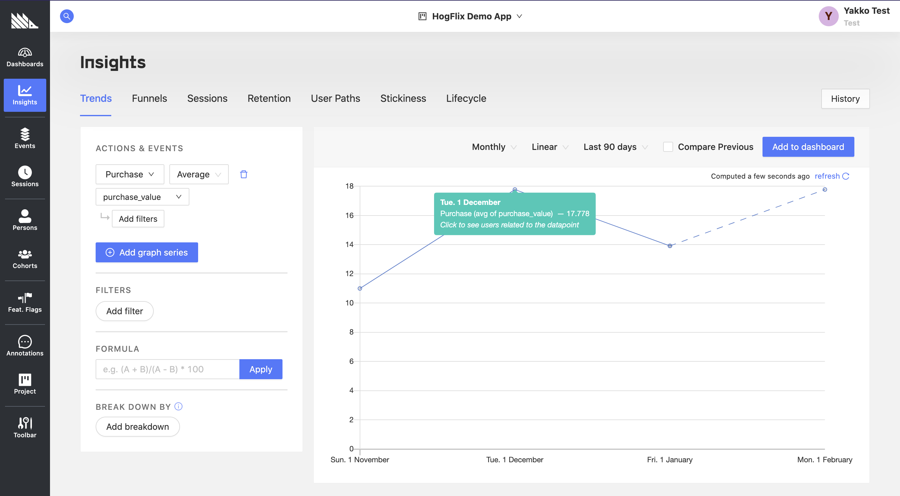
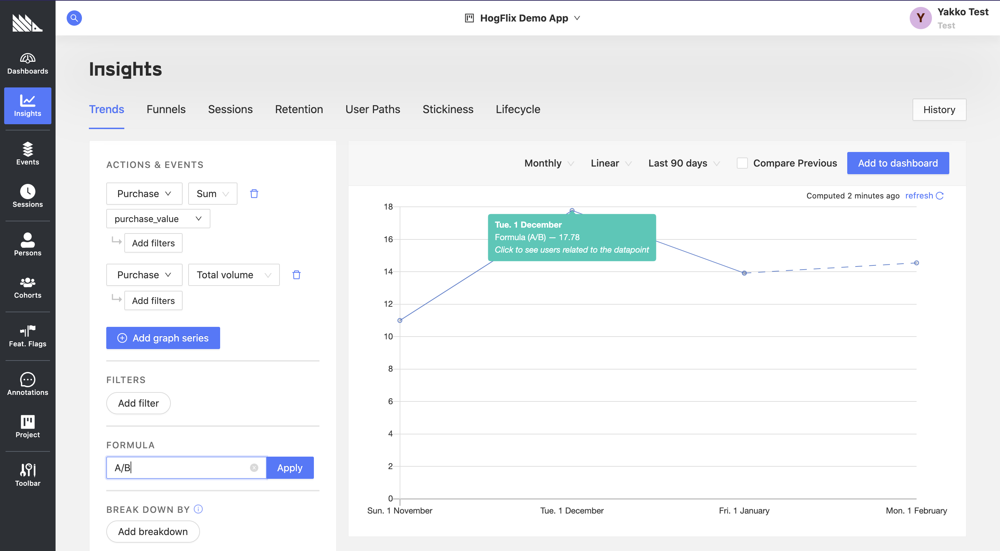

_Estimated reading time: 12 minutes_ ☕☕☕

When using PostHog or any other product analytics tool, there are two key entities that underpin all of your analytics: events and users.

Every event that you capture is associated with a user, which generally corresponds to a person.

However, what if you want your analytics to be based on an entity larger than one person, such as an organization, or smaller than one person, such as a project created by a user?

In this tutorial, we will explain how to structure your analytics to fit these needs. We will use PostHog Cloud as an example, and show how we could track our events on an organization basis, rather than a person basis, aiming to answer the following questions:

- How many organizations are in PostHog Cloud?
- How many total users are there?
- What is the average number of users per organization?
- How many total projects were created?
- What is the average number of projects per organization?
- What is our total revenue?
- What is the average revenue per organization?
- How many organizations are there at each pricing tier?

## Prerequisites

To follow this tutorial along, you need to:

1. Have [deployed PostHog](/docs/deployment).
1. Have started receiving events via our [snippet](/docs/integrate/client/js), one of our [integrations](/docs/integrate/overview), or our [API](/docs/api/overview).

## Identifying users

Every event in PostHog has an associated distinct ID, which determines which user the event "belongs" to.

When using PostHog in your backend, you will always specify this distinct ID yourself, whereas in the frontend we derive it for you.

Now, what happens when a user lands on your website and there's no record of them in PostHog already? Well, PostHog provisions an anonymous yet unique ID for the user which ensures that we can differentiate between unique users in our analytics.

However, when the user does something identifiable on your app, like logging in, you are then able to identify them yourself, in order to be able to:

- Track a user across platforms or browsers (e.g. web to mobile)
- Specify a more human-friendly identifier for this user
- Associate this user with an ID that is already used elsewhere in your application
- Combine the activity of a user from before they're logged to after

In most cases, users are identified using either email, username, or an internal unique identifier. This helps us differentiate between one person and another.

If you're unfamiliar with how to identify users, here's an example from our JavaScript Library:

```js
posthog.identify('your desired id')
```

However, if we want to do organization-based, rather than person-based analytics, we can use `posthog.identify` to our advantage.

Using the PostHog Cloud example, when a user logs in, we can either identify them by something unique to the person, like an email:

```js
posthog.identify(user.email)
```

Or, instead, we could identify them based on their organization:

```js
posthog.identify(user.org)
```

So what are the implications of doing things this way?

Above all, you first want to make sure organization names are unique, to prevent events being merged across organizations.

With that criterion fulfilled, what will now happen is that all events from people in that organization will be associated with the same PostHog user.

As such, if we were to filter a PostHog chart by 'Active Users', we will actually be looking at unique organizations, rather than unique persons that performed an event.

If we still want to keep some record of an event coming from a specific person, we can do that by either passing a person-unique identifier with our event calls:

```js
/* 
* Event will be associated with the organization, but we have 
* a way of tracing it back to the individual person if we want to.
*/
posthog.capture('some event', { personEmail: user.email })
```

When using our JavaScript library, you can also simplify this with `posthog.register`:

```js
/* 
* From now on, every event from this user will
* come with the personEmail property.
*/
posthog.register({ personEmail: user.email })
```

With this in place, let's now look at how we can visualize our organization metrics in PostHog.

## Total number of organizations and persons

Having set up our modified identifying mechanism to group all persons in one organization together, let's now start sending events to our organization.

One event that would be particularly useful is `account_created`. This is fired for an organization any time a new team member joins the organization, as well as at the organization creation step, given that that's when the first team member "joined".

Here's what that event might look like in JavaScript:

```js
posthog.capture('account_created', {
    is_first_user: usr.is_org_admin
    // any other relevant props
})
```

Once we have this event set up, we can now tackle 3 of our metrics:

1. How many organizations are in PostHog Cloud?
2. How many total users are there?
3. What is the average number of users per organization?

To get the answers for points 1 and 2, we can use the following table:



Given that our event `account_created` is fired for each new member of an organization, we can get the total number of persons using our platform by just looking at the total volume on that event.

As for the number of organizations, we can simply select 'Active Users' instead of 'Total Volume', ensuring that we only count the `account_created` event once per user (organization).

Finally, to get the average number of users per organization, we can then use a formula, dividing the total volume of the `account_created` event by the number of organizations (active users):



This `account_created` event can also work as a basis for other valuable metrics, such as number of new organizations per month.

To get that, we can select the total volume of `account_created` events, and then filter it by `is_first_user = true`.

## Total projects

In PostHog Cloud, organizations are composed of multiple users, and these users can create various projects.

To establish metrics on the number of projects, we can use a similar approach as above. This will allow us to tackle:

1. How many total projects were created?
2. What is the average number of projects per organization?

Like we did with `account_created`, we now also want an event tracking when a new project was created in an organization.

Here's what that might look like:

```js
posthog.capture('project_created', {
    is_first_project: organization.projects.length === 0,
    new_total: organization.projects.length, // sets new_total on the event
    $set: {
        // sets project_total on the user
        project_total: organization.projects.length
    }
})
```

Here, we also added a few other useful properties:

- `is_first_project` will let us set up useful activation metrics
- `new_total` corresponds to the new number of total projects the organization has, and will help us do operations like maximum number of projects created by an organization
- `project_total` will be set on the user, and allows us to see how many total projects a given organization has at any point in time

For aggregate "all time" numbers, we could once more use tables as shown with `account_created`. That would give us the total number of projects ever created, as well as the average number of projects per organization.

However, we can also track the number of new projects per month, alongside the number of organizations that created a project that month:



If we were to average this, it would give us the average number of projects per organization that created a project during the time period.

Another thing we can do is get the maximum number of projects any organization has created:



This could be useful in informing architectural decisions, as you can have an idea of what the limits of your platform should be.

Exploratory questions that could come out of this include:

- Should we allow an organization to have 31 projects?
- What is the UX like for this organization with 31 projects?
- How does having more than 30 projects impact our performance?

To answer these questions, you could then, for example, create a cohort of organizations with `project_total > 30` , and analyze how their usage of the platforms differs from everyone else.

## Revenue analysis

Another very useful thing to track on an organization basis is revenue. So how do we answer the following questions in PostHog:

1. What is our total revenue?
2. What is the average revenue per organization?
3. How many organizations are there at each pricing tier?

First, once again, we need an event. In PostHog Cloud, users are billed monthly, so let's set up an event to be triggered every time a customer pays their invoice:

```js
posthog.capture('purchase', {
    purchase_value: invoice.amount // e.g. in thousands of USD
})
```

Now, we can find our total revenue by selecting the 'sum' operation on the `purchase_value` property of the `purchase` event, like so:



<small class='centered'>Disclaimer: The data shown above is **demo data**.</small>

Above, we establish that our total revenue is 1,753,000 USD (given that our `purchase_value` is in thousands of dollars). We have also set up a breakdown by the `plan` property.

Thus, this not only gives us our total revenue, but also shows us a breakdown by each pricing plan.

If you do usage-based pricing, as PostHog Cloud now does, you can instead use multiple graph series with the appropriate filters for each pricing tier, for example:

- `purchase_value < 10`
- `purchase_value > 9 AND purchase_value < 20`
- `purchase_value > 19 AND purchase_value < 50`

This can then be displayed in a format just like the pie chart above.

Now, to find the average purchase value, there are two approaches in this case:

#### 1. Average of the `purchase_value` property



With the graph above, we're using PostHog's built-in mathematical operations to get the average purchase value per month.

#### 2. Sum of purchases divided by total purchases



In this case, we are doing the same as above, but with an extra step. We first calculate the sum of purchases, and then divide it by the total number of purchases.

While in this case we get the same results (except for the final data point simply because of when the screenshots were taken), it is useful to be aware of this method as it gives you more flexibility for your averages.

For example, if organizations in your platform can do a purchase more than once per month, you can set the second event to be filtered by `Active Users`, giving you the average revenue per organization that month, rather than the average revenue per purchase event during the month.

## Recap

So this was a quick overview at how to track usage in your product based on an entity other than a person, such as an organization comprised of many persons.

We learned that:

- We can use `posthog.identify` to group many persons into one PostHog user
- We can still distinguish the events within a user on a person basis by passing an event property to identify them
- We can use event properties to do native numerical operations, and user properties to group users into relevant cohorts (such as based on the number of projects or their pricing tier)
- We can use formulas to determine averages for more complex metrics that cannot use the native mathematical operations

But, most importantly, we learned that while PostHog is built with certain frameworks in mind (such as the person-event model), given the flexibility of our API and metric-building capabilities, you are likely to find a way to track your product exactly how you want to.

## Further reading

- [The guide to frontend vs backend group analytics implementations](/tutorials/frontend-vs-backend-group-analytics)
