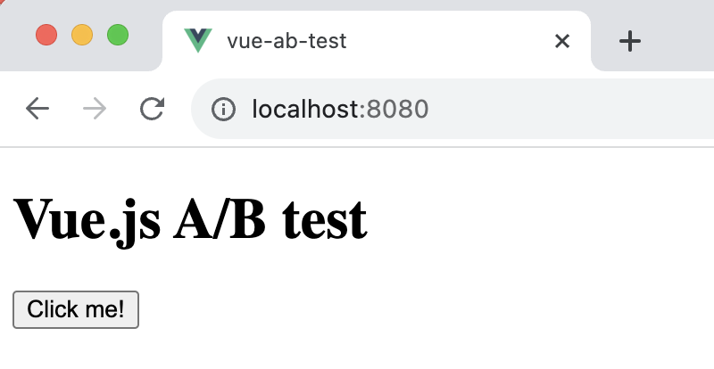
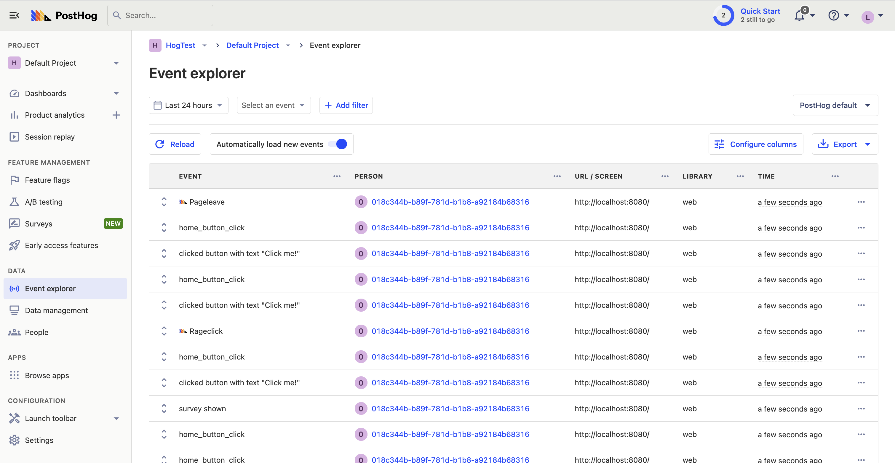
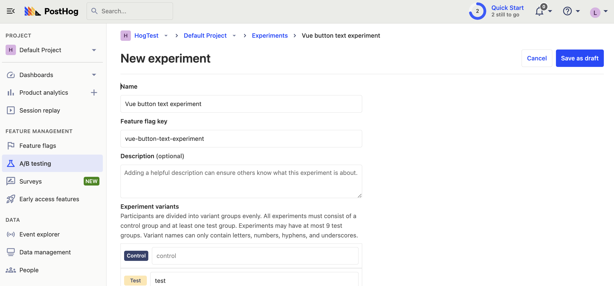

A/B tests help you make your Vue app better by enabling you to compare the impact of changes on key metrics. To show you how to set one up, in this tutorial we create a basic Vue app, add PostHog, create an A/B test, and implement the code for it.

## Creating a Vue app

For this tutorial, we create a basic `Vue 3` app with a simple button to run our test on.

First, ensure [Node.js is installed](https://nodejs.dev/en/learn/how-to-install-nodejs/) (version 14.6.0 or newer). Then install `@vue/cli` and create a new Vue app:

```bash
npm install -g @vue/cli
vue create vue-ab-test
```

Make sure to select `[Vue 3] babel, eslint` as the Vue version.

Next, replace the code in `src/App.vue` with a simple heading and button:

```vue file=App.vue
<template>
  <div id="app">
    <h1>Vue.js A/B test</h1>
    <button @click="handleClick">Click me!</button>
  </div>
</template>

<script>
export default {
  name: 'App',
  methods: {
    handleClick() {
      // Event handling logic will go here
    }
  }
}
</script>
```

Run `npm run serve` to start your app.



## Adding PostHog

> This tutorial shows how to integrate PostHog with `Vue 3`. If you're using `Vue 2`, see [our Vue docs](/docs/libraries/vue-js) for how to integrate PostHog.

Next, we add PostHog (if you don't have a PostHog instance, you can [sign up for free](https://app.posthog.com/signup)). To do this, first install `posthog-js` .

```bash
npm install posthog-js
```

Create a new [plugin](https://vuejs.org/guide/reusability/plugins) by first creating a new folder in your base directory called `plugins` and then a new file `posthog.js`:

```bash
mkdir plugins
cd plugins 
touch posthog.js
```

Add the following code to your `posthog.js` file:

```js file=plugins/posthog.js
import posthog from "posthog-js";

export default {
  install(app) {
    app.config.globalProperties.$posthog = posthog.init(
      "<ph_project_api_key>",
      {
        api_host: "<ph_instance_address>",
      }
    );
  },
};
```

Replace `<ph_project_api_key>` and `<ph_instance_address>` with your your PostHog API key and host. You can find these in your [project settings](https://app.posthog.com/settings/project).

Finally, activate your plugin in `main.js`:

```js file=main.js
import { createApp } from 'vue'
import App from './App.vue'
import posthogPlugin from '../plugins/posthog';

const app = createApp(App);
app.use(posthogPlugin);
app.mount('#app')
```

Once you’ve done this, reload your app and click the button a few times. You should see events appearing in the [PostHog events explorer](https://app.posthog.com/events).



## Creating a custom event for our A/B test goal

The first part of setting up our A/B test in PostHog is setting up the goal. We'll use the number of clicks on the button as our goal.

To measure this, we [capture a custom event](/docs/product-analytics/capture-events) `home_button_clicked` when the button is clicked. To do this, update `handleClick` function in `App.vue` with the following:

```vue file=App.vue
<!-- rest of your code -->
  methods: {
    handleClick() {
      this.$posthog.capture('home_button_click');
    }
  }
<!-- rest of your code -->
```

With this set up, refresh your app and click the button a few times to capture the event in PostHog.
## Creating an A/B test in PostHog

The next step is to set up an A/B test (we call them experiments in PostHog).

Go to the [A/B testing tab](https://app.posthog.com/experiments) in PostHog and click "New experiment". Add the following details to your experiment:

1. Name it "Vue button text experiment".
2. Set "Feature flag key" to `vue-button-text-experiment`.
3. Under the experiment goal, select the `home_button_clicked` event we created in the previous step.
4. Use the default values for all other fields.

Click "Save as draft" and then click "Launch".



## Implementing the A/B test code

To implement the A/B test, we fetch the `vue-button-text-experiment` feature flag and update the button text based on whether the user is in the `control` or `test` variant of the experiment.

Update your code in `App.vue` to the following:

```vue file=App.vue
<template>
  <div id="app">
    <h1>Vue.js A/B test</h1>
    <button @click="handleClick">{{ buttonText }}</button>
  </div>
</template>

<script>
export default {
  name: 'App',
  data() {
    return {
      buttonText: 'No Variant'
    };
  },
  mounted() {
    const posthog = this.$posthog;
    if (posthog.getFeatureFlag('vue-button-text-experiment') === 'control') {
      this.buttonText = 'Control variant';
    } else if (posthog.getFeatureFlag('vue-button-text-experiment') === 'test') {
      this.buttonText = 'Test variant';
    }
  },
  methods: {
    handleClick() {
      this.$posthog.capture('home_button_click');
    }
  }
}
</script>
```

Now if you refresh your app, you should see the button text updated to either `Control variant` or `Test variant`. 

With this, you’re ready to launch your experiment!

## Further reading

- [How to set up surveys in Vue](/tutorials/vue-surveys)
- [Building a Vue cookie consent banner](/tutorials/vue-cookie-banner)
- [How to set up analytics in Vue with PostHog](/tutorials/vue-analytics)