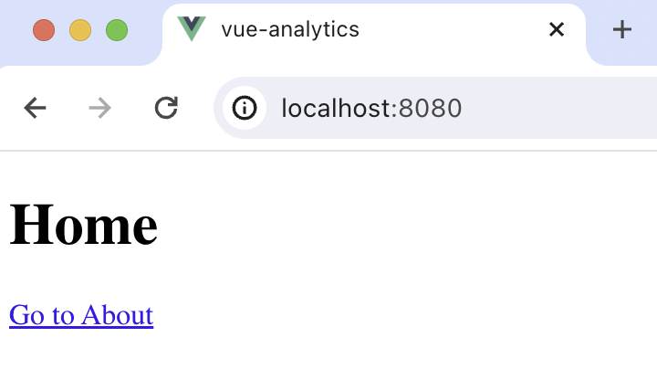

import { ProductScreenshot } from 'components/ProductScreenshot'
import EventsLight from '../images/tutorials/vue-surveys/events-light.png'
import EventsDark from '../images/tutorials/vue-surveys/events-dark.png'

[Product analytics](/product-analytics) enable you to gather and analyze data about how users interact with your Vue.js app. To show you how to set up analytics, in this tutorial we create a basic Vue app, add PostHog, and show you have to capture pageviews and custom events.

## Creating a Vue app

To demonstrate the basics of PostHog analytics, we'll create a simple Vue 3 app with two pages and a link to navigate between them.

First, ensure [Node.js is installed](https://nodejs.dev/en/learn/how-to-install-nodejs/) (version 14.6.0 or newer). Then install `@vue/cli` and create a new Vue app:

```bash
npm install -g @vue/cli
vue create vue-analytics
```

Make sure to select `[Vue 3] babel, eslint` as the Vue version.

### Adding pages

Next, create two new files `HomePage.vue` and `AboutPage.vue` in `src/components`. 

In `HomePage.vue`, add the following the code:

```vue file=components/HomePage.vue
<template>
  <div>
    <h1>Home</h1>
    <router-link to="/about">Go to About</router-link>
  </div>
</template>

<script>
export default {
  name: 'HomePage'
}
</script>
```

In `AboutPage.vue`, add the following the code:

```vue file=components/AboutPage.vue
<template>
  <div>
    <h1>About</h1>
    <router-link to="/">Back Home</router-link>
  </div>
</template>

<script>
export default {
  name: 'AboutPage'
}
</script>
```

Next we set up the routing. First install Vue Router in your project:

```bash
npm install vue-router@4
```

In your `src` directory, create a new folder `router` and then a new file `index.js`:

```bash
cd ./src
mkdir router
cd router 
touch index.js
```

In `router/index.js`, import the components and define the routes:

```js file=router/index.js
import { createRouter, createWebHistory } from 'vue-router'
import HomePage from '../components/HomePage.vue'
import AboutPage from '../components/AboutPage.vue'

const routes = [
  {
    path: '/',
    name: 'HomePage',
    component: HomePage
  },
  {
    path: '/about',
    name: 'AboutPage',
    component: AboutPage
  }
]

const router = createRouter({
  history: createWebHistory(),
  routes
})

export default router
```

Then, update your `App.vue` to use the router-view. Replace the contents of this file with:

```vue file=App.vue
<template>
  <router-view></router-view>
</template>

<script>
export default {
  name: 'App'
}
</script>
```

Finally, set up `main.js` to use the router:

```js file=main.js
import { createApp } from 'vue'
import App from './App.vue'
import router from './router'

createApp(App).use(router).mount('#app')
```

The basic setup is now complete. Run `npm run serve` to see your app.



## Adding PostHog

> This tutorial shows how to integrate PostHog with `Vue 3`. If you're using `Vue 2`, see [our Vue docs](/docs/libraries/vue-js) for how to integrate PostHog.

With our app set up, it’s time to install and set up PostHog. If you don't have a PostHog instance, you can [sign up for free](https://us.posthog.com/signup). 

First install `posthog-js`.

```bash
npm install posthog-js
```

Create a new [plugin](https://vuejs.org/guide/reusability/plugins) by creating a new folder in your base directory called `plugins` and then a new file `posthog.js`:

```bash
mkdir plugins
cd plugins 
touch posthog.js
```

Add the following code to your `posthog.js` file:

```js file=plugins/posthog.js
import posthog from "posthog-js";

export default {
  install(app) {
    app.config.globalProperties.$posthog = posthog.init(
      "<ph_project_api_key>",
      {
        api_host: "<ph_instance_address>",
      }
    );
  },
};
```

Replace `<ph_project_api_key>` and `<ph_instance_address>` with your your PostHog API key and host. You can find these in your [project settings](https://app.posthog.com/settings/project).

Finally, activate your plugin in `main.js`:

```js file=main.js
import { createApp } from 'vue'
import App from './App.vue'
import router from './router'
import posthogPlugin from '../plugins/posthog';

createApp(App)
.use(posthogPlugin)
.use(router)
.mount('#app');
```

Once you’ve done this, reload your app and click the buttons a few times. You should see events appearing in the [PostHog events explorer](https://app.posthog.com/events).

<ProductScreenshot
  imageLight={EventsLight} 
  imageDark={EventsDark} 
  alt="Events in PostHog" 
  classes="rounded"
/>

## Capturing pageviews

You might notice that moving between pages only captures a single pageview event. This is because PostHog only captures pageview events when a [page load](https://developer.mozilla.org/en-US/docs/Web/API/Window/load_event) is fired. Since Vue creates a single-page app, this only happens once, and the Vue router handles subsequent page changes.

If we want to capture every route change, we must write code to capture pageviews that integrates with the router.

In `router/index.js`, set up PostHog to capture pageviews in the `router.afterEach` function. Additionally, you can use `nextTick` so that the capture event fires only after the page is mounted.

```js router/index.js
import { createRouter, createWebHistory } from 'vue-router'
import { nextTick } from 'vue';
// ...rest of your imports and code

router.afterEach((to, from, failure) => {
  if (!failure && router.app) {
    const posthog = router.app.config.globalProperties.$posthog;
    nextTick(() => {
      posthog.capture('$pageview', { path: to.fullPath });
    });
  }
});

export default router
```

Now, every time a user moves between pages, PostHog captures a `$pageview` event, not just the first page load.

Lastly, go back to `plugins/posthog.js` and make sure to set `capture_pageview` in the PostHog initialization config to `false`. This turns off autocaptured pageviews and ensures you won’t double-capture pageviews on the first load.

```js file=plugins/posthog.js
import posthog from "posthog-js";

export default {
  install(app) {
    app.config.globalProperties.$posthog = posthog.init(
      "<ph_project_api_key>",
      {
        api_host: "<ph_instance_address>",
        capture_pageview: false
      }
    );
  },
};
```

## Capturing custom events

Beyond pageviews, there might be more events you want to capture. To do this, you can capture custom events with PostHog. To showcase this, we add a button to the home page and capture a custom event whenever it is clicked. 

To do this, update the code in `HomePage.vue`:

```vue file=HomePage.vue
<template>
  <div>
    <h1>Home</h1>
    <router-link to="/about">Go to About</router-link>
    <button @click="captureCustomEvent">Click Me</button>
  </div>
</template>

<script>
export default {
  name: 'HomePage',
  methods: {
    captureCustomEvent() {
      this.$posthog.capture('home_button_clicked', {
        'user_name': 'Max the Hedgehog' 
      });
    }
  }
}
</script>
```

Now when you click the button, PostHog captures the custom `home_button_clicked` event. Notice that we also added a property `user_name` to the event. This is helpful for filtering events in PostHog.

## Further reading

- [PostHog Vue.js docs](/docs/libraries/vue-js)
- [How to set up A/B tests in Vue](/tutorials/vue-ab-tests)
- [How to set up surveys in Vue](/tutorials/vue-surveys)