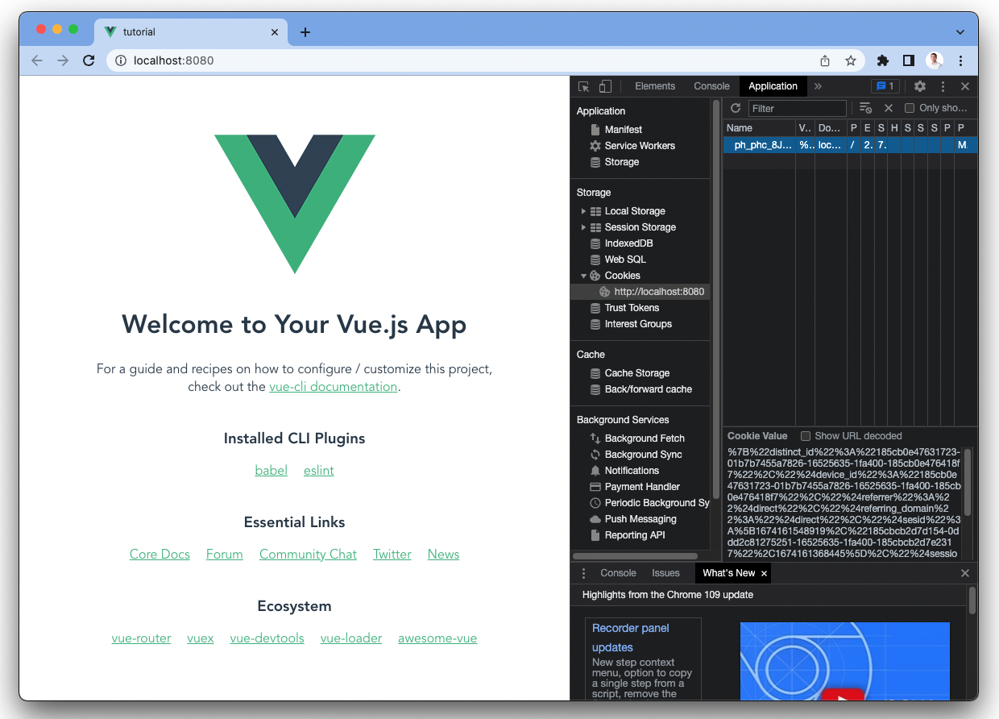
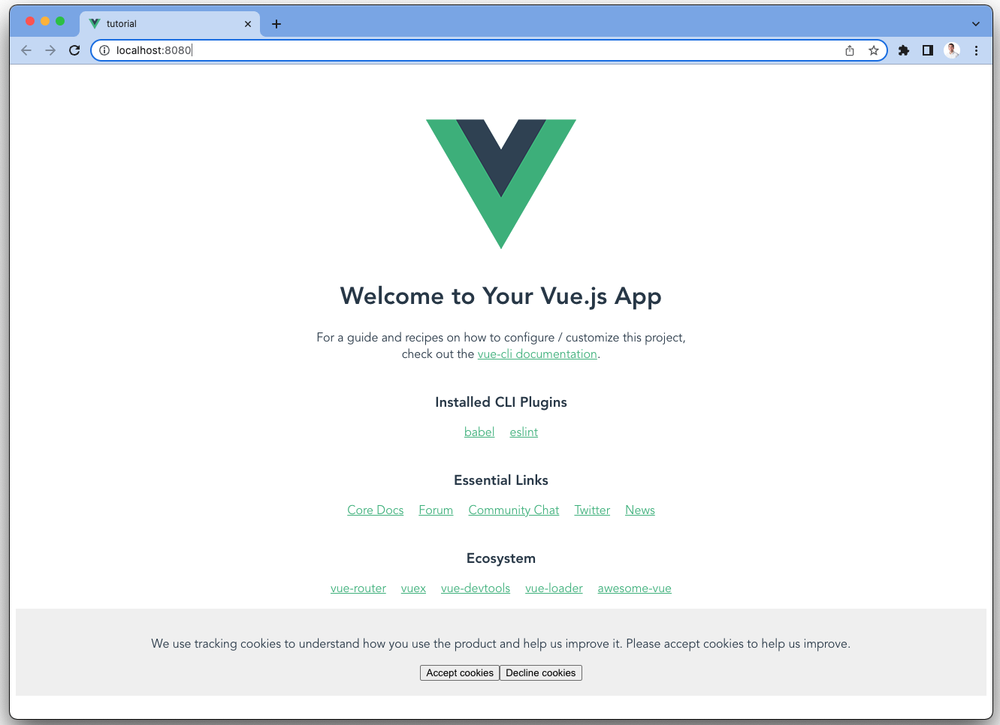
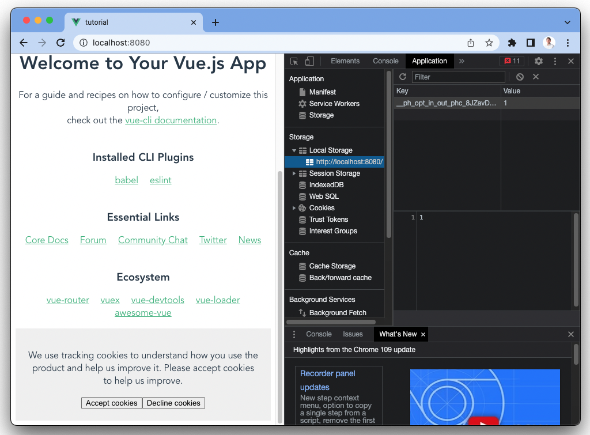

> <p align="center">Open this tutorial in PostHog and follow along step-by-step!</p> <CallToAction href="https://app.posthog.com/#panel=docs:/tutorials/vue-cookie-banner" size="sm" className="mt-auto self-start sm:w-auto !w-full">Launch tutorial</CallToAction>

With internet privacy regulations, like GDPR, coming into effect, managing cookies is becoming increasingly important. Cookies are pieces of information apps set in users’ browsers to help them store information and identity. It’s possible to use [PostHog without cookies](/tutorials/cookieless-tracking), but it’s simpler to use them.

To ensure you are compliant with regulations such as GDPR, your app must receive consent to use cookies. One way to do this is with a cookie consent banner, and this tutorial shows you how to build one in Vue, a popular JavaScript framework.

## Step 1: Setting up our Vue app

First, if you haven’t used Vue before, install the command line interface (CLI). You also need a package manager such as npm, which you can get by installing [Node](https://nodejs.org/en/).

```bash
npm install -g @vue/cli
```

After installing the CLI, you can create the Vue project. We are naming ours "tutorial." When the CLI prompts you with options, choose `vue3` and `npm` (or `yarn`, it doesn’t matter).

```bash
vue create tutorial
```

Next, head into the folders it created and run the server. This launches the site. 

```bash
cd tutorial
npm run serve
```

Now you have the template for a Vue app that is ready for PostHog and a cookie consent banner. 

## Step 2: Installing PostHog

We’ll add PostHog as a plugin to Vue. This way we can access it everywhere in our Vue app and use it to make our cookie banner functional. To do this, install `posthog-js`, create a `plugins` folder, and a `posthog.js` file within that folder.

```bash
npm i posthog-js
cd src
mkdir plugins
touch posthog.js
```

In `posthog.js`, add the code to set up and initialize PostHog as a plugin.

```js
// src/plugins/posthog.js
import posthog from "posthog-js";

export default {
  install(app, options) {
    app.config.globalProperties.$posthog = posthog.init(
      "<ph_project_api_key>",
      {
        api_host: "<ph_instance_address>",
      }
    );
  },
};
```

In `main.js`, import the PostHog plugin and connect it to our app.

```js
// main.js
import { createApp } from 'vue'
import App from './App.vue'
import posthogPlugin from "./plugins/posthog"; //import the plugin. 

const app = createApp(App);

app.use(posthogPlugin); //install the plugin
app.mount('#app')
```

Once you run `npm run serve` again and head into the cookies for your site, you should see a PostHog cookie added.



Our app did this without the consent of the user, and now, it’s time to build the cookie consent banner to fix this.

## Step 3: Creating our cookie banner component

First, create a `CookieBanner.vue` component in our `components` folder.

```bash
cd components
touch CookieBanner.vue
```

For our cookie banner, create a basic component with some details about cookies, buttons to accept and decline, and some basic styling. You can customize it more if you like (our [posthog.com cookie banner](https://github.com/PostHog/posthog.com/blob/master/src/components/CookieBanner/index.tsx) can provide some inspiration).

```js
// components/CookieBanner.vue
<template>
  <div class="banner">
    <p>
      We use tracking cookies to understand how you use the product 
      and help us improve it.
      Please accept cookies to help us improve.
    </p>
    <button type="button">Accept cookies</button>
    <button type="button">Decline cookies</button>
  </div>
</template>

<script>
export default {
  name: "CookieBanner",
};
</script>

<style scoped>
.banner {
  background-color: #f1f1f1;
  padding: 20px;
  text-align: center;
}
</style>
```

Back in `App.vue`, import the `CookieBanner` component and add below the default `HelloWorld` component.

```js
// App.vue
<template>
  <div>
    
    <HelloWorld msg="Welcome to Your Vue.js App"/>
    <CookieBanner />
  </div>
</template>

<script>
import HelloWorld from './components/HelloWorld.vue'
import CookieBanner from './components/CookieBanner.vue'

export default {
  name: 'App',
  components: {
    HelloWorld,
    CookieBanner
  }
}
</script>

// ...
```

That gives us a basic cookie consent banner in our Vue app. It’s not the prettiest, but you can modify it to fit your site.



The problem is that it doesn’t function at the moment. We must add the logic to opt users in or out of cookies. Luckily, PostHog makes this easy.

## Step 4: Adding the opt out (or in) logic

PostHog has methods to help us opt user in or out and deal with cookies. We’ll add click handlers to our buttons and connect them to methods that use PostHog to either opt in or out of tracking.

```js
// components/CookieBanner.vue
<template>
  <div class="banner">
    <p>
      We use tracking cookies to understand how you use the product 
      and help us improve it.
      Please accept cookies to help us improve.
    </p>
    <button type="button" @click="acceptCookies">Accept cookies</button>
    <button type="button" @click="declineCookies">Decline cookies</button>
  </div>
</template>

<script>
export default {
  name: "CookieBanner",
  methods: {
    acceptCookies() {
      this.$posthog.opt_in_capturing();
    },
    declineCookies() {
      this.$posthog.opt_out_capturing();
    }
  }

};
</script>

// ...
```

When you reload your page and click decline, your PostHog cookie disappears and an `opt_in_out` key is added to local storage. If you click accept, the value in local storage is `1`, and the cookie stays.



This is the functionality we want, but the banner stays no matter if the user clicked an option (and that’s annoying). We can add some more logic, again using PostHog, to hide the banner if the user choose an option.

## Step 5: Making the banner conditional

First, we want to hide the banner on page load if the user opted in or out. To do this, we can check with more PostHog methods, and if they have made a choice, don’t show the banner.

```js
// App.vue
<template>
  <div>
    
    <HelloWorld msg="Welcome to Your Vue.js App"/>
    <CookieBanner v-if="showBanner"/>
  </div>
</template>

<script>
import HelloWorld from './components/HelloWorld.vue'
import CookieBanner from './components/CookieBanner.vue'

export default {
  name: 'App',
  data: function() {
    return {
      showBanner: !(this.$posthog.has_opted_out_capturing()||this.$posthog.has_opted_in_capturing())
    }
  },
  components: {
    HelloWorld,
    CookieBanner
  }
}
</script>
```

If you reload the site and have the PostHog `opt_in_out` key in local storage, the banner disappears.

We also want the banner to disappear when the user chooses an option. Right now, it only disappears when the page loads. To do this, emit a `hideBanner` message from the `CookieBanner` component and handle it in `App.vue`.

```js
// components/CookieBanner.vue
<template>
  <div class="banner">
    <p>
      We use tracking cookies to understand how you use the product 
      and help us improve it.
      Please accept cookies to help us improve.
    </p>
    <button type="button" @click="acceptCookies">Accept cookies</button>
    <button type="button" @click="declineCookies">Decline cookies</button>
  </div>
</template>

<script>
export default {
  name: "CookieBanner",
  methods: {
    acceptCookies() {
      this.$posthog.opt_in_capturing();
      this.$emit("hideBanner")
    },
    declineCookies() {
      this.$posthog.opt_out_capturing();
      this.$emit("hideBanner")
    }
  }

};
</script>

//...
```

In App.vue, we can handle the `hideBanner` message and set `showBanner` to `false`.

```js
// App.vue
<template>
  <div>
    
    <HelloWorld msg="Welcome to Your Vue.js App"/>
    <CookieBanner 
      v-if="showBanner"
      @hideBanner="showBanner = false"
    />
  </div>
</template>

// ...
```

Once we’ve done that, our cookie consent banner is fully functional. Try it out by clicking accept and decline, making sure it disappears, and the correct values show up in cookies and local storage. Clear local storage to reset and test again.

## Further reading

- [How to set up A/B tests in Vue](/tutorials/vue-ab-tests)
- [How to set up surveys in Vue](/tutorials/vue-surveys)
- [How to use PostHog without cookie banners](/tutorials/cookieless-tracking)
