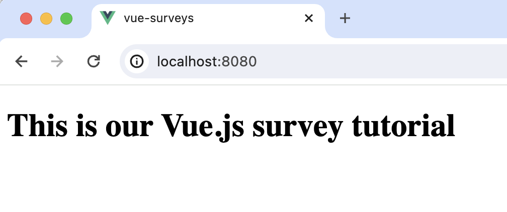
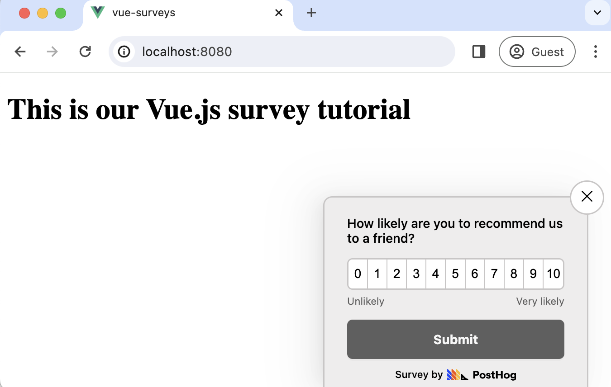
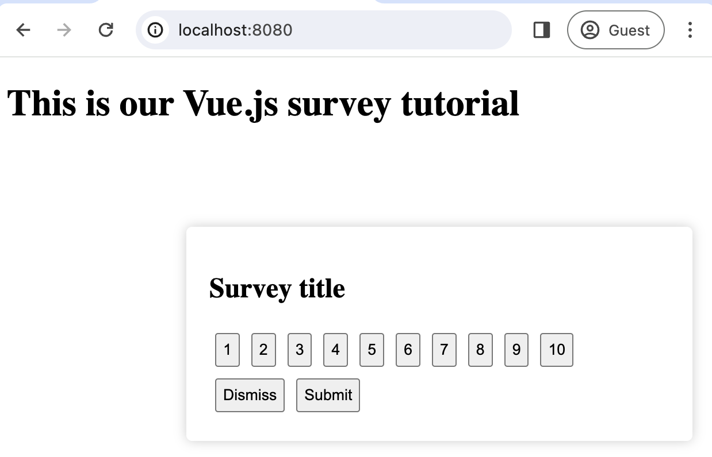

import { ProductScreenshot } from 'components/ProductScreenshot'
import EventsLight from '../images/tutorials/vue-surveys/events-light.png'
import EventsDark from '../images/tutorials/vue-surveys/events-dark.png'
import ImgSurveyResultsLight from '../images/tutorials/vue-surveys/survey-results-light.png'
import ImgSurveyResultsDark from '../images/tutorials/vue-surveys/survey-results-dark.png'
import ImgSurveyTemplatesLight from '../images/tutorials/vue-surveys/survey-templates-light.png'
import ImgSurveyTemplatesDark from '../images/tutorials/vue-surveys/survey-templates-dark.png'

[Surveys](/docs/surveys) are a great way to get feedback from your users. In this guide, we show you how to add a survey to your Vue.js app.

We'll create a basic Vue app, add PostHog, create a survey, and then show you how to display the survey in the app and get responses.

## 1. Create a Vue app

For this tutorial, we create a basic `Vue 3` app. First, ensure [Node.js is installed](https://nodejs.dev/en/learn/how-to-install-nodejs/) (version 18.0 or newer). Then install `@vue/cli` and create a new Vue app:

```bash
npm install -g @vue/cli
vue create vue-surveys
```

Make sure to select `[Vue 3] babel, eslint` as the Vue version.

Once the new app is created, replace the code in `src/App.vue` with the following:

```vue file=App.vue
<template>
  <div id="app">
    <h1>This is our Vue.js survey tutorial</h1>
  </div>
</template>

<script>
export default {
  name: 'App'
}
</script>
```

Run `npm run serve` to start your app.



## 2. Add PostHog

> This tutorial shows how to integrate PostHog with `Vue 3`. If you're using `Vue 2`, see [our Vue docs](/docs/libraries/vue-js) for how to integrate PostHog.

We use PostHog to create and control our survey as well as monitor results. If you don't have a PostHog instance, you can [sign up for free here](https://us.posthog.com/signup). 

First, install `posthog-js`:

```bash
npm install posthog-js
```

Create a new [plugin](https://vuejs.org/guide/reusability/plugins) by creating a new folder in your base directory called `plugins` and then a new file `posthog.js`:

```bash
mkdir plugins
cd plugins 
touch posthog.js
```

Add the following code to your `posthog.js` file:

```js file=plugins/posthog.js
import posthog from "posthog-js";

export default {
  install(app) {
    app.config.globalProperties.$posthog = posthog.init(
      "<ph_project_api_key>",
      {
        api_host: "<ph_instance_address>",
      }
    );
  },
};
```

Replace `<ph_project_api_key>` and `<ph_instance_address>` with your your PostHog API key and host. You can find these in your [project settings](https://us.posthog.com/settings/project).

Finally, activate your plugin in `main.js`:

```js file=main.js
import { createApp } from 'vue'
import App from './App.vue'
import posthogPlugin from '../plugins/posthog';

const app = createApp(App);
app.use(posthogPlugin);
app.mount('#app')
```

Once you’ve done this, reload your app. You should begin seeing events in the [PostHog events explorer](https://us.posthog.com/events).

<ProductScreenshot
  imageLight={EventsLight} 
  imageDark={EventsDark} 
  alt="Events in PostHog" 
  classes="rounded"
/>

## 3. Create a survey

There are two options for displaying a survey using PostHog:

1. Use PostHog's prebuilt survey UI.
2. Implement your own survey UI.

This tutorial will cover how to implement both options:

### Option 1: Use PostHog's prebuilt survey UI

This is the simplest option. PostHog has a variety of [survey templates](/templates?filter=type&value=survey) to choose from, and handles all the display logic and response capture for you. You can also customize the questions, branding, and targeting as needed – see our [survey docs](/docs/surveys/creating-surveys) for more details on how to do so.
 
To create a survey with a prebuilt UI, go to the [surveys tab](https://us.posthog.com/surveys) in PostHog and click "New survey". 

<ProductScreenshot
  imageLight={ImgSurveyTemplatesLight} 
  imageDark={ImgSurveyTemplatesDark} 
  alt="PostHog survey templates" 
  classes="rounded"
/>

Select any template, or you can create your own by clicking "Create blank survey". Then, configure your survey with the following details:

1. Ensure `Presentation` is set to **Popover**.
2. Set the targeting to `All users`.
3. Use the default values for everything else.

Then, click "Save as draft" and then "Launch". Your survey is now live and you should see it in your app. After submitting responses, you can [view results in PostHog](#4-view-results).



### Option 2: Implement your own survey UI

If you prefer to have complete control of your survey UI and logic, you can still use PostHog to keep track of and analyze your results.

First, create a survey in PostHog like in option 1 above (for this tutorial, we use a Net Promoter Score survey template). The only difference is you must set `Presentation` to **API**.

Then, there are four parts to adding code for our custom survey:

1. Create the survey UI.
2. Fetch the survey from PostHog.
3. Add the logic for displaying and hiding it.
4. Capture interactions from it.

#### 1. Create the survey UI

We've created a sample survey UI for this tutorial. To use it, create a new file in `components` folder called `CustomSurvey.vue` and paste the following code:

```vue file=components/CustomSurvey.vue
<template>
  <div class="survey">
    <h2>{{ title }}</h2>
    <div>
      <button v-for="i in 10" :key="i" class="button" @click="handleSelect(i)">
        {{ i }}
      </button>
    </div>
    <div>
      <button class="button" @click="emitDismiss">Dismiss</button>
      <button class="button" @click="emitSubmit">Submit</button>
    </div>
  </div>
</template>

<script>
export default {
  name: 'CustomSurvey',
  props: {
    title: String,
    onDismiss: Function,
    onSubmit: Function
  },
  data() {
    return {
      selectedValue: null
    };
  },
  methods: {
    handleSelect(value) {
      this.selectedValue = value;
    },
    emitDismiss() {
      this.$emit('onDismiss');
    },
    emitSubmit() {
      this.$emit('onSubmit', this.selectedValue);
    }
  }
}
</script>

<style scoped>
.survey {
  position: fixed;
  bottom: 20px;
  right: 20px;
  width: 400px;
  padding: 20px;
  background-color: #ffffff;
  box-shadow: 0px 0px 10px rgba(0, 0, 0, 0.2);
  border-radius: 5px;
  z-index: 1000;
}

.button {
  margin: 5px;
  padding: 5px;
}
</style>
```

Then, integrate the component into `App.vue`:

```vue file=App.vue
<template>
  <main>
    <div class="App">
      <h1>This is our Vue.js survey tutorial</h1>
      <CustomSurvey
        v-if="showSurvey"
        title="Survey title"
        @onDismiss="handleDismiss"
        @onSubmit="handleSubmit"
      />
    </div>
  </main>
</template>

<script>
import CustomSurvey from './components/CustomSurvey.vue'

export default {
  name: 'App',
  components: {
    CustomSurvey
  },
  data() {
    return {
      showSurvey: true
    };
  },
  methods: {
    handleDismiss() {
      this.showSurvey = false;
    },
    handleSubmit(value) {
      console.log("Submitted value:", value);
      this.showSurvey = false;
    }
  }
}
</script>
```

This shows a survey popup every time you visit your app's homepage.



#### 2. Fetch the survey from PostHog

PostHog keeps track of all active surveys for a user (this is especially helpful if you set up [custom targeting options](/docs/surveys/creating-surveys#targeting)). 

To fetch the active surveys, we use `this.$posthog.getActiveMatchingSurveys()`:

```vue file=App.vue
<template>
  <!-- ... rest of your template ... -->
</template>

<script>
import CustomSurvey from './components/CustomSurvey.vue'

export default {
  name: 'App',
  components: {
    CustomSurvey
  },
  data() {
    return {
      showSurvey: true,
    };
  },
  mounted() {
    this.fetchActiveSurveys();
  },
  methods: {
    fetchActiveSurveys() {
      this.$posthog.getActiveMatchingSurveys((surveys) => {
      });
    },    // ... rest of your methods ...
  }
  
  
}
</script>
```

`posthog.getActiveMatchingSurveys()` returns a surveys object that looks like this:

```JSON
[
   {
     "id": "018cfcd5-107e-0000-49a1-8e7c6b825947",
     "name": "Net promoter score (NPS) API Survey",
     "description": "",
     "type": "api",
     "linked_flag_key": null,
     "targeting_flag_key": null,
     "questions": [
       {
         "type": "rating",
         "scale": 10,
         "display": "number",
         "question": "How likely are you to recommend us to a friend?",
         "description": "",
         "lowerBoundLabel": "Unlikely",
         "upperBoundLabel": "Very likely"
       }
     ],
     "conditions": null,
     "start_date": "2024-01-12T08:41:20.614000Z",
     "end_date": null
   }
]
```

We can use this survey object to configure our `CustomSurvey` component:

```vue file=App.vue
<template>
  <main>
    <div class="App">
      <h1>This is our Vue.js survey tutorial</h1>
      <CustomSurvey
        v-if="showSurvey"
        :title="surveyTitle"
        @onDismiss="handleDismiss"
        @onSubmit="handleSubmit"
      />
    </div>
  </main>
</template>

<script>
import CustomSurvey from './components/CustomSurvey.vue'

export default {
  name: 'App',
  components: {
    CustomSurvey
  },
  data() {
    return {
      showSurvey: true,
      surveyTitle: '',
      surveyID: ''
    };
  },
  mounted() {
    this.fetchActiveSurveys();
  },
  methods: {
    fetchActiveSurveys() {
      this.$posthog.getActiveMatchingSurveys((surveys) => {
        if (surveys.length > 0) {
          const survey = surveys[0];
          this.surveyID = survey.id;
          this.surveyTitle = survey.questions[0].question;
        }
      });
    },
    // ... rest of your methods ...
  }
}
</script>
```

#### 3. Add the logic for displaying and hiding it.

We want to make sure we don't show the survey again to users who have either submitted or dismissed it. We use [`localStorage`](https://developer.mozilla.org/en-US/docs/Web/API/Window/localStorage) to store this data and use it to check whether to show the survey or not.

```vue file=App.vue
<template>
  <!-- ... rest of your template ... -->
</template>

<script>
import CustomSurvey from './components/CustomSurvey.vue'

export default {
  name: 'App',
  components: {
    CustomSurvey
  },
  data() {
    return {
      showSurvey: false, // updated 
      surveyTitle: '',
      surveyID: ''
    };
  },
  mounted() {
    this.fetchActiveSurveys();
    this.checkSurveyInteraction();
  },
  methods: {
    fetchActiveSurveys() {
      this.$posthog.getActiveMatchingSurveys((surveys) => {
        // ... existing survey logic ...
      });
    },
    checkSurveyInteraction() {
      const hasInteractedWithSurvey = localStorage.getItem(`hasInteractedWithSurvey_${this.surveyID}`);
      this.showSurvey = !hasInteractedWithSurvey;
    },
    handleDismiss() {
      this.showSurvey = false;
      localStorage.setItem(`hasInteractedWithSurvey_${this.surveyID}`, 'true');
    },
    handleSubmit(value) {
      console.log("Submitted value:", value);
      this.showSurvey = false;
      localStorage.setItem(`hasInteractedWithSurvey_${this.surveyID}`, 'true');
    }
  }
}
</script>

<style>
  /* ... rest of your styles ... */
</style>
```

#### 4. Capture interactions from it.

The final step in setting up our survey is capturing interactions. This enables us to analyze the results in PostHog. 

There are 3 events to capture:

1. `"survey shown"`
2. `"survey dismissed"`
3. `"survey sent"` (for responses)

You can capture these events using `this.$posthog.capture()`:

```vue file=App.vue
<template>
  <!-- ... rest of your template ... -->
</template>

<script>
import CustomSurvey from './components/CustomSurvey.vue'

export default {
  name: 'App',
  components: {
    CustomSurvey
  },
  data() {
    // existing code
  },
  mounted() {
    // existing code
  },
  methods: {
    fetchActiveSurveys() {
      this.$posthog.getActiveMatchingSurveys((surveys) => {
        if (surveys.length > 0) {
          const survey = surveys[0];
          this.surveyID = survey.id;
          this.surveyTitle = survey.questions[0].question;
          this.checkSurveyInteraction();
          if (this.showSurvey) {
            this.$posthog.capture("survey seen", {
              $survey_id: this.surveyID // required
            })
          }
        }
      });
    },
    checkSurveyInteraction() {
      const hasInteractedWithSurvey = localStorage.getItem(`hasInteractedWithSurvey_${this.surveyID}`);
      this.showSurvey = !hasInteractedWithSurvey;
    },
    handleDismiss() {
      this.showSurvey = false;
      localStorage.setItem(`hasInteractedWithSurvey_${this.surveyID}`, 'true');
      this.$posthog.capture("survey dismissed", {
        $survey_id: this.surveyID // required
      })
    },
    handleSubmit(value) {
      this.showSurvey = false;
      localStorage.setItem(`hasInteractedWithSurvey_${this.surveyID}`, 'true');
      this.$posthog.capture("survey sent", {
        $survey_id: this.surveyID, // required
        $survey_response: value // required
      })
    }
  }
}
</script>
```

Altogether, your code should look like this:

```vue file=App.vue
<template>
  <main>
    <div class="App">
      <h1>This is our Vue.js survey tutorial</h1>
    <CustomSurvey
      v-if="showSurvey"
      :title="surveyTitle"
      @onDismiss="handleDismiss"
      @onSubmit="handleSubmit"
    />
    </div>
  </main>
</template>

<script>
import CustomSurvey from './components/CustomSurvey.vue'

export default {
  name: 'App',
  components: {
    CustomSurvey
  },
  data() {
    return {
      showSurvey: false,
      surveyTitle: '',
      surveyID: ''
    };
  },
  mounted() {
    this.fetchActiveSurveys();
    this.checkSurveyInteraction();
  },
  methods: {
    fetchActiveSurveys() {
      this.$posthog.getActiveMatchingSurveys((surveys) => {
        if (surveys.length > 0) {
          const survey = surveys[0];
          this.surveyID = survey.id;
          this.surveyTitle = survey.questions[0].question;
          this.checkSurveyInteraction();
          if (this.showSurvey) {
            this.$posthog.capture("survey seen", {
              $survey_id: this.surveyID // required
            })
          }
        }
      });
    },
    checkSurveyInteraction() {
      const hasInteractedWithSurvey = localStorage.getItem(`hasInteractedWithSurvey_${this.surveyID}`);
      this.showSurvey = !hasInteractedWithSurvey;
    },
    handleDismiss() {
      this.showSurvey = false;
      localStorage.setItem(`hasInteractedWithSurvey_${this.surveyID}`, 'true');
      this.$posthog.capture("survey dismissed", {
        $survey_id: this.surveyID // required
      })
    },
    handleSubmit(value) {
      this.showSurvey = false;
      localStorage.setItem(`hasInteractedWithSurvey_${this.surveyID}`, 'true');
      this.$posthog.capture("survey sent", {
        $survey_id: this.surveyID, // required
        $survey_response: value // required
      })
    }
  }
}
</script>
```

Our survey is now ready to go! The next step is ship the changes, get responses, and view your results.

## 4. View results

After interacting with your survey, you can view results by selecting the survey from the [surveys tab](https://us.posthog.com/surveys). You'll see data on:

- How many users have seen the survey.
- How many users have dismissed the survey.
- Responses.

You can also filter these results based on [user properties](/docs/product-analytics/user-properties), [cohorts](/docs/data/cohorts), [feature flags](/docs/feature-flags/creating-feature-flags) and more.

<ProductScreenshot
  imageLight={ImgSurveyResultsLight} 
  imageDark={ImgSurveyResultsDark} 
  alt="Survey results" 
  classes="rounded"
/>

## Further reading

- [How to set up analytics in Vue](/tutorials/vue-analytics)
- [How to set up feature flags in Vue](/tutorials/vue-feature-flags)
- [How to set up A/B tests in Vue](/tutorials/vue-ab-tests)
