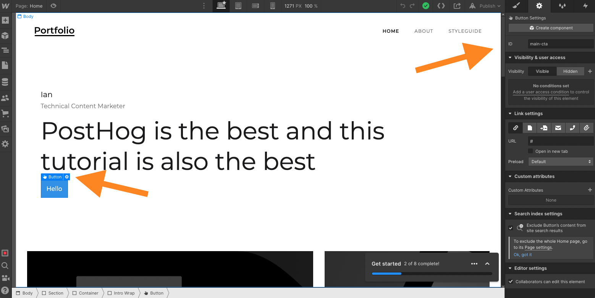

Optimizing your marketing site often requires testing small changes against each other, also known as A/B tests. Getting the best site possible requires tweaking, experimenting, and tracking results.

[Webflow, a no-code site builder](https://webflow.com/), makes it easy to make these changes. PostHog, with its built-in experimentation suite, makes it easy to set up and track A/B tests and experiments. 

This tutorial shows how to set up A/B tests with Webflow and PostHog to get the most out of your marketing site.

> Thanks to Julia at [Mayan](https://www.mayan.co/) for inspiring this tutorial.

## Setup Webflow and PostHog

In case it wasn’t obvious, you need both a Webflow site and a PostHog instance. We covered [how to add PostHog to Webflow](/tutorials/webflow#adding-posthog-to-your-webflow-site) in another tutorial, but the summary is:

1. Get the HTML snippet from your PostHog instance (in "Getting started" or "Project settings")
2. Go to "Project Settings" of your Webflow site, click the "Custom Code" tab, paste the PostHog snippet
3. Save the site, publish, and test that events are showing up from Webflow in PostHog

The whole process looks like this:


Make sure your Webflow site has a good place to A/B test, such as a call-to-action button. Whatever this element is, it needs an ID so we can select it later. To add this, click the element then either click the gear next to the element or the gear at the top of the side panel. Enter whatever ID you like, we choose `main-cta`.



## Create an experiment in PostHog

Once your Webflow site is set up and ready to A/B test, set up an experiment in PostHog. To do so, go to PostHog, click the "Experiments" tab, and then click "New experiment." Fill out as many of the details as you like, the only mandatory fields are key and name. 

If the button is a call-to-action, you will likely want it to connect to an event or action like signups. You can filter your participant type also. Be aware you must [identify](/tutorials/identifying-users-guide) participants with the properties first. If an experiment with filters triggers before participant identification, they aren’t shown the experiment variations. For our example, we won’t use any filters.

Once you set up your experiment, click save and we will set up the code for the experiment in Webflow.

## Implement the experiment in Webflow

Back in the Webflow site designer, click the "Pages" tab on the left panel, hover over your page (for us "Home"), then click the gear for page settings. In page settings, scroll down to "Before `</body>` tag" under "Custom Code." Add code that waits for feature flags to load, checks the experiment’s flag for the right variant, then changes the element if so. It should look like this:

```js
// You need to include the script tags
<script>
  posthog.onFeatureFlags(() => {
    if (posthog.getFeatureFlag('cta') == 'test') {
      const button = document.getElementById('main-cta')
      if (button) {
        button.text = "Cool new CTA"
      }
    }
  });
</script>
```

Once you do this, go back to PostHog and click "Launch" on the experiment. When you publish the changes and reload your Webflow page, there should be a 50% chance you see the new CTA. If not, add `posthog.featureFlags.override({'cta': 'test'})` to the custom code you just added (but don’t forget to remove it). You can check the variations in incognito windows in your browser.


Once you launch this experiment, PostHog automatically tracks the results and make a suggestion about which variation performs best. It uses the goals you set in the experiment to decide this. 

Now that you set up an A/B test in Webflow with PostHog, you can use this same pattern to run experiments and A/B tests throughout your site. Happy testing!

## Further reading

- [How to set up Webflow analytics and session recordings with PostHog](/tutorials/webflow)
- [How to create surveys in Webflow with PostHog](/tutorials/webflow-surveys)
- [What to do after installing PostHog in 5 steps](/tutorials/next-steps-after-installing)