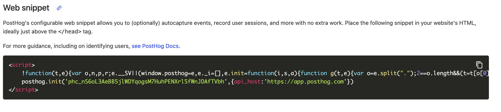
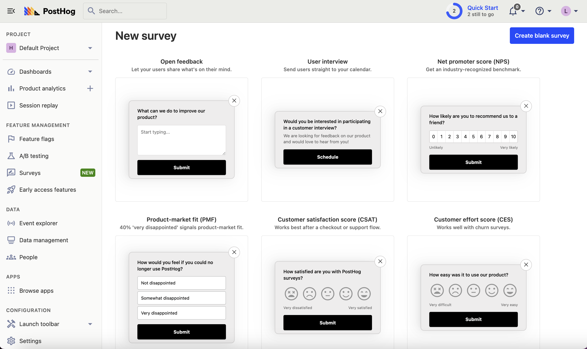

Surveys are a great way to collect feedback from your users. This tutorial shows you how to create surveys for your [Webflow](https://webflow.com/) marketing site using PostHog.

## Adding PostHog to your Webflow site

First, [sign up to PostHog](https://app.posthog.com/signup). Then, go to your [project settings](https://app.posthog.com/settings/project) and copy your web snippet:

With the snippet copied, go to your Webflow site settings by clicking on the menu icon in the top left. If you haven’t already, sign up for the "Basic" site plan. This enables you to add custom code.

Go to the "Custom code" tab in site settings. In the "Head code" section, paste your PostHog snippet and press "Save". Then, publish your site.

## Create your survey

Create a survey in PostHog by going to the [surveys tab](https://app.posthog.com/surveys) and clicking "New survey." There are a variety of [survey types](/docs/surveys/creating-surveys#question-type) to choose from, or you can create your own by clicking "Create blank survey".

Next, customize your survey as needed. You can customize the questions, branding, and targeting. See our [survey docs](/docs/surveys/creating-surveys) for more details on how to do so.

Then, click "Save as draft" and then "Launch". Your survey is now live and you should see it on your website! 

## Viewing survey results

After interacting with your survey, you can view results by selecting the survey from the [surveys tab](https://app.posthog.com/surveys). You'll see data on:

- How many users have seen the survey.
- How many users have dismissed the survey.
- Responses.

You can also filter these results based on [user properties](/docs/product-analytics/user-properties), [cohorts](/docs/data/cohorts), [feature flags](/docs/feature-flags/creating-feature-flags) and more.

## Further reading

- [How to set up Webflow analytics and session recordings with PostHog](/tutorials/webflow)
- [How to run A/B tests in Webflow with PostHog](/tutorials/webflow-ab-tests)
- [How to analyze surveys with ChatGPT](/tutorials/analyze-surveys-with-chatgpt)