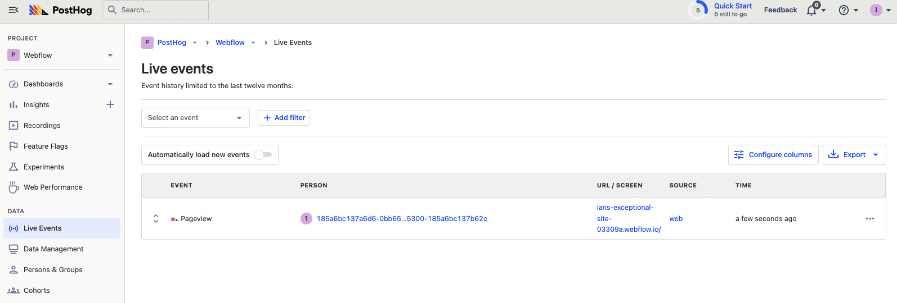

Webflow is one of the most popular no-code site builders. It makes building high-quality marketing sites, blogs, landing pages, and ecommerce stores a breeze. 

To ensure your [Webflow](https://webflow.com/) site is as good as possible, you need data about its usage. PostHog provides tools to capture and analyze this data. This tutorial goes over how to add PostHog to your Webflow site to capture pageviews, events like button clicks, session recordings, and more.

It requires both a PostHog and Webflow account, along with a Webflow paid site plan (PostHog is free up to 1M events and 15k session recordings per month).

## Create a Webflow site

First, you need a Webflow site to add PostHog to. Sign up at [webflow.com](https://webflow.com/), go through the tutorial, and create a new site. There are pre-made templates available to make this process easy, such as the one we used for this tutorial. Once you're happy with the site you've made, publish it. 

You should get a `.webflow.io` URL we can test with. Once you published your site, go to the top right menu and open the Project Settings page.


## Adding PostHog to your Webflow site

In PostHog, get the JavaScript snippet from the Getting Started page or in your Project settings. It looks like this:

```html
<script>
    !function(t,e){var o,n,p,r;e.__SV||(window.posthog=e,e._i=[],e.init=function(i,s,a){function g(t,e){var o=e.split(".");2==o.length&&(t=t[o[0]],e=o[1]),t[e]=function(){t.push([e].concat(Array.prototype.slice.call(arguments,0)))}}(p=t.createElement("script")).type="text/javascript",p.async=!0,p.src=s.api_host+"/static/array.js",(r=t.getElementsByTagName("script")[0]).parentNode.insertBefore(p,r);var u=e;for(void 0!==a?u=e[a]=[]:a="posthog",u.people=u.people||[],u.toString=function(t){var e="posthog";return"posthog"!==a&&(e+="."+a),t||(e+=" (stub)"),e},u.people.toString=function(){return u.toString(1)+".people (stub)"},o="capture identify alias people.set people.set_once set_config register register_once unregister opt_out_capturing has_opted_out_capturing opt_in_capturing reset isFeatureEnabled onFeatureFlags getFeatureFlag getFeatureFlagPayload reloadFeatureFlags group updateEarlyAccessFeatureEnrollment getEarlyAccessFeatures getActiveMatchingSurveys getSurveys".split(" "),n=0;n<o.length;n++)g(u,o[n]);e._i.push([i,s,a])},e.__SV=1)}(document,window.posthog||[]);
    posthog.init('<ph_project_api_key>',{api_host:'<ph_instance_address>'})
</script>
```

Copy the snippet and go back to Webflow. In the Webflow “Project Settings” page, go to the “Custom Code” tab. If you haven’t already, add a site plan to enable custom code. Once active, just paste the PostHog snippet in and save the changes.


Once you’ve done that, publish the site again, go to the published site, refresh, and click around (to capture some events). After a minute, events appear in PostHog. 



From here, you can analyze data from your Webflow site with our suite of product analytics tools like trends, funnels, and recordings. It also enables you to combine [your website data](/blog/track-your-website-with-posthog) with your product data leading to better insights about the full journey.

> **Note:** You must enable session recordings for to capture them on your Webflow site. To do this, go to Project settings in PostHog, scroll down to Recordings, and toggle on “Record user sessions.”

## Further reading

- [How to track performance marketing in PostHog](/tutorials/performance-marketing)
- [A non-technical guide to understanding data in PostHog](/tutorials/non-technical-guide-to-data)
- [Calculating average session duration, time on site, and other session-based metrics](/tutorials/session-metrics)
