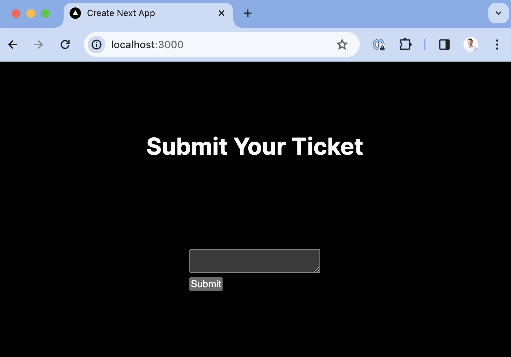
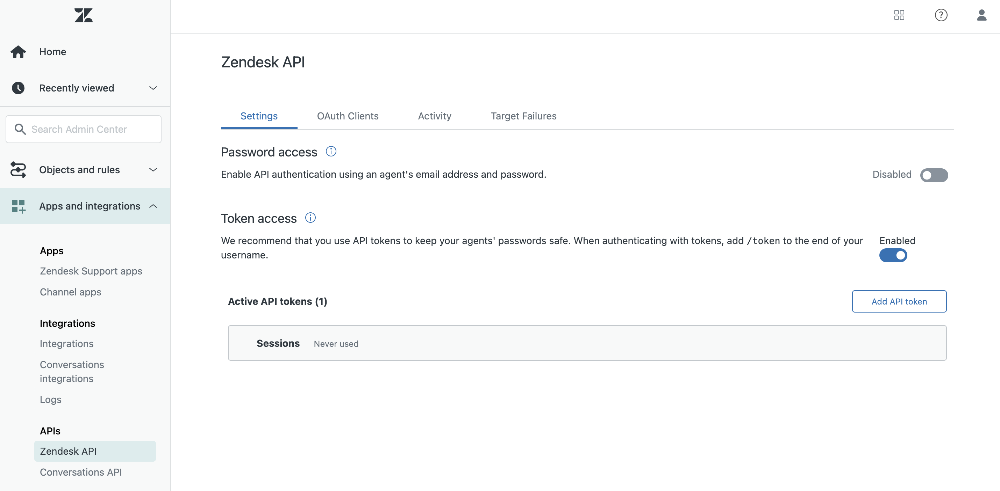
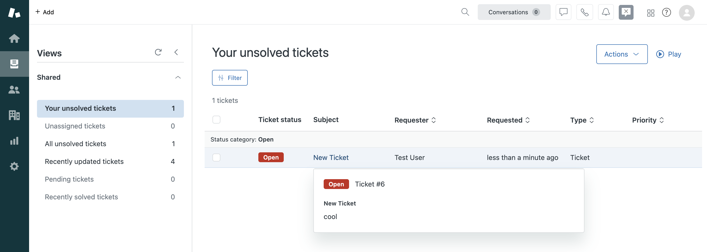

[Session replays](/session-replay) can be a useful support tool for debugging and recreating issues. The errors, console, and network data along with the rest of PostHog's tools make PostHog a powerful support platform.

To get easy access to session replays in Zendesk, you can link to them when users submit tickets. To show you how to do this, we build a basic Next.js app with a form, add PostHog, connect the form to Zendesk, and setup the session replay link in the submitted ticket.

## 1. Create a basic Next.js app with a form

First, make sure [Node is installed](https://nodejs.dev/en/learn/how-to-install-nodejs/) (18.17 or newer), and then create a Next.js app:

```bash
npx create-next-app@latest zendesk-sessions
```

Select **No** for TypeScript, **Yes** for `use app router`, and the defaults for every other option. Once created, go into your `app/page.js` file and set up a basic form for users to submit.

```js
// app/page.js
"use client"
import { useState } from 'react';
import styles from "./page.module.css";

export default function Home() {
  const [content, setContent] = useState('');

  const handleSubmit = async (e) => {
    e.preventDefault();
  }

  return (
    <main className={styles.main}>
      <h1>Submit Your Ticket</h1>
      <form onSubmit={handleSubmit}>
        <textarea 
          value={content} 
          onChange={(e) => setContent(e.target.value)} 
        />
        <br />
        <button type="submit">Submit</button>
      </form>
    </main>
  );
}
```

Once done, run `npm run dev` and go `http://localhost:3000`  to see your app.



## 2. Add PostHog

To set up session replays, we need to install PostHog in our app. If you don't have a PostHog instance, you can [sign up for free](https://us.posthog.com/signup). 

> **Important:** Make sure to enable "Record user sessions" in [your project settings](https://us.posthog.com/settings/project#replay).

After doing this, install the [`posthog-js`](/docs/libraries/js) SDK:

```bash
npm i posthog-js
```

Next, create a `providers.js`  file in your `app`  folder. In it, initialize PostHog with your project API key and instance address and export a provider component. If you have a US Cloud instance, also make sure your `ui_host` config option is set to `https://us.posthog.com`.

```js
// app/providers.js
'use client'
import posthog from 'posthog-js'
import { PostHogProvider } from 'posthog-js/react'

if (typeof window !== 'undefined') {
  posthog.init('<ph_project_api_key>', {
    api_host: '<ph_instance_address>',
    ui_host: 'https://us.posthog.com' // remove if EU
  })
}

export function PHProvider({ children }) {
  return <PostHogProvider client={posthog}>{children}</PostHogProvider>
}
```

Once created, you can import `PHProvider` into your `layout.js` file and wrap your app in it:

```js file=layout.js
import "./globals.css";
import { PHProvider } from './providers'

export default function RootLayout({ children }) {
  return (
    <html lang="en">
      <PHProvider>
        <body>{children}</body>
      </PHProvider>
    </html>
  );
}
```

## 3. Connect the form to Zendesk

Connecting the form to Zendesk requires you to have access to your admin center at `your-subdomain.zendesk.com/admin/home`. Once here, click "Apps and integrations" in the sidebar and then select "Zendesk API." Enable token access, add a new API token, copy its value, and head back to your app.



In `app/pages.js`, we set up a server-side function to submit a ticket to Zendesk. In it, we set up a POST request with a subject, body content, requester, and authorization. Ideally, you would have their real name and email, but we will use my own as a placeholder for now.

```js
// app/page.js
// ... your existing code

async function submitTicket(content) {
  const user = 'ian@posthog.com'
  const pwd = 'mUndDjKGW3Qu1jPqTKsw1k7hDtLUALswwQlggK27'
  const url = 'https://your-subdomain.zendesk.com'

  const res = await fetch(`${url}/api/v2/requests.json`, {
    method: 'POST',
    headers: {
      'Content-Type': 'application/json',
    },
    body: JSON.stringify(
      { 
        request: { 
          subject: 'New Ticket', 
          comment: { body: content },
          requester: {
            name: 'Test User',
            email: 'ian@posthog.com'
          } 
        }}
    ),
    auth: {
      username: user,
      password: pwd
    }
  })
  console.log(res);
}
```

After adding this, we have `handleSubmit` trigger it with the content like this:

```js
"use client"
import { useState } from 'react';
import styles from "./page.module.css";

export default function Home() {
  const [content, setContent] = useState('');

  const handleSubmit = async (e) => {
    e.preventDefault();
    await submitTicket(content);
  }

  return (
    <main className={styles.main}>
      <h1>Submit Your Ticket</h1>
      <form onSubmit={handleSubmit}>
        <textarea 
          value={content} 
          onChange={(e) => setContent(e.target.value)} 
        />
        <br />
        <button type="submit">Submit</button>
      </form>
    </main>
  );
}

async function submitTicket(content) {
	//... rest of your code
```

Now when we go to our app and submit a value, it creates a ticket in Zendesk.



## 4. Add the session replay link to the ticket

The final piece is including a link to the session replay in the ticket. The JavaScript SDK makes this easy with the [`get_session_replay_url()`](/docs/libraries/js#session-replay) method. We just add PostHog and then modify the content value we pass to `submitTicket` .

```js
"use client"
import { useState } from 'react';
import styles from "./page.module.css";
import { usePostHog } from 'posthog-js/react'

export default function Home() {
  const [content, setContent] = useState('');

  const posthog = usePostHog();

  const handleSubmit = async (e) => {
    e.preventDefault();
    console.log(posthog.get_session_replay_url())
    const finalContent = `
      ${content}\n\n
      Session Replay: ${posthog.get_session_replay_url()}
    `
    await submitTicket(finalContent);
  }
// ... rest of your code 
```

Now, when you check your ticket in Zendesk, you'll see a session replay link to watch the replay in PostHog.


> **Bonus:** Beyond a session replay link, you can customize the content for the ticket with information like:
> - User ID
> - Report event ID
> - Admin links
> - Target area
> 
> As an example, you can see [what we do in GitHub](https://github.com/PostHog/posthog/blob/b817a1bc4af92ac5691921c4d1995c17311a8a9d/frontend/src/lib/components/Support/supportLogic.ts#L223C9-L223C28).

## Further reading

- [How to use session replays to improve your support experience](/tutorials/session-recordings-for-support)
- [How to use filters + session replays to understand user friction](/tutorials/filter-session-recordings)
- [Get feedback and book user interviews with surveys](/tutorials/feedback-interviews-site-apps)