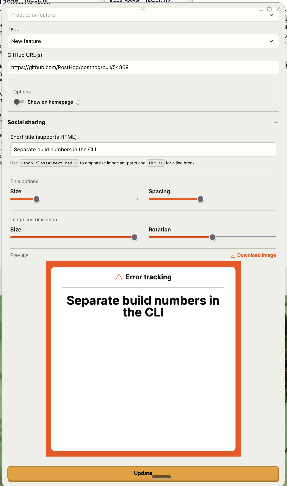
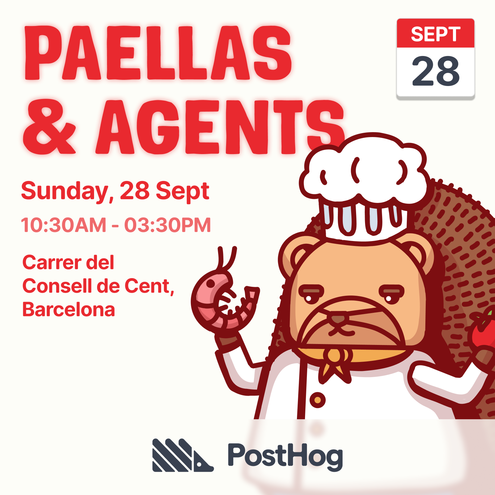
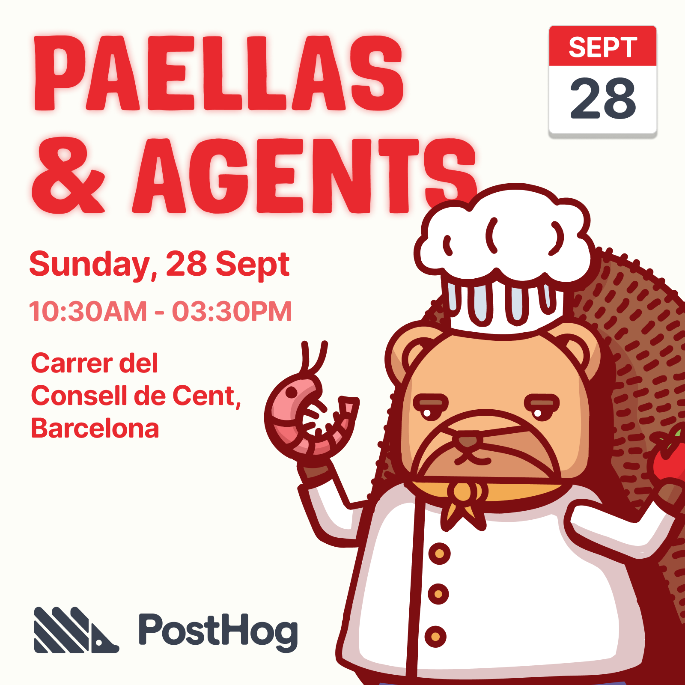
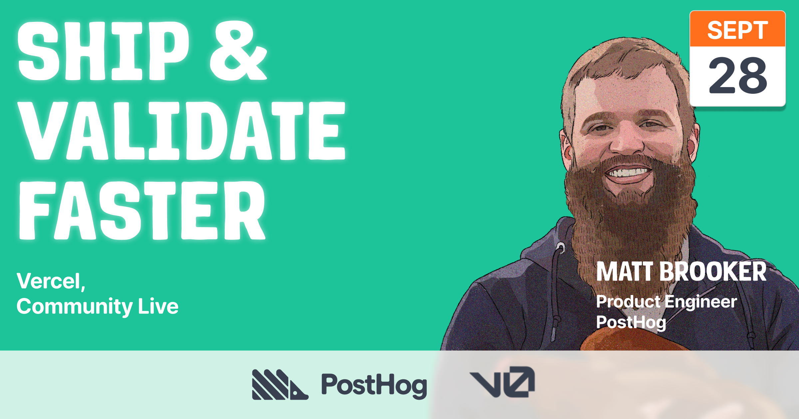
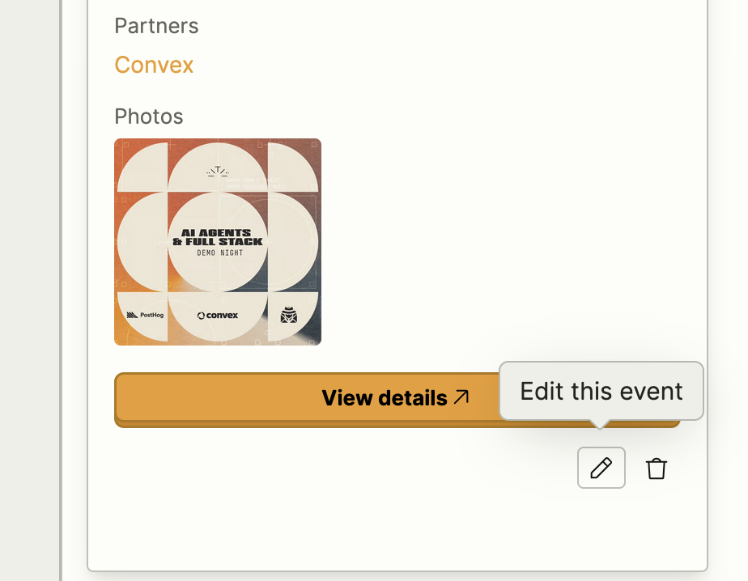
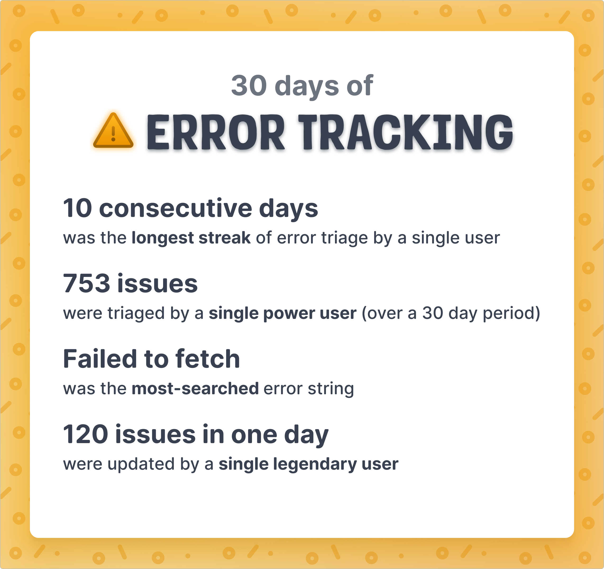

# Image generator

We've previously built an image generator for changelog images. On the individual [changelog detail page](http://localhost:8001/changelog?id=2675) in edit mode, the form contains a social sharing section which adds content to a fixed size frame and allows the user to generate and download the image.

The image is compiled from data provided to it in the form. (Note this preview below is missing an image which would typically render in the center, and the controls would allow manipulation of the image.)

I'd like to take this concept but abstract it, and feed it more data that can be used to generate images. The ultimate goal is to use this to generate blog images, event posters, and more.

## Example ouput

### Event poster

### Schema

- Layout
  - Square
  - Open graph
- Theme
  - Select from list of predefined themes (see separate section on this - this is a new addition)
  - Background color (optionally supplied by theme but can be modified)
- Title
  - Content
  - max-width (%-based), set by default but adjustable
- Text
  - Content  (multiple-line, support html)
  - max-width (%-based), set by default but adjustable
- Image
  - Source
    - Person
      - Image URL
      - Name (editable after loading)
      - Title (editable after loading), multiline
      - Notes:
        - Strapi users - look up a user in Strapi by name and return their avatar. For PostHog employees (primary use case), it'll be their illustration. If it's an external person who has a profile, it might be a photo. Users with role=moderator should always come first as that's the primary use case.
    - Library
      - Image URL
      - Extracted colors
      - Notes:
        - PostHog art library is hosted at - https://posthog-art-library.vercel.app/data/index.json / https://posthog-art-library.vercel.app/library/angel-2/meta.json and has a bunch of metadata we should load in, in case we want to use it. See https://posthog-art-library.vercel.app/docs for context on how to load in the content. Should be searchable and browsable by tags.
    - Custom upload (to Cloudinary)
      - Notes:
        - Manual upload - should go to Cloudinary in the same way we already do it in src/components/MediaLibrary/Uploads.tsx 
  - Size
    - Take default size and allow scaling up/down
  - Position
    - Take default position and allow X and Y adjusting
- Logos
  - Position
    - Overlay (adds background, backdrop blur, centers logos)
    - Inline (margin-top: auto) to place it at the bottom of the content column
  - Content
    - Include PostHog logo by default, using the src/components/Logo/index.tsx component and serve the variants so the user can select the version (landscape, color vs monochrome, etc) depending on the environment
    - Sometimes other logos will be included. Support an HTML block where an SVG can be added, or also an image uploader (to Cloudinary) for other assets.
    - Each element added should be sized independently.
  - Style
    - Default color (optionally fed by theme) but can be modified
  - Arrangement
    - flex, gap-8 by default but could be flex-col and a gap adjustment
- Other elements
  - Event template
    - Event date, time, from standard fields so we can extract information from them
      - Optionally choose to populate data from events sourced from http://localhost:8001/events which already links to the correct person
    - Calendar graphic in top right (on by default) shows the date of the event - option to disable

## Cross-linking

It will be handy to be able to access this generator from relevant places in the app. For example, moderators can edit events on http://localhost:8001/events

so let's add a "Go to image generator" button which opens this new app and pre-populates the fields with the data provided for event templates, so it would select the correct template, inject the title, include the person, etc.

## Event open graph images

We generate open graph images at build time for many pages of the site. Use this new events template with the default settings for open graph images.

## Blog image

Note: We've really only scoped out the event template which is for MVP, but note there will be other templates in the future with other types of content and layout, including loading in product hooks like @src/hooks/productData/error_tracking.tsx where we may want to pull in things like the product icon and title, color, and possibly other nodes to render, then customize from there. 

## Themes

Color schemes for backgrounds are laid out in http://localhost:8001/colors. We need to supply these for the backgrounds of the images.